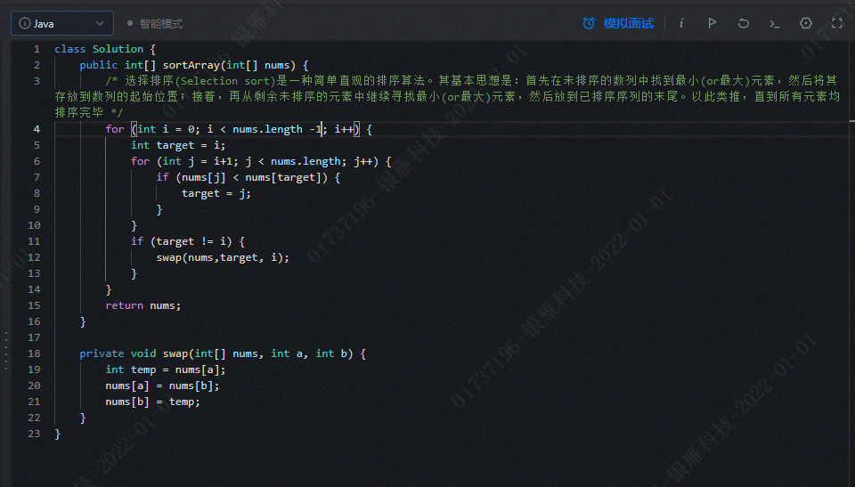

# 基础应用加强

## JVM相关

JVM是一套规定了class文件在系统运行的标准。主流是HotSpot

JVM分为四大部分

-   类加载器

-   字节码执行引擎：执行class文件的字节码指令

-   本地方法接口：调用C C++实现的本地方法及返回结果

-   内存区

### 类加载机制

类加载机制可大致分为两部分:JVM加载阶段和初始化阶段

Java中的类是动态加载

-   加载到内存的阶段有:

1.  **加载** 将class文件加载到内存 在方法区生成class对象（1.8本地）

2.  **验证** 验证class文件格式 数据安全

3.  **准备** 为类变量分配方法区内存空间并赋初始值

4.  **解析**
    将常量池中的符号引用替换为直接引用（内存地址）。接口、字段、类方法、接口方法（即静态链接：将字面量转化为内存的指针或者句柄。动态链接是程序运行中将符号引号转换为直接引用的过程）

5.  **初始化** 为静态变量赋值，执行静态代码块

-   **加载**  第一次用到A和B类

> 1    加载父类，为父类的静态变量分配内存
>
> 2    加载子类，为子类的静态变量分配内存
>
> 3    执行父类静态变量的赋值运算，和静态初始化块
>
> 4    执行子类静态变量的赋值运算，和静态初始化块

-   **初始化 **创建对象 反射调用 主启动类

> 1为父类对象，父类的非静态变量分配内存
>
> 2为子类对象，子类的非静态变量分配内存
>
> 3父类的非静态变量赋值运算
>
> 4    执行父类构造方法 初始化对象
>
> 5子类的非静态变量赋值运算
>
> 6  执行子类构造方法 初始化对象

-   加载器分为:

```{=html}
<!-- -->
```
-   启动类加载器(C++编写) BootStrap

-   扩展类加载器ExtClassLoader

-   应用类加载器(Java编写) AppClassLoader

-   最后为多个自定义类加载器 不是继承 是组合关系

```{=html}
<!-- -->
```
-   **双亲委派模型**：（classLoader的源码逻辑）JVM加载类时，会自下而上去查看是否被加载
    如果没有加载会 自上而下去加载后通知
    最终全都找不到会抛出ClassNotFoundException

> 这样的做法目的是

-   安全，如果自定义一个java.lang.string 类是不会加载的。

-   避免重复加载，保证class的唯一。

> 启动类加载器（bootstrap）-\>扩展类加载器（ext）-\>应用类加载器（app）-\>自定义加载器

-   **源码**：底层的加载器持有parent加载器的引用，先从底层查看是否加载过，没有的话调用parent.loadClass()，最后一步判断parent==null(启动类加载器为null,C++实现没有java对象)，然后自顶向下尝试加载，加载后返回。classNotFound后通过URLClassLoader父类进行加载。

-   **打破双亲委派：**自定义classLoader，重写findClass方法使得不从parent中查找。Tomcat使用了自定义打破双亲委派为了实现不同jsp
    war包的隔离。

#### 面试题：Class.forName 和 ClassLoader 的区别

Class.forName()和 ClassLoader 都可以对类进行加载。ClassLoader 就是遵循
双亲委 派模型
最终调用启动类加载器的类加载器，实现的功能是通过一个类的全限定名来获取描述
此类的二进制字节流，获取到二进制流后放到 JVM 中。classloader
只干一件事情，就是将 .class 文件加载到jvm中，不会执行 static 中的内容

### 四种引用

**强引用**：默认的引用，只要存在GC就不会回收对象

**软引用**：内存不够用的时候才会进行回收 softReference
可以实现类似缓存的功能，内存充足在对象取值，内存不足直接回收。将图片或者大数据缓存到内存，如果内存不足直接回收。

**弱引用**：发生回收就会被回收，weakReference 一般用在容器中weakHashMap
ThreadLocal的key

**虚引用**：通过传递一个队列，触发垃圾回收时，将被删除的对象放入到队列中，如果队列有值说明被回收了。PhantomReference主要用于管理堆外内存，通过DirectByteBuffer

### GC垃圾回收与JVM调优

#### 常见的垃圾回收算法

-   引用计数法

-   复制：将内存一分为二，只是用一半，标记出存活对象，复制全部到另一块内存，将之前的内存清空，然后两边互换。问题是只能使用50%空间，大对象复制很消耗性能比较适合需要频繁回收的区域。MinorGC/youngGC

-   标记清除：标记出存活对象，没有标记出的就回收。节约内存空间，会产生内存碎片

-   标记整理：标记出存活对象进行覆盖整理。无内存碎片，但是有性能损失。

如何进行标记？可达性分析法，基于GCRoot对象进行跟踪。

-   **GCRoots**

> 通过一系列命名为
> GCRoot，通过引用图遍历，如果一个对象到根对应无可达路径，则该对象不可用。GCRoot对象：

-   虚拟机栈中引用的对象

-   方法区中的类静态属性引用的对象

-   方法区中常量引用的对象

-   本地方法栈中引用的对象

-   类加载器 虚拟器内部的应用

#### 新生代，老年代，永久代

-   **新生代：**存放新生对象，分为 **Eden，ServivorFrom
    ServivorTo**三个区

```{=html}
<!-- -->
```
-   **Eden区**：新对象的出生地（如果对象占很大内存直接进入老年代，多大？-XX:PretenureSizeThreshold,默认为0
    如果不调参数，默认肯定在eden区，除非对象放不下了才直接进入老年代）
    当Eden区内存不足就会触发MinorGC

-   **ServivorTo**：保留一次MinorGC过程中的幸存者

-   **ServivorFrom** 上一次的幸存者，作为这一次的被扫描者

> MinorGC采用复制算法：首先把Eden区和From中存活的对象复制到To区，（如果有对象的年龄达到老年的标准就放到老年区），同时把对象的年龄+1,
> 然后清空Eden区和From中的对象；最后To和From互换，原来To成为下一次GC的From区，对象每经历一次MinorGC年龄就会增加一岁，到达一定年纪就会移动到老年代。当To区满后将所有对象移到老年代

-   **老年代：存放生命周期长的对象**

> 当无法找到足够大的连续空间给新创建的大对象分配时，会触发一次MajorGC
>
> MajorGC一般采用标记-清除法，首先扫描一次所有的老年代，标记处存活对象，然后回收没有标记的对象，耗时比较长，会产生内存碎片，一般需要进行合并标记出来方便下一次分配
>
> 当老年代也放不下时，会抛出OOM

#### GC算法实现：

-   Serial收集器(-XX:+UseSerialGC-XX:+UseSerialOldGC)

> 新生代采用复制算法，老年代采用标记-整理算法。

-   ParallelScavenge收集器(-XX:+UseParallelGC(年轻代),-XX:+UseParallelOldGC(老年代))

> 串行收集器的多线程版本

-   ParNew收集器(-XX:+UseParNewGC)

> ParNew收集器其实跟Parallel收集器很类似，区别主要在于它可以和CMS收集器配合使。新生代采用复制算法，老年代采用标记-整理算法。

-   CMS(-XX:+UseConcMarkSweepGC(old))

> 是一种以获取最短回收停顿时间为目标的收集器。它非常符合在注重用户体验的应用上使用，它是HotSpot虚拟机第一款真正意义上的并发收集器，它第一次实现了让垃圾收集线程与用户线程

1.  **初始标记**：暂停所有的其他线程(STW)，并记录下gcroots直接能引用的对象，速度很快。可达性分析法

2.  **并发标记**： 并发标记阶段就是从GC
    Roots的直接关联对象开始遍历整个对象图的过程，
    这个过程耗时较长但是不需要停顿用户线程，
    可以与垃圾收集线程一起并发运行。因为用户程序继续运行，可能会有导致已经标记过的对象状态发生改变。

3.  **重新标记**：
    重新标记阶段就是为了修正并发标记期间因为用户程序继续运行而导致标记产生变动的那一部分对象的标记记录，这个阶段的停顿时间一般会比初始标记阶段的时间稍长，远远比并发标记阶段时间短。主要用到三色标记里的增量更新算法做重新标记。

4.  **并发清理**：
    开启用户线程，同时GC线程开始对未标记的区域做清扫。这个阶段如果有新增对象会被标记为黑色不做任何处理。

5.  **并发重置**：重置本次GC过程中的标记数据。

-   G1

> 适用于内存大于8G

-   ZGC

#### JVM参数类型

-   标配参数：基本参数

-   X参数：调整编译模式

-   **XX参数**：

    -   **-xx （-+）参数名称，-为关闭 +为开启**

    -   **K-v值 -xx:k**=v

{width="5.770833333333333in"
height="1.6458333333333333in"}

内存溢出：对象过多放不下 调整 xmx xms

内存泄漏：过期对象没能回收 检查GCRoots 的引用链

栈溢出：方法无穷递归

内存溢出场景

-   **JVM Heap（堆）溢出**：OutOfMemoryError: Java heap space：
    发生这种问题的原因是 java
    虚拟机创建的对象太多，在进行垃圾回收之间，虚拟机分配的到堆内存空间已
    经用满了。JVM 在启动的时候会自动设置 JVM Heap 的值， 可以利用 JVM
    提供的-Xmn -Xms -Xmx
    等选项可进行设置。Heap的大小是新生代和老年代之和。

```{=html}
<!-- -->
```
-   解决方法：

> 手动设置 JVM Heap（堆）的大小。
>
> 检查程序，看是否有死循环或不必要地重复创建大量对象。

-   **Metaspace溢出**：java.lang.OutOfMemoryError: Metaspace
    程序中使用了大量的 jar 或 class，使 java 虚拟机装载类的空间不够，与
    metaspace 大小有关。方法区用于存放 Java
    类型的相关信息。在类装载器加载 class
    文件到内存的过程中，虚拟机会提取其中的类型信息，并将这些信息存储到方法区。当需要存储类信息而方法区的
    内存占用又已经达到 -XX:MaxMetaspaceSize 设置的最大值，将会抛出
    OutOfMemoryError
    异常。对于这种情况的测试，基本的思路是运行时产生大量的类去填满方法区，直到溢出。

> **1**.8元空间使用直接内存，但是metaspaceSize默认21m，放满后触发fullGC自动调整大小，如果不配置maxSize则最大扩容直接内存大小。推荐配置metaspaceSize=512m，不然启动时可能触发大量的GC导致特别慢。

-   解决方法:

通过 -XX:MetaspaceSize 和 -XX:MaxMetaspaceSize 设置永久代大小即可。

-   栈溢出： java.lang.StackOverflowError : Thread Stack
    space：线程的方法嵌套调用层次太多(如递归调用)，以致于把栈区溢出了。

解决方法：

修改程序。

通过 -Xss: 来设置每个线程的 Stack 大小即可

**常用参数：**

-Xms 初始大小内存，默认为物理内存的1/64 -XX : InitialHeapSize

-Xmx 最大分配内存，默认为物理内存1/4 -XX : MaxHeapSize

-Xss 设置单线程栈大小(StackOverFlow)，默认为512k -1024k -XX :
ThreadStackSize

jvisualvm：java自带的虚拟机诊断工具

jstack：追踪线程执行内容

### 内存模型

计算机内存模型、java内存模型、JVM内存结构

#### 计算机与JMM内存模型

**计算机内存模型：**

现代计算机系统都不得不加入一层读写速度尽可能接近处理器运算速度的高速缓存（Cache）来作为内存与处理器之间的缓冲：将运算需要使用到的数据复制到缓存中，让运算能快速进行，当运算结束后再从缓存同步回内存之中，这样处理器就无须等待缓慢的内存读写了。

**这种模型带来的问题：**

**https://www.hollischuang.com/archives/6460**

-   **原子性：**CPU不可以中途暂停，要么成功，要么失败。因为单CPU下有时间片的概念，如果i++，执行一般结果B线程过来改了i的值就引起了数据不一致。

-   **可见性：**当一个线程修改了一个值，其他线程立即可见

> Volatile和锁可解决局部变量其他线程不可见性

-   **有序性：**

> 编译器优化的重排序
>
> 指令级并行的重排序
>
> 内存系统的重排序

解决问题的办法：

**限制处理器优化**和使用**内存屏障**

**JMM内存模型：**

JMM是隶属于JVM的。从抽象的角度来看，JMM定义了线程和主内存之间的抽象关系：线程之间的共享变量存储在主内存（Main
Memory）中，每个线程都有一个私有的本地内存（Local
Memory），本地内存中存储了该线程以读/写共享变量的副本。本地内存是JMM的一个抽象概念，并不真实存在。它涵盖了缓存、写缓冲区、寄存器以及其他的硬件和编译器优化。

#### JVM内存结构

{width="5.768055555555556in"
height="3.283333333333333in"}

### 多态

> 对象标识符也就是Object id
> 允许对象在不暴露结构的情况下依然可以引用属性和方法，这是多态的基础。
>
> 为优化主存访问带来的损耗，编译器通过逃逸分析进行标量替换和站上分配，基本原理是如果能通过分析，得知一个对象不会传递到方法之外，那就不需要真实地在内存中创建完整的对象布局，完全可以绕过对象标识符，将它拆散为基本的原生数据类型来创建，法执行完毕后随着栈帧一起销毁掉。
>
> **编译时多态**
>
> **方法重载** 都是编译时多态。根据实际参数的数据类型、个数和次序，Java
> 在编译时能够确定执行重载方法中的哪一个。
>
> **方法覆盖**
> 表现出两种多态性，当对象引用本类实例时，为编译时多态，否则为运行时多态。
>
> **运行时多态**
>
> 通过父类对象引用变量引用子类对象来实现。当父类对象引用子类实例时。通过接口类型变量引用实现接口的类的对象来实现
> 。运行时多态主要是通过继承和接口实现的。

## 泛型

1.  是什么

```{=html}
<!-- -->
```
1)  参数化类型,是JDK1.5的新特性。（定义泛型时使用参数可以简单理解为形参）

2)  编译时的一种类型，此类型仅仅在编译阶段有效，运行时无效。

    1.  为什么

```{=html}
<!-- -->
```
1)  提高编程时灵活性。

2)  提高程序运行时的性能。（在编译阶段解决一些运行时需要关注的问题，例如强转）

    1.  怎么用

```{=html}
<!-- -->
```
1)  泛型类： class 类名\<泛型\>{}

2)  泛型接口: interface 接口名\<泛型\>{}

3)  泛型方法: 访问修饰符 \<泛型\> 方法返回值类型 方法名(形参){}

    1.  泛型的通配符\<?\>（这里的通配符可以看成是一种不确定的类型）

```{=html}
<!-- -->
```
1)  泛型应用时有一个特殊符号"?",可以代表一种任意参数类型，注释是实参。

2)  通配符泛型只能应用于变量的定义。

    1.  泛型的上下界问题

```{=html}
<!-- -->
```
1)  指定泛型下界：\<? super 类型\>

2)  指定泛型上界：\<? extends 类型\>

例如：

List\<? extends CharSequence\> list1=new ArrayList\<String\>();

List\<? super Integer\> list2=new ArrayList\<Number\>();

说明：这种上下界一般会用于方法参数变量定义，方法返回值类型定义。

1.  面试题：如何理解泛型类型擦除

泛型是编译时的一种类型，在运行时无效，运行时候都会变成Object类型。

例如定义一个List\<String\> list =new
ArrayList\<String\>(),使用反射可以在运行时将其他类型的数据放入list中。

在编译器编译的时候会去掉，这个过程成为类型 擦除

## 序列化

1.  是什么

```{=html}
<!-- -->
```
1)  序列化：将对象转换为字节的过程。

2)  反序列化：将字节转换为对象的过程。

    1.  使用场景

```{=html}
<!-- -->
```
1)  网络通讯

2)  数据存储(例如文件，缓存)

    1.  Java 中的对象的序列化与反序列化

```{=html}
<!-- -->
```
1)  对象要实现Serializable接口

2)  添加序列化id（为反序列化提供保障）

3)  借助流对象实现序列化和反序列化？

    1.  Java 中的序列化存在安全问题如何解决

```{=html}
<!-- -->
```
1)  添加writeObject(ObjectOutpuStream out)方法

> 对内容进行加密再执行序列化。

2)  添加readObject(ObjectInputStream in)方法对

内容先进行反序列化然后在执行解密操作

1.  Java 中序列化的粒度如何控制

```{=html}
<!-- -->
```
1)  Transient (当少量属性不需要序列化时，使用此关键字修饰)

2)  Externalizable（当只有少量属性需要序列化时实现此接口然后自己进行序列化操作，但是要序列化的对象必须时public修饰。）

protobuf：

dubbo中使用的高性能序列化反序列化的框架。

## 注解

阿里操作手册：

> getField 只能拿到public的属性
>
> getDeclareFields
> 获取全部的属性但是不包括父类基础的。注意：变量不能保证顺序

private的变量在set时，需要setAccessible（true）

1.  是什么

```{=html}
<!-- -->
```
1)  JDK1.5推出的一种新的应用类型（特殊的class）

2)  元数据(Meta Data):一种描述性类型，例如@Override

    1.  应用场景

```{=html}
<!-- -->
```
1)  描述类及其成员(属性，方法)：例如@Overide

2)  替换项目中xml方式对相关对象的描述(例如@Service,@Controller,\...)

> 例如spring框架中相关注解？
>
> 1)@Configuration (描述配置类对象)
>
> 2)@Service(描述业务层对象)
>
> 3)@Controller(描述控制层对象)
>
> 4)@Responsitory(描述数据层对象)
>
> 5)@RestController(描述控制层对象)
>
> 6)@RestControllerAdvice（描述控制全局异常处理）
>
> 7)@Bean(描述bean对象，一般修饰方法将返回交给spring管理)
>
> 8)@Autowired（实现bean对象的自动装配）
>
> 9)...

1.  注解(Annotation)的定义？

> 可以借助@interface关键字进行定义，例如Override注解的应用

\@Target(value=METHOD)

\@Retention(value=SOURCE)

public \@interface Override{}

其中：

1)@Target 用于描述定义的注解能够修饰的对象。

2)@Retention 用于描述定义的注解何时有效。

2.  注解常用的生效范围？

```{=html}
<!-- -->
```
1)  编译时有效（例如@Retention(RetentionPolicy.SOURCE)）

2)  运行时有效（例如@Retention(RetentionPolicy.RUNTIME）

说明：我们自己定义的注解，包括框架中的很多注解基本都是运行时有效。

1.  注解应用案例分析实现？

```{=html}
<!-- -->
```
1.  与编译器结合实用(@Override)

2.  与反射API结合使用(@RequiredLog,@Transaction,...)

例如：

1)  通过反射或类上的注解

2)  通过反射获取属性或方法上的注解。

## 反射

1.  是什么

```{=html}
<!-- -->
```
1)  Java中特有一种技术

2)  JAVA中自省特性的一种实现?(对象运行时动态发现对象成员)

3)  是实现JAVA动态编程的基石?(例如AOP,...)

```{=html}
<!-- -->
```
2.  反射的应用场景

```{=html}
<!-- -->
```
1)  框架中对象的构建？(例如mybatis中的resultType,resultMap,spring中的bean)

2)  框架中方法的调用？(例如对象set方法，get方法，spring mvc
    控制层方法，..)

> 总之：反射不能预知未来，但可驾驭未来，通过反射可以更好构建一些编程框架，以实现通用性编程，从而达到简化代码编写,频繁运用反射需要考虑性能的问题。

3.  反射的应用起点

> 起点可以理解为反射应用的入口，在java中这个入口是字节码对象(Class对象)。其获取方式如下：

1)  类名.class

2)  Class.forName("包名.类名")；最常用

3)  实例对象.getClass();（获取已经存在的类对象）

> 说明：任意的一个类在同一个JVM内部,类对象是唯一的,此类对象会在第一次类加载时创建。

4.  反射核心API

```{=html}
<!-- -->
```
1)  Constructor (构造方法对象类型)

2)  Field (属性对象类型)

3)  Method (方法对象类型)

4)  Annotation(注解对象类型)

5)  ...

```{=html}
<!-- -->
```
5.  反射应用案例分析及实现？

```{=html}
<!-- -->
```
1)  基于反射构建类的实例:首先要基于类对象获取构造方法对象

2)  基于反射获取对象属性，并为属性赋值。

3)  基于反射获取对象方法，并执行对象方法。

4)  基于反射获取描述对象的注解,并基于注解的含义执行下一步操作。

5)  基于反射获取类上的泛型参数？

## 线程

### 进程与线程

#### 进程与线程

**进程**：OS操作系统进行资源调度和分配的最小单位（例如浏览器，APP，JVM）。

**线程**：进程中的最小执行单位（可以理解为一个顺序的执行流）OS操作系统调度CPU的最小单位。

说明：多个线程可以共享所属进程的所有资源。

#### 多线程中的并行与并发

并发：多线程抢占CPU，可能不同时执行，侧重于多个任务交替执行。

现在的操作系统无论是windows，linux还是macOS等其实都是多用户多任务分时操作系统，使用这些操作系统的的用户可以"同时"干多件事情。但实际上，对于单机CPU的计算机而言，在同一时间只能干一件事，为了看起来像是"同时干多件事"分时操作系统把CPU的时间划分成了长短进本相同的时间区间，即"时间片"，通过操作系统的管理，把时间片依次轮流的分配给各个线程任务使用。我们看似的"同时干多件事"，其实是通过CPU时间片技术并发完成的。

并行：线程可以不共享CPU，可每个线程一个CPU同时执行多个任务。

总之：个人认为并行只出现在多CPU或多核CPU中，而并发可理解为并行中的一个子集。

#### 线程的生命周期及状态变化

一个线程从创建，运行，到最后销毁的这个过程称之为线程的生命周期，在这个生命周期过程中线程可能会经历如下几个状态：

{width="5.0625in" height="2.7083333333333335in"}

这些状态可归纳为：状态分别为新建状态，就绪状态，运行状态，阻塞状态，死亡状态。

-   **新建**:创建线程的3种方式:

1.  继承Thread,并重写run方法

2.  实现Runnable接口,重写run方法

3.  实现callable接口,重写call方法

对比:

> 1.实现Runnable和Callable接口允许类继承其他类
>
> 2.继承Thread,因为Thread底层也是实现Runnable,所以扩展了功能.比如:this就表示当前线程,不需要去Thread.currentThread()获取线程对象.
>
> 3.callable
> 重写call()方法,运行时可以获得Future对象,表示异步计算结果.通过future对象可以取消任务,获取运行结果等等.

-   **就绪状态:**

1.  调用线程对象的Start()方法进入就绪状态

2.  当前线程的sleep()结束,其他线程join()结束,等待用户输入完毕,某个线程拿到对象锁,进入就绪状态

3.  调用yield()方法 放弃时间片,进入就绪状态

-   **运行状态**:在就绪状态下,线程获取CPU时间片进入到运行状态

-   **阻塞状态**:**等待阻塞**:正在运行的线程没有运行结束,暂时让出时间片
    **同步阻塞**:线程在进入synchronized修饰的方法或代码块时,jvm将线程放入锁池中竞争锁

**同步监视器:**

> 每个对象都有锁,锁修饰方法时指的是调用方法的对象.
>
> 执行到synchronized,会在加锁对象上,关联一个同步监视器对象
>
> {width="3.0520833333333335in"
> height="1.7104166666666667in"}
>
> Wait() object中的方法,
> 线程释放对象锁,进入等待队列等待notify()唤醒,等待队列中的头线程,或者时间到.需要在同步代码块中才能调用,在加锁对象上等待
>
> sleep() 不释放对象锁,时间到后线程进入就绪状态
>
> suspend()
>
> 使用阻塞式IO 锁

-   **死亡状态**: 方法执行完毕. isalive() 判断线程的存活

### 线程并发安全问题

#### 如何理解线程安全与不安全？

**什么是线程安全与不安全,如何保证线程的安全**

多个线程并发执行时，仍旧能够保证数据的正确性，这种现象称之为线程安全。

多个线程并发执行时，不能能够保证数据的正确性，这种现象称之为线程不安全。

#### 导致线程不安全的因素有哪些？

1.  多个线程并发执行。(没有共享就没有伤害)

2.  多个线程并发执行时存在共享数据集(临界资源)。

3.  多个线程在共享数据集上的操作不是原子操作。(如果只读,不涉及写入时)

#### 如何保证并发线程的安全性

1.  基于不可变性，例如final，只要不对共享变量修改不存在并发安全问题，例如（String,Long,Integer等都是final类），这些类在提供修改的方法的做法都是复制一个新的类出来，避免之前的进行修改。同时基于享元设计模式，通过对象池进行对象的复用，避免内存浪费。

2.  对共享进行限制访问（例如加锁：syncronized，Lock）

3.  基于CAS实现非阻塞同步（基于CPU硬件技术支持）

4.  取消共享，每个线程一个对象实例（例如threadlocal）

    a.  **ThreadLocal**:包装共享数据实现线程隔离

    b.  原理是每次set 都将value放到 当前Thread中的map中，实现数据隔离

    c.  Entry为弱引用用于防止内存泄露。因为entry 的key为threadLocal

    d.  **注意：使用完的value一定要设置为null 防止内存溢出
        调用remove()**

    e.  应用：spring的申明式事务保证同一个Connection

{width="5.768055555555556in"
height="3.0729166666666665in"}

说明：Java中的线程安全问题的主要关注点有3个：可见性，有序性，原子性；

Java内存模型（JMM）解决了可见性和有序性问题，而锁解决了原子性问题。

### Synchronized 

**为什么**：

JMM内存模型带来的可见性、原子性、重排序。由JDK提供的原语级别的支持。通过使用Syn解决这些问题。

-   原子性：由于有CPU有时间片的概念，如果执行一般另外一个线程过来了就会导致CPU去执行另外的线程导致数据不一致。

-   可见性：加锁和解锁必须将变量同步到主内存。

-   有序性：基于as-if-serial语义，保证重排后与之前的结果一致。

**是什么：**

**两种写法：方法或者代码块**

代码块锁的是对象，通过加锁时给对象的锁计算器+1，释放时-1。

对象头：GC分代年龄、锁状态标记、哈希码、epoch等

> {width="5.768055555555556in"
> height="1.851388888888889in"}
>
> 其中的2位标识 01没有锁00轻量级锁 01偏向模式 10重量级锁 11 GC标志。

**原理：**

**由C++写的**ObjectMonitor实现

-   同步代码块采用汇编指令monitorenter、monitorexit(监视器进入和退出)指令显式的实现。

> monitorenter指令是在编译后插入到同步代码块的开始位置，而monitorexit是插入到方法结束处和异常处

-   同步方法则使用ACC_SYNCHRONIZED方法标记符隐式的实现，在方法的常量池中有标记，当访问这个方法时会获取monitor的锁。

synchronized是排它锁的一种实现，支持可重入性。

排他性：如果线程T1已经持有锁L，则不允许除T1外的任何线程T持有该锁L

重入性：如果线程T1已经持有锁L，则允许线程T1多次获取锁L，更确切的说，获取一次后，可多次进入锁。

-   **锁的优化（面试重点）**

**在JDK1.6之前，synchronized的实现才会直接调用ObjectMonitor的enter和exit，这种锁被称之为重量级锁**

**JDK1.6通过适应性自旋、锁消除、锁粗化、轻量级锁和偏向锁实现了高效并发**

-   **自旋锁：**

> 与**重量级锁相比**就是不放弃CPU的时间片，通过反复尝试获取锁。

-   **锁的消除：**

编译器通过分析会去除只有一个线程访问的锁。

-   **锁的粗化**：

JDK1.6后如果对一个对象循环加锁，会自动将锁移动最外面只加一次

注意事项：避免使用String常量，Integer，Long等单例对象进行加锁，会发生死锁

-   **Synchronized锁的升级（重点面试题）**

为了减少获得锁和释放锁带来的性能消耗，JVM在JDK1.6以后的锁一共有4种状态，级别从低到高依次进行优化：**无锁状态**(单线程访问锁时,底层会将锁去掉)、**偏向锁状态**、**轻量级锁状态**和**重量级锁状态**，这几个状态会随着竞争情况逐渐升级。

说明：锁可以升级但不能降级，意味着偏向锁升级成轻量级锁后不能降级成偏向锁。这种锁升级却不能降级的策略，目的是为了提高获得锁和释放锁的效率。

这三种锁是指锁的状态，并且是针对Synchronized。

-   **偏向锁**是指刚开始时如果
    > 一段同步代码一直被一个线程所访问，那么该线程会自动获取锁。降低获取锁的代价。

-   **轻量级自旋锁**是指当锁是偏向锁的时候，发生了线程争用，偏向锁就会升级为轻量级自旋锁，其他线程会通过自旋的形式尝试获取锁，不会阻塞，提高性能。

> **为什么使用自旋锁**：之所以使用自旋锁，是因为如果线程数不多，且时间很短，则无需通过用户态切换为内核态去申请锁以优化性能开销，但如果长时间获取不到，或者自旋线程过多，则自然需要申请锁进入阻塞状态。

-   **重量级锁**是指当锁为轻量级锁的时候，另一个线程虽然是自旋，但自旋不会一直持续下
    > 去，当自旋一定次数的时候，默认10次，还没有获取到锁，就会进入阻塞，该锁膨胀为重量级锁。
    > 重量级锁会让其他申请的线程进入阻塞，性能降低。

### Lock

Syn是JDK关键字，但是在锁优化之前JDK1.6存在性能问题。JDK1.5一位大神写的一个JUC包，基于CAS实现。

Lock.lock()
多线程基于CAS去尝试修改stat，只有一个会成功，其他的会加入到AQS中的队列中。Lock.unLock()后会将stat-1，通知head节点的线程。

还提供了一系列的工具，具体查看JUC工具章节。

### volatile

1.作用（记忆）：

1)  多核或多cpu场景下保证共享变量的可见性。（CPU缓存一致性协议）

2)  禁止指令的重排序操作

3)  但是不能保证原子性。

2.应用场景分析：

1)  状态标记（boolean类型属性）

2)  安全发布 (线程安全单例中的对象安全发布)

3)  读写锁策略（一个写，并发读，类似读写锁）

3.代码实现分析：

1.  状态标记代码示例

**class** Looper{

**private** **volatile** **boolean** isStop;

**public** **void** loop() {

**for**(;;) {

**if**(isStop)**break**;

}

}

**public** **void** stop() {

isStop=**true**;

}

}

**public** **class** TestVolatile01 {

**public** **static** **void** main(String\[\] args)**throws** Exception
{

Looper looper=**new** Looper();

Thread t1=**new** Thread() {

**public** **void** run() {

looper.loop();

};

};

t1.start();

t1.join(1000);

looper.stop();

}

}

2.  安全发布代码示例

**class** Singleton{

**private** Singleton() {}

**private** **static** Singleton *instance*;

**public** **static** Singleton getSingleton() {

**if**(*instance*==**null**) {

**synchronized** (Singleton.**class**) {

*instance*=**new** Singleton();

}

}

**return** *instance*;

}

}

3.  读写锁应用案例：

**class** Counter{

**private** **volatile** **int** count;

**public** **int** getCount() {//read

**return** count;

}

**public** **synchronized** **void** doCount() {//write

count++;

}

}

**实际应用场景**

单例模式下的双重检测（double check的原因）

由于指令重排序的原因，instance != null 有可能是：

1.  分配对象内存空间

2.  初始化对象

3.  设置instance指向内存地址

> 2、3不存在依赖关系，可能存在指令重排序。到第三步时存在对象还没有初始化完成。

### CAS（Compare and swap）

> 简单理解为SVN提交代码时，版本冲突，就无法更新。理解：预先给一个期望值，如果相符说明可以更新，否则说明产生了冲突，需要重新提交。

AtomicInteger AtomicLong

> 原子类底层使用CAS算法实现增减线程安全。原理基于自旋锁和Unsafe类
>
> val是volatile修饰，其他线程修改时可见，比较交换时，使用自旋比较，如果和期望值一致则更新，不一致重新读取。更新时调用本地方法是原子操作。
>
> Unsafe类：native方法可直接操作内存地址
>
> {width="5.770833333333333in"
> height="3.3854166666666665in"}

-   **CAS算法的缺点**

> 循环时间长 开销大
>
> 只能保证一个共享变量的原子操作
>
> ABA问题（解决办法：时间戳引用，版本号）

-   **原子引用**

> AtomicReference

-   线程安全的集合

    -   Vector

    -   Collections.sync

    -   CopyOnWriteArrayList:读写分离

    -   CopyOnWriteArraySet:底层也是上个

    -   ConcurrentHashMap,HashTable,SynMap

### happen-before原则

用happens-before的概念来阐述操作之间的内存可见性。在JMM中，如果一个操作执行的结果需要对另一个操作可见，那么这两个操作之间必须要存在happens-before关系
。

两个操作之间具有happens-before关系，并不意味着前一个操作必须要在后一个操作之前执行！happens-before仅仅要求前一个操作（执行的结果）对后一个操作可见，且前一个操作按顺序排在第二个操作之前（the
first is visible to and ordered before the second） 。

1）如果一个操作happens-before另一个操作，那么第一个操作的执行结果将对第二个操作可见，而且第一个操作的执行顺序排在第二个操作之前。(对程序员来说)

2）两个操作之间存在happens-before关系，并不意味着Java平台的具体实现必须要按照happens-before关系指定的顺序来执行。如果重排序之后的执行结果，与按happens-before关系来执行的结果一致，那么这种重排序是允许的(对编译器和处理器
来说)

在Java
规范提案中为让大家理解内存可见性的这个概念，提出了happens-before的概念来阐述操作之间的内存可见性。对应Java程序员来说，理解happens-before是理解JMM的关键。JMM这么做的原因是：程序员对于这两个操作是否真的被重排序并不关心，程序员关心的是程序执行时的语义不能被改变（即执行结果不能被改变）。因此，happens-before关系本质上和as-if-serial语义是一回事。as-if-serial语义保证单线程内程序的执行结果不被改变，happens-before关系保证正确同步的多线程程序的执行结果不被改变。

**Happens-Before规则-无需任何同步手段就可以保证的**

1）程序顺序规则：一个线程中的每个操作，happens-before于该线程中的任意后续操作。

2）监视器锁规则：对一个锁的解锁，happens-before于随后对这个锁的加锁。

3）volatile变量规则：对一个volatile域的写，happens-before于任意后续对这个volatile域的读。

4）传递性：如果A happens-before B，且B happens-before C，那么A
happens-before C。

5）start()规则：如果线程A执行操作ThreadB.start()（启动线程B），那么A线程的ThreadB.start()操作happens-before于线程B中的任意操作。

6）join()规则：如果线程A执行操作ThreadB.join()并成功返回，那么线程B中的任意操作happens-before于线程A从ThreadB.join()操作成功返回。

7
）线程中断规则:对线程interrupt方法的调用happens-before于被中断线程的代码检测到中

在JMM中如果A操作**happen-before另一个操作,那么A**个操作的结果对于另一个操作的结果是可见的,我们就称这种方式为happen-before

1.  Single thread rule:(单线程)
    如果第二条语句不可见第一条语句的结果,就会造成线程不安全

{width="2.9583333333333335in"
height="2.0729166666666665in"}

2.  Monitor lock rule(A释放了锁,B时可见的 同理)

{width="5.770833333333333in" height="2.0625in"}

3.  Volatile variable rule

{width="5.770833333333333in"
height="2.2395833333333335in"}

4.  Thread start rule

{width="5.770833333333333in"
height="2.0833333333333335in"}

5.  Thread join rule

{width="5.770833333333333in"
height="2.5208333333333335in"}

作用:JMM中基于happen-before
规则,判定数据是否存在竞争,线程是否是安全的,判断多线程环境下变量的值是否是可见的.

> JVM存在指令优化
>
> A操作happen-before于B操作,不一定A先于B执行,只要A的结果对B可见即可.

### JAVA各种锁

#### 悲观锁与乐观锁

JAVA中为了保证多线程并发访问的安全性，提供了基于锁的应用，大体可归纳为两大类，即悲观锁和乐观锁。

悲观锁&乐观锁定义说明：

1.  悲观锁：假定会发生并发冲突，屏蔽一切可违反数据完整性的操作.同一时刻只能有一个线程执行写操作。

例如java中可以基于syncronized,Lock，ReadWriteLock等实现。

2\) 乐观锁：假设不会发生冲突，只在提交操作时检查是否违反数据完整性.

多个线程可以并发执行写操作但只能有一个线程写操作成功。通过算法实现

例如java中可借助CAS（ Compare And
Swap）算法实现(此算法依赖硬件CPU)。或者是AtomicInteger 原子类

数据库端使用版本ID 进行验证

悲观锁&乐观锁应用场景说明：

1)悲观锁适合写操作比较多的场景，写可以保证写操作时数据正确。

2)乐观锁适合读操作比较多的场景，不加锁的特点能够使其读操作的性能大幅提升

悲观锁&乐观锁应用案例分析

悲观锁实现计数器：

方案1：

**class** Counter{

**private** **int** count;

**public** **synchronized** **int** count() {

count++;

**return** count;

}

}

方案2：

**class** Counter{

**private** **int** count;

**private** Lock lock=**new** ReentrantLock();

**public** **int** count() {

lock.lock();

**try** {

count++;

**return** count;

}**finally** {

lock.unlock();

}

}

}

乐观锁实现计数器：

**class** Counter{

**private** AtomicInteger at=**new** AtomicInteger();

**public** **int** count() {

**return** at.incrementAndGet();

}

}

其中 AtomicInteger 是基于CAS算法实现。

#### 公平锁与非公平锁

公平锁：使用队列先进先出按排队顺序获得

非公平锁：随机获取

ReentrantLock(Boolean fair)

#### 可重入锁

线程可以进入任何一个它已经拥有的锁 所同步着的代码块

Synchronized ReentrantLock 都是可重入锁

### 线程的上下文切换

一个线程得到CPU执行的时间是有限的。当此线程用完为其分配的CPU时间以后，cpu会切换到下一个线程执行。例如：

{width="5.072916666666667in"
height="2.28125in"}

在线程切换之前，线程需要将当前的状态进行保存，以便下次再次获得CPU时间片时可以加载对应的状态以继续执行剩下的任务。而这个切换过程是需要耗费时间的，会影响多线程程序的执行效率，所以在在使用多线程时要减少线程的频繁切换。那如何实现呢？

减少多线程上下文切换的方案如下：

1)  无锁并发编程：锁的竞争会带来线程上下文的切换

2)  CAS算法：CAS算法在数据更新方面，可以达到锁的效果

3)  使用最少线程：避免不必要的线程等待

4)  使用协程：单线程完成多任务的调度和切换，避免多线程(在NIO中有selector一个单独的线程进行轮询调度)

### 死锁以及避免死锁问题

多个线程互相等待已经被对方线程正在占用的锁，导致陷入彼此等待对方释放锁的状态，这个过程称之为死锁，如图所示：

{width="3.9375in" height="2.9791666666666665in"}

死锁案例分析-1（面试可能会考，写一个死锁）：

可能出现死锁的案例分享

**class** SyncTask01 **implements** Runnable {

**private** Object obj1;

**private** Object obj2;

**public** SyncTask01(Object o1, Object o2) {

**this**.obj1 = o1;

**this**.obj2 = o2;

}

\@Override

**public** **void** run() {

**synchronized** (obj1) {

work();

**synchronized** (obj2) {

work();

}

}

}

**private** **void** work() {

**try** {Thread.*sleep*(30000);} **catch** (InterruptedException e) {

e.printStackTrace();

}

}

}

死锁测试

**public** **class** TestDeadLock01 {

**public** **static** **void** main(String\[\] args)**throws** Exception
{

Object obj1 = **new** Object();

Object obj2 = **new** Object();

Thread t1 = **new** Thread(**new** SyncTask01(obj1, obj2), \"t1\");

Thread t2 = **new** Thread(**new** SyncTask01(obj2, obj1), \"t2\");

t1.start();

t2.start();

}

}

在高并发多线程中 多线程通讯需要关注和避免死锁

如何避免死锁呢？

1)  避免一个线程中同时获取多个锁

2)  避免一个线程在一个锁中获取其他的锁资源

3)  考虑使用定时锁来替换内部锁机制，如lock.tryLock(timeout)。

**死锁预防**： 破坏导致死锁必要条件中的任意一个就可以预防死锁。例如：

（1） 破坏保持和等待条件：
一次性申请所有资源，之后不再申请资源，如果不满足资源条件则得不到资源分配。

（2） 破坏不可剥夺条件：
当一个进程获得某个不可剥夺的资源时，提出新的资源申请，若不满足，则释放所有资源。

（3） 破坏循环等待条件： 按某一顺序申请资源，释放资源则反序释放。

**死锁避免**： 进程在每次申请资源时判断这些操作是否安全。

**死锁检测**： 判断系统是否属于死锁的状态，如果是，则执行死锁解除策略。

**死锁解除**：
将某进程所占资源进行强制回收，然后分配给其他进程。（与死锁检测结合使用的）

### 线程池

流程图:

{width="5.768055555555556in"
height="2.745833333333333in"}

API : Executor ExecutorService

{width="3.1493055555555554in"
height="3.3506944444444446in"}

**常见的实现类：**

-   CompletableFuture进行管理多个future的结果，

-   ThreadPoolExecutor父类时ExecutorService

-   ForkJoinPool：每个threadk内部都有一个任务队列

分解汇总的任务，用少的线程执行多个任务，主要的思想是并行计算后合并结果。为防止空闲线程浪费性能，会工作窃取（work-stealing）其他线程的任务进行处理。

-   ScheduledThreadPoolExecutor：延时处理线程池，任务调度

线程池的7个参数（重点面试题）：

推荐构建线程池使用new ThreadPoolExecutor，构造函数的七个参数如下：

1)  corePoolSize：系统常驻线程数量

2)  maximumPoolSize：允许并发执行的最大数量

3)  keepaliveTime：max-core的线程多久后归还给系统

4)  TimeUtil：时间单位

5)  BlockQueue：等待队列，传入不同类型的队列实现不同的功能，可指定最大队列长度，满了可进行拒绝处理

6)  ThreadFactory：线程构建工厂，默认是default 非守护 默认优先级
    默认线程名称，可自定义线程名称便于后续管理（例如Jstack）

7)  destPolicy：拒绝策略： Abort 抛异常（推荐） discard 忽略
    discardOldest 丢弃最老的 CallerRunsPolicy
    常用做法：将未处理的请求记录到缓存或者日志中，进入后续的异步处理

**如何设置：**

**CPU密集型任务**应配置尽可能小的线程，如配置 Ncpu+1个线程的线程池。(可以通过Runtime.getRuntime().availableProcessors()来获取CPU物理核数)

**IO密集型任务**线程并不是一直在执行任务，则应配置尽可能多的线程，如 2\*Ncpu。

优先级不同的任务可以使用优先级队列 PriorityBlockingQueue来处理。它可以让优先级高的任务先执行（注意：**如果一直有优先级高的任务提交到队列里，那么优先级低的任务可能永远不能执行**）

### JUC 工具

#### CountDownLatch

线程同步计数器，可以实现线程的通信。

给定一个初始值，调用await是阻塞，当其他线程调用countDown方法是进行\--，当计数变为0时取消阻塞。

一个典型应用场景就是启动一个服务时，主线程需要等待多个组件加载完毕，之后再继续执行。

#### CyclicBarrier 

一个线程组的线程需要等待所有线程完成任务后再继续执行下一次任务

使用场景：可以用于多线程计算数据，最后合并计算结果的场景。

CyclicBarrier 与 CountDownLatch 区别

-   CountDownLatch 是一次性的，CyclicBarrier 是可循环利用的

-   CountDownLatch
    参与的线程的职责是不一样的，有的在倒计时，有的在等待倒计时结束。CyclicBarrier
    参与的线程职责是一样的。

#### Semaphore

主要用于限流

Semaphore也是一个线程同步的辅助类，可以维护当前访问自身的线程个数，并提供了同步机制。使用Semaphore可以控制同时访问资源的线程个数，例如，实现一个文件允许的并发访问数。

包含公平和非公平模式。

　void
acquire():从此信号量获取一个许可，在提供一个许可前一直将线程阻塞，否则线程被中断。

　　void release():释放一个许可，将其返回给信号量。

　　int availablePermits():返回此信号量中当前可用的许可数。

　　boolean hasQueuedThreads():查询是否有线程正在等待获取。

### 阻塞队列

传统的阻塞队列，必须用while判断为空或者满，因为唤醒后需要继续判断

**阿里面试：**2个生产者 10个消费者的阻塞队列

> 多个生产者，多个消费者。传统sync写法，满了或者空了需要notifyAll
> 此时叫醒的可能是同级的其他线程。
>
> 使用Lock的多个condition，每次await时使用，condition的await
> 最后使用consumer.signalAll
>
> 原理是每个condition是一个等待队列，每次await会加入到对应的等待队列中。使用不同的等待队列可以精准控制。

Lock的底层原理：

> **AQS** ：核心是 volatile state(0/1)
> 使用CAS进行尝试独占加锁，如果判断已经独占此线程，则state+1使得可重入
>
> addWaiter 自旋使用CAS加入到等待队列中
>
> 通过park unpark进行阻塞和放行
>
> 等待队列的数据结构是**双向列表**，入队出队都使用CAS进行入队
>
> Concurrent中新增的特殊队列，高效且线程安全。***当队列中填满数据的情况下，生产者端的所有线程都会被自动阻塞（挂起），直到队列中有空的位置，线程被自动唤醒。***作为BlockingQueue的使用者，我们再也不需要关心什么时候需要阻塞线程，什么时候需要唤醒线程，因为这一切BlockingQueue都给你一手包办了

-   常见的实现类

> **ArrayBlockingQueue ：内部维护一个数组**
>
> **LinkedBlockingQueue：无参构造 边界为最大值，有内存溢出风险**
>
> **DelayQueue元素只有当其指定的延迟时间到了，才能够从队列中获取到该元素**
>
> **PriorityBlockingQueue ：基于优先级的阻塞队列**
>
> **SynchronousQueue ：无缓存的队列，用一个生产一个**

-   常见的方法

    -   Add():容器满了会抛异常

    -   Remove()：先见先出，可指定参数，会抛异常

    -   Offer():插入不会抛出异常，

    -   Poll():取出 null

    -   Put():阻塞

    -   Take():阻塞

> {width="5.760416666666667in"
> height="2.3020833333333335in"}
>
> {width="5.760416666666667in"
> height="1.3229166666666667in"}
>
> 超高性能的阻塞队列：Disruptor
>
> 使用数组实现的环形队列，首尾相接，初始化时预先加载对象避免每次都new
> 减少GC的次数
>
> 包含一个sequence用于标识当前有效坐标
>
> 通过happen-before原则 避免加锁，读取追赶写入 直到停止

## Java容器

> {width="5.688366141732283in"
> height="5.375984251968504in"}

### Map

#### HashMap

数组加链表，数组里是链表，链表中的entry对象存放k-v数据，使用put时hash（）与数组长度-1
的与运算决定下标，拿到下标后在数组中链表进行遍历每一个entry的key，使用equal对比，如果相等直接覆盖，全部不相等进行尾插，链表大于8并且容量大于64才会转为红黑树，否则优先扩容。当数组数据超过负载因子进行扩容及rehash。使用get方法，hash
key取到下标，遍历列表equals获取value.

-   默认16，每次扩容翻倍，传进去的容量会约等于2的幂次

-   头插与尾插，1.7的头插可能导致死锁

```{=html}
<!-- -->
```
-   0.75负载因子是时间和空间的一个平衡

重点关注1.8的红黑树

-   **为什么使用红黑树**

> 红黑树是二叉查找树的变种，是平衡树，查找时的时间复杂度时O(log
> n)，当元素很多时比链表的O(n)快很多。但是插入的效率比链表要低，要维护红黑树的旋转保持平衡。
>
> 普通的二叉树可能存在平衡问题，AVL树的平衡条件比较严格，插入性能差。红黑树兼顾了查询和插入的性能。

#### ConcurrentHashMap（面试重点）

1.7 1.8的具体实现（待补充）

> 1.7
> 数组加链表，分段锁，将数组分为16个segment，对某个segment操作需要获取对应的锁，最多只有16个线程并发操作。
>
> 1.8 底层结构与hashMap相同，并发使用CAS + synchronized
> 实现更加细粒度的锁大大提升了并发性能，具体细节是将锁控制在了哈希桶级别，写入时锁住哈希桶的头结点，不影响其他哈希桶写入。

### 其他容器

-   **ConcurrentSkipListMap**：

对排好序的map进行cas操作很困难。数据结构是将排好序的map进行拆分成多个list（123456
。 1 3 5 。 3），以空间换时间，变成一种特殊的树进行查找与插入。

-   copyOnWriteArrayList：读多写少使用，读时不加锁。写时sync然后在原有的list上copy一份，将要插入的元素放到尾部，替换原有数组
    可以实现在插入时不影响读原有的数据。

-   **Queue**

> queue和list 的区别：queue添加了很多对线程有好的api：offer peek pool

blockingQueue 内置的生产者消费者模型 put take是会阻塞

DelayQueue：take时通过等待时间进行获取。应用：按时间进行任务调度

TransferQueue：带确认机制的消费者队列

## 计算机网络

> 基于OSI七层网络模型，每一层都有对应的实际应用。
>
> 应、表、会、传、网、数、物
>
> {width="6.104166666666667in"
> height="2.9479166666666665in"}

**Linux通过抓80端口的包查看：**

tcpdump -nn -i eth0 port 80

> {width="6.645833333333333in"
> height="2.783333333333333in"}

-   **网络基础模型**

> {width="5.768055555555556in" height="3.39375in"}
>
> 数据层层封装，TCP组装对应的header和可靠性保证（重发与顺序的序列化、校验的check
> Sum），IP层组装路由地址 长度 版本号，
> Device可能是硬件也可能是软件tcpdump工作的区域基于ARP获取下一跳的MAC地址，Driver基于DMA将主存复制到缓存区组装以太帧并自动计算校验以及TCP的重发和ACK确认响应在此处完成。
>
> 发送和接收是相反的处理逻辑，层层解包

-   **干预网络通信-netfilter**

> 以上的步骤之前是固定的，Linux2.4加入了netfilter框架。基本原理是在IP层前后加入的5个hooks（钩子），系统通过注册对应的回调函数，当数据经过时会自动调用。类比spring
> aop的前置后置及环绕方法。
>
> {width="4.205869422572179in"
> height="4.531802274715661in"}
>
> 每一个回调可以注册一个filterChain，类比tomcat的filterChain以及SpringCloud
> gateway的filterChain。
>
> Linux 系统提供的许多网络能力，如数据包过滤、封包处理（设置标志位、修改
> TTL
> 等）、地址伪装、网络地址转换、透明代理、访问控制、基于协议类型的连接跟踪，带宽限速，等等，都是在
> Netfilter 基础之上实现的
>
> 最常用的是iptables（防火墙、路由转发、端口映射、地址伪装NAT(网络地址转换)、日志）。sideCar代理流量的一种实现方式。

-   **虚拟网络**

> **tun/tap的方案**
>
> {width="4.045138888888889in"
> height="2.5319444444444446in"}
>
> 应用程序通过 tun 设备对外发送数据包后，tun
> 设备如果发现另一端的字符设备已被 VPN
> 程序打开（这就是一端连接着网络协议栈，另一端连接着用户态程序），便会把数据包通过字符设备发送给
> VPN 程序，VPN
> 收到数据包，会修改后再重新封装成新报文，譬如数据包原本是发送给 A
> 地址的，VPN 把整个包进行加密，然后作为报文体，封装到另一个发送给 B
> 地址的新数据包当中。这种将一个数据包套进另一个数据包中的处理方式被形象地形容为"隧道"（Tunneling）VPN的数据流
>
> Veth（virtual eth）
>
> 用于两个隔离的网络空间的通信
>
> {width="4.295491032370953in"
> height="2.608974190726159in"}
>
> Bridge网桥（交换机）
>
> {width="5.768055555555556in"
> height="2.229861111111111in"}
>
> {width="5.768055555555556in"
> height="4.518055555555556in"}

### 应用层（HTTP）

**HTTP**: 无状态，一次请求一次响应

#### HTTP与HTTPS的区别（面试重点）

<https://zhuanlan.zhihu.com/p/22142170> HTTPS

非对称加密（建立连接） + 数字摘要 + 数字签名 + 对称加密（传输过程）

Transport security ：HTTPS在HTTP的TCP层中间加了
SSL/TLS层，默认端口使用443

从而实现了以下几个功能：

-   信息加密传输：而非HTTP的明文

-   校验机制：一旦篡改了通信内容就无法正常显示

-   身份认证：

**原理：**

1、建立连接与数据加密

-   在通信建立前采用**非对称加密**的方式交换「会话秘钥」，后续就不再使用非对称加密。

-   在通信过程中全部使用**对称加密**的「[会话秘钥](https://www.zhihu.com/search?q=%E4%BC%9A%E8%AF%9D%E7%A7%98%E9%92%A5&search_source=Entity&hybrid_search_source=Entity&hybrid_search_extra=%7b)」的方式加密明文数据。

2.  摘要算法实现数据完整性，通过指纹加密解密实现

3.  数字证书：

客户端先向服务器端索要公钥，然后用公钥加密信息，服务器收到密文后，用自己的私钥解密。

为防止公钥被修改，将有第三方权威机构进行管理即CA证书。

-   面试题：HTTPS如何建立连接的

首先是TCP三次握手，然后客户端（浏览器）发起一个HTTPS连接建立请求，客户端先发一个Client
Hello的包，然后服务端响应一个Server
Hello，接着再给客户端发送它的证书（客户端会检查证书并给出警告，检查域名
有效期），然后双方经过密钥交换，最后使用交换的密钥加行加解密数据。

{width="3.786411854768154in"
height="3.449516622922135in"}

-   客户端向服务器索要并验证服务器的公钥。

-   双方协商生产「会话秘钥」。

-   双方采用「会话秘钥」进行加密通信。

### 表示层

> 编解码

### 会话层

Session管理

### 传输层（TCP/IP）

-   **TCP与UDP的区别（高频面试）**

1.  TCP**面向连接可靠的**;UDP是无连接的，即发送数据之前不需要建立连接。最大努力交付不保证可靠交付

2.  TCP一对一;UDP支持一对一，一对多，多对一和多对多的交互通信。

3.  TCP面向字节流，实际上是TCP把数据看成一连串无结构的字节流;UDP是面向报文的；UDP没有拥塞控制，因此网络出现拥塞不会使源主机的发送速率降低（对实时应用很有用，如IP电话，实时视频会议等）

4.  TCP头部开销20字节;UDP的首部开销小，只有8个字节。在部分ajax请求中是劣势。

5.  TCP的逻辑通信信道是全双工的可靠信道，UDP则是不可靠信道

-   **TCP和UDP的使用场景？**

UDP用于即时通信，比如： QQ 语音、 QQ 视频
、直播、DNS查询、心跳检测、物联网设备等等。

TCP用于需要可靠传输的场景，文件传输、发送和接收邮件、远程登录等场景。

-   **UDP如何保证可靠性**

> UDP经常用于实时性要求比较高的场景，可靠性一般不重要，一定要的话需要用户自己保证，可以借鉴TCP的做法。需要解决的问题一般是丢包、乱序、超时、流量控制。具体的做法可以是ACK确认应答，缓冲区乱序重拍，超时重试等。

-   **TCP如何保证可靠性**

<https://www.cnblogs.com/xiaokang01/p/10033267.html>

-   **校验和：**

发送的数据包的二进制相加然后取反，**目的是检测数据在传输过程中的任何变化**。如果收到段的检验和有差错，TCP将丢弃这个报文段和不确认收到此报文段。 

 

-   **确认应答+序列号（累计确认+seq）：**

接收方收到报文就会确认（累积确认：对所有按序接收的数据的确认）

TCP给发送的**每一个包进行编号**，接收方**对数据包进行排序**，把有序数据传送给应用层。 

 

-   **超时重传：**

当TCP**发出一个段后，它启动一个定时器**，**等待目的端确认收到这个报文段**。**如果不能及时收到一个确认，将重发这个报文段**。 

 

-   **流量控制：**

**TCP连接的每一方都有固定大小的缓冲空间**，TCP的**接收端只允许发送端发送接收端缓冲区能接纳的数据**。当接收方来不及处理发送方的数据，能提示发送方降低发送的速率，防止包丢失。TCP使用的流量控制协议是可变大小的滑动窗口协议。

**接收方有即时窗口（滑动窗口），随ACK报文发送**

 

-   **拥塞控制：**

当网络拥塞时，减少数据的发送。

**发送方有拥塞窗口，发送数据前比对接收方发过来的即使窗口，取小。慢启动，速率根据窗口大小逐步增大**

**慢启动、拥塞避免、拥塞发送、快速恢复**

 

应用数据被分割成TCP认为最适合发送的数据块。 

TCP的接收端会**丢弃重复的数据**。 

-   **三次握手与四次挥手**

<https://www.cnblogs.com/bj-mr-li/p/11106390.html>

<https://www.cnblogs.com/xiaokang01/p/10032377.html>

{width="6.8190102799650045in"
height="7.354411636045494in"}

{width="6.570753499562555in"
height="4.555246062992126in"}

面向连接：**三次握手**建立连接，在B\\S的两个角度上看都需要发出与确认使得连接可靠。

断开连接：四次挥手：1、客户端发送断开2、服务端回应收到
3、服务端发送断开4、客户端回应断开

-   2MSL:(Maximum Segment Lifetime):

虽然按道理，四个报文都发送完毕，我们可以直接进入CLOSE状态了，但是我们必须假象网络是不可靠的，有可以最后一个ACK丢失。所以TIME_WAIT状态就是用来重发可能丢失的ACK报文。在Client发送出最后的ACK回复，但该ACK可能丢失。Server如果没有收到ACK，将不断重复发送FIN片段。所以Client不能立即关闭，它必须确认Server接收到了该ACK。Client会在发送出ACK之后进入到TIME_WAIT状态。

**简而言之**：可能最后一次应答服务器没收到，所以等待一段时间避免服务端重发FIN请求，如果2msl了就不等了。

-   如果连接建立后一方突然断了怎么办？

TCP还设有一个保活计时器，显然，客户端如果出现故障，服务器不能一直等下去，白白浪费资源。服务器每收到一次客户端的请求后都会重新复位这个计时器，时间通常是设置为2小时，若两小时还没有收到客户端的任何数据，服务器就会发送一个探测报文段，以后每隔75秒钟发送一次。若一连发送10个探测报文仍然没反应，服务器就认为客户端出了故障，接着就关闭连接。

#### 拥塞控制

<https://blog.csdn.net/shuxnhs/article/details/80644531>

{width="4.96875in"
height="2.6666666666666665in"}

{width="6.71875in"
height="2.2916666666666665in"}

{width="6.543106955380577in"
height="4.515587270341207in"}

### 网络层（IPV4）

> IPV4 IPV6
>
> 基于IP加端口，主要的作用是用来找到下一跳位置，问题是网关和目标服务器2个地址，客户端不管写哪个地址都不合适，如果写网关，网关不知道目标。如果写目标，则无法找到下一层地址。所以需要有链路层做路由寻址。
>
> DNS:域名解析服务器。要理解DNS的设计思想，TTL机制（不会主动更新，过期后主动获取上级服务器，在高可用及一致性中选择了AP），在缓存一致性问题，分布式同步问题，都能找到影子。
>
> 掩码：IP地址与掩码进行二进制与操作，得到最后一位是主机号，前面是网络段

### 链路层

> PPP 802.1
>
> 通过MAC路由器地址+目标服务器地址进行寻址。整个过程中目标IP不变，但是MAC地址每次路由都换变化完成节点间跳跃通信。
>
> 如何先知道MAC地址？通过FFFFFF的广播地址群发处理。
>
> ARP地址解析：通过数据包发送处理数据，记录MAC地址。主机通过ARP请求拿到目标MAC地址

抓包查看：tcpdump -nn -i eth0 port 80 or arp

> {width="6.989583333333333in"
> height="3.3854166666666665in"}

### 物理层

> 网卡连接交换机：通过前导码分割
> 获取MAC地址拿到属于自己处理的，分割查看协议，通过进程处理请求。
>
> 光纤、电话线等

### 网络架构

#### DNS与CDN

#### 负载均衡

> 软件：LVS(Linux Virtual Server), Nginx
>
> 硬件：F5

-   **反向代理**

正向与反向的定义在于对客户端透明还是服务端透明。正向代理客户端透明，反向反之。还有一种透明代理双方都透明。Nginx就是反向代理的代表，代理服务端。

-   **四层、七层负载均衡（面试）**

#### 从游览器输入地址到返回内容发生了什么

## 线程通讯与进程通讯应用基础

### 进程通讯-IPC 

线程通讯：java中的多线程通讯主要是共享内存（变量）等方式。

进程通讯：java中进程通讯（IPC inter-process communication）主要是：

a)  管道/匿名管道(Pipes)：用于具有亲缘关系的父子进程间或者兄弟进程之间的通信。

b)  具名管道(Names Pipes):
    匿名管道由于没有名字，只能用于亲缘关系的进程间通信。为了克服这个缺点，提出了有名管道。有名管道严格遵循先进先出(first
    in first
    out)。有名管道以磁盘文件的方式存在，可以实现本机任意两个进程通信。

> 典型的例子： ps -ef \| grep java
>
> ps 与 grep都是单独的进程，由匿名管道进行连接

c)  消息队列(Message
    Queuing)：消息队列是消息的链表，具有特定的格式，存放在内存中并由消息队列标识符标识。管道和消息队列的通信数据都是先进先出的原则。与管道（无名管道：只存在于内存中的文件；命名管道：存在于实际的磁盘介质或者文件系统）不同的是消息队列存放在内核中，只有在内核重启(即，操作系统重启)或者显示地删除一个消息队列时，该消息队列才会被真正的删除。消息队列可以实现消息的随机查询，消息不一定要以先进先出的次序读取，也可以按消息的类型读取.比
    FIFO
    更有优势。消息队列克服了信号承载信息量少，管道只能承载无格式字节流以及缓冲区大小受限等缺。

d)  信号(Signal)：信号是一种比较复杂的通信方式，用于通知接收进程某个事件已经发生；（对于异常情况下的工作模式，就需要用「信号」的方式来通知进程，信号事件的来源主要有硬件来源（如键盘
    Cltr+C ）和软件来源（如 kill 命令）。比如，Ctrl+C 产生 SIGINT
    信号，表示终止该进程，Ctrl+Z 产生
    SIGSTP，表示停止该进程，但还未结束）

> Kill -9 pid 由shell进行向PID进程发送signalKill命令

e)  信号量(Semaphores)：信号量是一个计数器，用于多进程对共享数据的访问，信号量的意图在于进程间同步。这种通信方式主要用于解决与同步相关的问题并避免竞争条件。（信号量其实是一个整型的计数器，主要用于实现进程间的互斥与同步，而不是用于缓存进程间通信的数据。）

> wait() notify()

f)  共享内存(Shared
    memory)：使得多个进程可以访问同一块内存空间，不同进程可以及时看到对方进程中对共享内存中数据的更新。这种方式需要依靠某种同步操作，如互斥锁和信号量等。可以说这是最有用的进程间通信方式。（共享内存的机制，就是拿出一块虚拟地址空间来，映射到相同的物理内存中）

g)  套接字(Sockets):
    此方法主要用于在客户端和服务器之间通过网络进行通信。套接字是支持
    TCP/IP
    的网络通信的基本操作单元，可以看做是不同主机之间的进程进行双向通信的端点，简单的说就是通信的两方的一种约定，用套接字中的相关函数来完成通信过程。

{width="5.770833333333333in"
height="2.7395833333333335in"}

### 线程之间的通讯

a.  互斥量(Mutex)：采用互斥对象机制，只有拥有互斥对象的线程才有访问公共资源的权限。比如
    Java 中的 synchronized 关键词和各种 Lock 都是这种机制。

b.  信号量(Semphares)：它允许同一时刻多个线程访问同一资源，但是需要控制同一时刻访问此资源的最大线程数量。

c.  事件(Event):Wait/Notify：通过通知操作的方式来保持多线程同步，还可以方便的实现多线程优先级的比较操作。

#### 基于wait/nofity/notifyall实现

1.  wait()/notify()/notifyall（）方法定义说明：

```{=html}
<!-- -->
```
1)  Wait:阻塞正在使用监视器对象的线程，同时释放监视器对象

2)  notify:
    唤醒在监视器对象上等待的单个线程，但不释放监视器对象，此时调用该方法的代码继续执行，直到执行结束才释放对象锁

3)  notifyAll:
    唤醒在监视器对象上等待的所有线程，但不释放监视器对象，此时调用该方法的代码继续执行，直到执行结束才释放对象锁

```{=html}
<!-- -->
```
2.  wait()/notify()/notifyall（）方法应用说明

```{=html}
<!-- -->
```
1.  这些方法必须应用在同步代码块或同步方法中

2.  这些方法必须由监视器对象（对象锁）调用

说明：使用wait/notify/notifyAll的作用一般是为了避免轮询带来的性能损失。

3.  wait()/notify()/notifyall()应用案例实现：

手动实现阻塞式队列，并基于wait()/notifyAll()方法实现实现线程在队列上的通讯。

/\*\*

\* 有界消息队列：用于存取消息

\* 1)数据结构：数组(线性结构)

\* 2)具体算法：FIFO(先进先出)-First in First out

\*/

**public** **class** BlockContainer\<T\> {//类泛型

/\*\*用于存储数据的数组\*/

**private** Object\[\] array;

/\*\*记录有效元素个数\*/

**private** **int** size;

**public** BlockContainer () {

**this**(16);//this(参数列表)表示调用本类指定参数的构造函数

}

**public** BlockContainer (**int** cap) {

array=**new** Object\[cap\];//每个元素默认值为null

}

}

向容器添加put方法，用于放数据。

/\*\*

\* 生产者线程通过put方法向容器放数据

\* 数据永远放在size位置

\* 说明：实例方法内部的this永远指向

\* 调用此方法的当前对象(当前实例)

\* 注意：静态方法中没有this，this只能

\* 应用在实例方法，构造方法，实例代码块中

\*/

**public** **synchronized** **void** put(T t){//同步锁：this

//1.判定容器是否已满，满了则等待

**while**(size==array.length)

**try**{**this**.wait();}**catch**(Exception e){}

//2.放数据

array\[size\]=t;

//3.有效元素个数加1

size++;

//4.通知消费者取数据

**this**.notifyAll();

}

向容器类添加take方法，用于从容器取数据。

/\*\*

\* 消费者通过此方法取数据

\* 位置：永远取下标为0的位置的数据

\* **\@return**

\*/

\@SuppressWarnings(\"unchecked\")

**public** **synchronized** T take(){

//1.判定容器是否为空，空则等待

**while**(size==0)

**try**{**this**.wait();}**catch**(Exception e){}

//2.取数据

Object obj=array\[0\];

//3.移动元素

System.arraycopy(

array,//src 原数组

1, //srcPos 从哪个位置开始拷贝

array, //dest 放到哪个数组

0, //destPost 从哪个位置开始放

size-1);//拷贝几个

//4.有效元素个数减1

size\--;

//5.将size位置为null

array\[size\]=**null**;

//6.通知生产者放数据

**this**.notifyAll();//通知具备相同锁对象正在wait线程

**return** (T)obj;

}

#### 基于Condition实现

1.  Condition 类定义说明

Condition
是一个用于多线程间协同的工具类，基于此类可以方便的对持有锁的线程进行阻塞或唤醒阻塞的线程。它的强大之处在于它可以为多个线程间建立不同的Condition，通过signal()/signalall()方法指定要唤醒的不同线程。

2.  Condition 类应用说明

```{=html}
<!-- -->
```
1)  基于Lock对象获取Condition对象

2)  基于Condition对象的await()/signal()/signalall()方法实现线程阻塞或唤醒。

```{=html}
<!-- -->
```
3.  Condition类对象的应用案例实现：

手动实现阻塞式队列，并基于wait()/notifyAll()方法实现实现线程在队列上的通讯。

/\*\*

\* 有界消息队列：用于存取消息

\* 1)数据结构：数组(线性结构)

\* 2)具体算法：FIFO(先进先出)-First in First out

\*/

**public** **class** BlockContainer\<T\> {//类泛型

/\*\*用于存储数据的数组\*/

**private** Object\[\] array;

/\*\*记录有效元素个数\*/

**private** **int** size;

**public** BlockContainer() {

**this**(16);//this(参数列表)表示调用本类指定参数的构造函数

}

**public** BlockContainer(**int** cap) {

array=**new** Object\[cap\];//每个元素默认值为null

}

//JDK1.5以后引入的可重入锁(相对于synchronized灵活性更好)

**private** ReentrantLock lock=**new** ReentrantLock(**true**);//
true表示使用公平锁，默认是非公平锁

**private** Condition producerCondition=lock.newCondition();//通讯条件

**private** Condition consumerCondition=lock.newCondition();//通讯条件

}

向容器中添加put方法，用于向容器放数据

/\*\*

\* 生产者线程通过put方法向容器放数据

\* 数据永远放在size位置

\* 说明：实例方法内部的this永远指向

\* 调用此方法的当前对象(当前实例)

\* 注意：静态方法中没有this，this只能

\* 应用在实例方法，构造方法，实例代码块中

\*/

**public** **void** put(T t){//同步锁：this

System.out.println(\"put\");

lock.lock();

**try**{

//1.判定容器是否已满，满了则等待

**while**(size==array.length)

//等效于Object类中的wait方法

**try**{producerCondition.await();}**catch**(Exception
e){e.printStackTrace();}

//2.放数据

array\[size\]=t;

//3.有效元素个数加1

size++;

//4.通知消费者取数据

consumerCondition.signalAll();//等效于object类中的notifyall()

}**finally**{

lock.unlock();

}

}

在容器类中添加take方法用于从容器取数据

/\*\*

\* 消费者通过此方法取数据

\* 位置：永远取下标为0的位置的数据

\* **\@return**

\*/

\@SuppressWarnings(\"unchecked\")

**public** T take(){

System.out.println(\"take\");

lock.lock();

**try**{

//1.判定容器是否为空，空则等待

**while**(size==0)

**try**{consumerCondition.await();}**catch**(Exception e){}

//2.取数据

Object obj=array\[0\];

//3.移动元素

System.arraycopy(

array,//src 原数组

1, //srcPos 从哪个位置开始拷贝

array, //dest 放到哪个数组

0, //destPost 从哪个位置开始放

size-1);//拷贝几个

//4.有效元素个数减1

size\--;

//5.将size位置为null

array\[size\]=**null**;

//6.通知生产者放数据

producerCondition.signalAll();//通知具备相同锁对象正在wait线程

**return** (T)obj;

}**finally**{

lock.unlock();

}

}

### 协程

协程是一种用户态的轻量级线程，协程的调度完全由用户控制。协程拥有自己的寄存器上下文和栈。协程调度切换时，将寄存器上下文和栈保存到其他地方，在切回来的时候，恢复先前保存的寄存器上下文和栈，直接操作栈则基本没有内核切换的开销，可以不加锁的访问全局变量，所以上下文的切换非常快。

对操作系统而言，线程是最小的执行单元，进程是最小的资源管理单元。无论是进程还是线程，都是由操作系统所管理的。

协程不是被操作系统内核所管理的，而是完全由程序所控制，也就是在用户态执行。这样带来的好处是性能大幅度的提升，因为不会像线程切换那样消耗资源。

协程既不是进程也不是线程，协程仅仅是一个特殊的函数，协程它进程和进程不是一个维度的。

一个进程可以包含多个线程，一个线程可以包含多个协程。

> 一个线程内的多个协程虽然可以切换，但是多个协程是串行执行的，只能在一个线程内运行，没法利用
> CPU 多核能力。

协程与进程一样，切换是存在上下文切换问题的。

### 实现进程之间间通讯（IPC）

(待补充)

1.  基于链表结构实现一个线程安全的阻塞队列？

\* 数据结构：数组结构(线性结构)

\* 算法：FIFO(先进先出)

\* 说明：

\* 线性结构：除了第一个节点和最后一个节点，其它每个

\* 节点都有一个直接前驱和一个直接后继

\*/

**public** **class** ArrayBlockContainerQueue {

**private** Object\[\] array;

/\*\*记录有效元素个数\*/

**private** **int** size;

**public** ArrayBlockContainerQueue(){

**this**(16);

}

/\*\*

\* **\@param** cap容器大小(最多能够存储多少数据)

\*/

**public** ArrayBlockContainerQueue(**int** cap){

array=**new** Object\[cap\];

}

/\*\*

\* 向容器放数据(保证过程的线程安全)

\* 说明：数据要永远放在size位置

\*/

**public** **synchronized** **void** put(Object data){

//1.判定容器是否已满，满了要等待

**while**(size==array.length)

**try**{**this**.wait();}**catch**(Exception e){}

//2.将数据放到size位置

array\[size\]=data;

//3.有效元素个数加1(修改size的值)

size++;

//4.通知处于阻塞状态的线程开始执行。

**this**.notifyAll();

}

/\*\*从容器取数据(保证过程的线程)

\* 说明：数据永远从第0个位置开始取\*/

**public** **synchronized** Object take(){

//1.容器是否为空，空则等待

**while**(size==0)

**try**{**this**.wait();}**catch**(Exception e){e.printStackTrace();}

//2.取数据(0位置的值)

Object data=array\[0\];

//3.移动数据(0位置后面的数据要向前移)

System.*arraycopy*(

array, //[src]{.underline}原数组

1,//原数组位置

array, //目标数组

0,//目标数组位置

size-1);//移动元素的个数(拷贝)

//4.修改size的值

size\--;

//5.设置size位置的值为null(恢复到初始状态)

array\[size\]=**null**;//(有选择的实现)

//5.通知处于阻塞状态的线程开始执行

**this**.notifyAll();

**return** data;

}

}

1.  基于BIO方式实现Socket跨进程通讯。

#### 基于socket实现进程间通讯？

基于BIO实现的简易server服务器
```java

public class BioMainServer01 {

private Logger log=LoggerFactory.getLogger(BioMainServer01.class

**private** ServerSocket server;

**private** **volatile** **boolean** isStop=**false**;

**private** **int** port;

**public** BioMainServer01(**int** port) {

**this**.port=port;

}

**public** **void** doStart()**throws** Exception {

server=**new** ServerSocket(port);

**while**(!isStop) {

Socket socket=server.accept();

log.info(\"client connect\");

doService(socket);

}

server.close();

}

**public** **void** doService(Socket socket) **throws** Exception{

InputStream in=socket.getInputStream();

**byte**\[\] buf=**new** **byte**\[1024\];

**int** len=-1;

**while**((len=in.read(buf))!=-1) {

String content=**new** String(buf,0,len);

log.info(\"client say {}\", content);

}

in.close();

socket.close();

}

**public** **void** doStop() {

isStop=**false**;

}

**public** **static** **void** main(String\[\] args)**throws** Exception
{

BioMainServer01 server=**new** BioMainServer01(9999);

server.doStart();

}

}

启动服务，然后打开浏览器进行访问或者通过如下客户端端访问

**public** **class** BioMainClient {

**public** **static** **void** main(String\[\] args) **throws**
Exception{

Socket socket=**new** Socket();

socket.connect(**new** InetSocketAddress(\"127.0.0.1\", 9999));

OutputStream out=socket.getOutputStream();

Scanner sc=**new** Scanner(System.***in***);

System.***out***.println(\"client input:\");

out.write(sc.nextLine().getBytes());

out.close();

sc.close();

socket.close();

}

}
```
## IO

> 磁盘的2个问题：寻址和带宽
>
> 4K对齐，是指磁盘每个扇区是4k
> 每次IO会读出4k的数据量。磁盘页是4k，一个格子，一个格子。
>
> Input/output

### IO模型

{width="5.768055555555556in"
height="3.5381944444444446in"}

Direct Memory Access

DMA复制：直接内存访问，是一种无需CPU的参与就可以让外设与系统内存之间进行双向数据传输的硬件机制。使用DMA可以使系统CPU从实际的I/O数据传输过程中摆脱出来，从而大大提高系统的吞吐率。DMA方式的数据传输由DMA控制器（DMAC）控制，在传输期间，CPU可以并发的执行其他任务。当DMA结束后，DMAC通过中断通知CPU数据传输已经结束，由CPU执行相应的中断服务程序进行后续处理。

> {width="5.768055555555556in"
> height="1.586111111111111in"}
>
> 阻塞与非阻塞：读写时是否立即返回
>
> 同步：单线程需要不停判断是否可读可写
>
> 异步：信号驱动 异步I/O
>
> AIO 异步IO
> ，类似JS中的按钮监听器，点击才响应执行。Linux目前没有纯粹的AIO，是伪AIO
> 只有window才有。
>
> BIO（阻塞IO）、NIO（newIO,同步非阻塞IO，底层使用epoll）、多路复用都是同步IO模型，
>
> {width="5.770833333333333in"
> height="2.7395833333333335in"}
>
> Linux程序系统调用追踪：
>
> {width="5.760416666666667in"
> height="2.4270833333333335in"}
>
> {width="5.770833333333333in"
> height="0.7916666666666666in"}
>
> Recator
> IO模型：去掉线程池即是netty的模型，这也是netty可以改进的地方，如果有阻塞操作的话需要将任务放入线程池去处理，才能最大限度发挥netty的性能。
>
> {width="5.768055555555556in"
> height="3.870138888888889in"}

### NIO

NewIO ，同步非阻塞IO JDK1.4引入的IO模型

Netty基于NIO但是，是异步非阻塞的，因为通过封装NIO的具体实现，封装异步回调的方法实现。

三大核心组件Channel Selector Buffer

#### Channel

FileChannel、SocketChannel、ServerSocketChannel、DatagramChannel

通道可以读也可以写，流一般来说是单向的

通道可以异步读写

通道总是基于缓冲区Buffer来读写

#### Selector

单线程可以通过selector进行管理多个任务，从而达到非阻塞的目的

{width="2.8604166666666666in"
height="1.9708333333333334in"}

包含3个set allKey selectedKey cancelKey

对set进行修改，会执行fail-fast 需要使用iterator的remove

SelectabeChannel

*selector.select(1000ms).如果没有就绪事件会阻塞，会检查系统底层就绪事件列表rdlist，select与epoll的区别在于，epoll基于rdlist将就绪事件放进去，select每次检查都是最大队列*

*通用的做法是
将accpet和其他操作的selector分开，单独一个selector处理连接以提升并发量。tomcat的做法，netty的做法*

#### Buffer

一个可读可写的数组，内部可使用基本数据类型

四个参数：mark \<= position \<= limit \<= capacity

分别是： 标记为 当前位置（可实现重复读） 读写边界 容量

最主要的2个实现类：**heapBuffer** **directBuffer**

> **MappedBuffer：**

**源码**：

byteBuffer：putChar（），一个char 2个字节，put的时候，先右移8位\>\>
放入第一个字节数据，然后强转byte舍弃高位字节，放入第二个字节数据。putInt
类似 4个字节调用4次放入

read方法：判断传入的buffer是否是directBuffer，如果是直接返回堆外数据，不是读出堆外数据
放到传入的buffer里 返回督导的长度

{width="5.768055555555556in"
height="3.1618055555555555in"}

directBytesBuffer：发生2次复制（普通IO是3次，磁盘到内核，内核到堆外，堆外到堆内。），通过**unsafe**类直接操作java堆外内存进行IO操作。netty使用这个实现了堆外内存的管理，从而极大提升性能

#### 使用

RandomAccessFile aFile = new RandomAccessFile(\"data/nio-data.txt\",
\"rw\");

FileChannel inChannel = aFile.getChannel();

ByteBuffer buf = ByteBuffer.allocate(48);

int bytesRead = inChannel.read(buf);

while (bytesRead != -1) {

System.out.println(\"Read \" + bytesRead);

buf.flip();

while(buf.hasRemaining()){

System.out.print((char) buf.get());

}

buf.clear();

bytesRead = inChannel.read(buf);

}

aFile.close();

这里说明NIO与BIO的一个很大区别在于，虽然BIO也有通过数组读取数据的方式，但是底层仍然是一个字节一个字节读的。NIO这个通过byteBuffer，直接面向缓存区读取数据。

### Linux Epoll

> 知乎优秀文章：epoll的本质：
>
> <https://zhuanlan.zhihu.com/p/64138532>
>
> Epoll ： redis（单线程为何快） Nginx底层的技术
>
> {width="5.768055555555556in"
> height="2.4541666666666666in"}
>
> {width="5.768055555555556in" height="2.1125in"}
>
> Epool由select poll 方法演变而来
>
> **select，poll，epoll本质上都是同步I/O，因为他们都需要在读写事件就绪后自己负责进行读写，也就是说这个读写过程是阻塞的，**而异步I/O则无需自己负责进行读写，异步I/O的实现会负责把数据从内核拷贝到用户空间。

-   **Select**:进程在调用select函数时需要将1000个fds传给内核，select进行遍历将有数据的结果返回，每次调用都要遍历1000个fds，时间复杂度O（n），默认长度1024。大量的fd在用户态和内核态之间复制会非常消耗性能

-   **poll：**与select本质没有区别，在于使用链表存储fd，没有长度的限制

-   **Epoll**: 可以理解为event
    poll，epoll提供了三个函数，**epoll_create,epoll_ctl**和**epoll_wait**，

> epoll_create是创建一个epoll句柄（Handle）；epoll_ctl是注册要监听的事件类型；epoll_wait则是等待事件的产生
>
> 在epoll_ctl时把current挂一遍（这一遍必不可少）并为每个fd指定一个回调函数，当设备就绪，唤醒等待队列（rdlist）上的等待者时，就会调用这个回调函数，而这个回调函数会把就绪的fd加入一个就绪链表）

JAVA中的实现：

1.  selector.open(),通过epll_create创建一个epoll实例

2.  register（），通过epoll_ctl注册监听事件

3.  **java中调用selector.selectedKeys()
    会将全部rdlist中的就绪fds返回，然后遍历判断每一个fd是可连接，可读，可写。从而不必每次都轮询全部的fd，相比select和poll而言，性能更佳。**

epoll的优点：

> 1、没有最大并发连接的限制，能打开的FD的上限远大于1024（1G的内存上能监听约10万个端口）；
>
> 2、效率提升，不是轮询的方式，不会随着FD数目的增加效率下降。只有活跃可用的FD才会调用callback函数；
>
> 即Epoll最大的优点就在于它只管你"活跃"的连接，而跟连接总数无关，因此在实际的网络环境中，Epoll的效率就会远远高于select和poll。
>
> 3、
> 消息传递方式：内存拷贝，利用mmap()文件映射内存加速与内核空间的消息传递；即epoll使用mmap减少复制开销。
>
> 与select的区别在于
> 使用mmap创建的共享空间，用户态程序与内核共用，每次调用epoll时将fd放入到共享空间的红黑树中，1000个fds调用1000次
> 注册为红黑树，epoll进行遍历将就绪的结果放到一个列表当中，用户态只需要轮询共享空间读取列表即可完成read。时间复杂度O（1）

-   mmap：是一种内存映射文件的方法，将一个文件或者其它对象映射到进程的地址空间，实现文件磁盘地址和进程虚拟地址空间中一段虚拟地址的一一对映关系。进程就可以采用指针的方式读写操作这一段内存，而系统会自动回写脏页面到对应的文件磁盘上，即完成了对文件的操作而不必再调用read,write等系统调用函数

{width="5.402777777777778in"
height="2.9618055555555554in"}

优点：

1)  对文件的读取操作跨过了页缓存，减少了数据的拷贝次数，用内存读写取代I/O读写，提高了文件读取效率。

2)  实现了用户空间和内核空间的高效交互方式。两空间的各自修改操作可以直接反映在映射的区域内

3)  提供进程间共享内存及相互通信的方式

4)  可用于实现高效的大规模数据传输

水平触发和边缘触发：

水平：如果rdlist中存在一个fd不需要读，每次wait都会通知，边缘触发就只会通知一次性能更高。

### Netty

知乎：netty能干什么

<https://www.zhihu.com/question/24322387/answer/282001188>

**是什么：**

高效的IO框架，封装了基本的NIO用法，原生的NIO极其容易犯错。程序员只需要选择合适的组件，然后自定义ChannelHandler，来处理数据，其他细节Netty都已处理好

**为什么高效：**

主从Reactor线程模型（观察者模式）

基于NIO的异步非阻塞IO（NIO为同步非阻塞，Netty采用线程池实现了异步）

无锁串行思想（每个channel的全生命周期都绑定同一个eventLoop，没有并发问题）

支持不同的序列化组件（protoBuf，dubbo类似）

零拷贝

ByteBuf池化处理

ByteBuf自动扩容

灵活的TCP参数

并发优化

-   **netty的零拷贝（面试重点）**：1、通过管理directBuffer堆外内存以减少拷贝
    2、通过channel的transferTo调用系统的sendFile函数实现

{width="4.982439851268591in"
height="4.9218536745406825in"}

-   epoll空轮询bug

> selector在select()时，有一个epoll
> bug，可能在无事件时有反馈，导致while(true) 不在阻塞导致CPU 100%。
> netty通过一个count值，默认512次，当超过时重新build一个selector，将旧的事件注册到新的。超时或者有事件处理时会重置1。

**怎么用：**

使用当连接建立后会初始化ChannelPipeline，初始化有2个head和tail
handler，然后通过编写自定义handler（inbound和outbound
自定义handler需要实现接口）去处理入栈和出栈事件，实现自由化定制。其中编码与解码是必须要有的通信事件。

心跳保活：只需要给pipeline里add一个IdleStatHander即可。一般只需要给读超时时间即可。内部将开启一个delay任务（timer为定长，delay任务可以自定义修改时间），每隔x秒，检测pipeline是否有数据。超时时会发出event，可通过自定义hanler处理event事件。

代码模板：

{width="5.768055555555556in"
height="4.824305555555555in"}

其中：option(SO_BACKLOG)是设置连接的队列大小。handler（）设置bossGroup的handler，childHander（）是设置workGroup的handler

channelPipeline是一个hanler队列管道，事件将在管道中从左到右进行处理，addLast的处理器

sync()方法是同步等待处理完成，不调用时类似callable调用返回一个future，异步完成后通知。

由于每个eventLoop需要管理多个channel，如果在业务逻辑中加入了长时间的阻塞操作，会导致eventLoop无法及时处理其他事件，导致性能急剧下降。

**自定义对象编解码器的代码实例：**

{width="5.768055555555556in"
height="1.5083333333333333in"}

#### 网络中的粘包拆包

由于TCP是面向字节流的协议，作为传输层的协议不包含具体的业务信息。传输时根据缓冲区的大小进行数据包的划分，如果一次请求由于比较大被拆分成多次发送。

{width="6.302567804024497in"
height="3.948779527559055in"}

常见的应用层协议：http的做法：

通过特定格式的请求头中的Content-Length来规定每次请求的长度，服务端通过长度进行分割。

dubbo协议：也是类似的做法 客户端和服务端的编解码

#### 整体架构：

{width="5.768055555555556in"
height="4.236111111111111in"}

{width="5.126388888888889in"
height="2.939583333333333in"}

{width="5.480555555555555in"
height="2.0430555555555556in"}

{width="5.417361111111111in"
height="2.770138888888889in"}

#### EventLoop线程模型

内部结构为：队列和selector

2个eventLoopGroup，一个用于接收请求创建连接，一个用于处理请求处理事件。每个eventLoopGroup包含多个eventLoop。eventLoopGroup也是一个特殊的eventLoop，单线程运行。

本身是SingleThreadEventExecutor，单线程运行，并且扩展了ScheduledExecutor，可执行调度任务

{width="5.768055555555556in"
height="5.456944444444445in"}

注意：每个Netty
的channel都有eventLoop与其绑定，一个eventLoop将负责一个channel生命周期内的所有事件

{width="5.768055555555556in"
height="2.6395833333333334in"}

我们之前已经阐明了不要阻塞当前I/O
线程的重要性。我们再以另一种方式重申一次："永

远不要将一个长时间运行的任务放入到执行队列中，因为它将阻塞需要在同一线程上执行的任何其他任务。"如果必须要进行阻塞调用或者执行长时间运行的任务，我们建议使用一个专门的EventExecutor。

注：因此tomcat并未使用netty的线程模型，而是有单独任务处理线程池，执行长时间的任务。

**异步模式**：

{width="5.768055555555556in"
height="3.2041666666666666in"}

一旦一个Channel
被分配给一个EventLoop，它将在它的整个生命周期中都使用这个EventLoop（以及相关联的Thread）。请牢记这一点，因为它可以使你从担忧你的Channel-Handler
实现中的线程安全和同步问题中解脱出来。

**阻塞模式**：

{width="5.768055555555556in"
height="2.564583333333333in"}

每个channel绑定单独的eventLoop，每个eventLoop是单线程

#### ByteBuf

注意与byteBuffer的区别：1.除了heapBuf和directBuf外，提供了聚合buf（CompositeByteBuf），用于灵活组合

主要的参数为**readerIndex** **writerIndex**

实现了**ReferenceCounted**接口，引用计数器用于内存管理，类似JVM的引用计数法GC

> 默认使用unPooled创建byteBuf。pooled为byteBuf池
>
> 分配过程：
>
> 1.参数校验2.判断unsafe走不同的分配方法3.new byte 4.set readIndex = 0
> writeIndex = 0
>
> {width="5.768055555555556in"
> height="1.4416666666666667in"}
>
> 0 \<= readerIndex \<= writeIndex \<= capacity
>
> buffer.isReabable() buffer.readByte (w-r)
>
> **核心结构**：
>
> {width="5.768055555555556in"
> height="1.9652777777777777in"}
>
> 注意：discardReadBytes()
> 方法会丢弃已读的数据，会引发内存的复制，把可写的区域复制。clear()只会清空index

#### CannelHandler ChannelPipeline

CannelPipeline管道是多个hander的聚合，事件在管道中传播处理

{width="5.768055555555556in"
height="1.6229166666666666in"}

ChannelHandler 可以通过添加、删除或者替换其他的ChannelHandler
来实时地修改 ChannelPipeline 的布局

ChannelHandlerContext是代表了ChannelHandler 和ChannelPipeline
之间的关联，每当有ChannelHandler 添加到ChannelPipeline
中时，都会创建ChannelHandler-Context。ChannelHandlerContext
的主要功能是管理它所关联的ChannelHandler 和在同一个ChannelPipeline
中的其他ChannelHandler 之间的交互。

#### 源码

源码图：

<https://www.processon.com/view/link/5dee0943e4b079080a26c2ac>

{width="5.768055555555556in"
height="3.2319444444444443in"}

在server端在bind时，通过initAndRegister（），初始化channel，创建selector监听accept事件，将handler注册到channel中

### Tomcat IO模型

-   1个acceptor

-   2个pooler ：

    -   数量最小是2，最大为cpu的可用线程数

    -   结构为：selector + 阻塞队列

-   1个线程池

> tomcat 线程分为acceptor 线程和worker 线程，acceptor
> 线程负责从内核accept 队列中取出连接并交给worker 线程，而worker
> 线程则负责处理连接（读取参数、执行处理、返回响应等）

### Jmetter压测

## 加密算法

主要分为对称加密和非对称加密，对称加密就是加密解密使用相同的密钥。非对称加密使用公钥与私钥

# 设计模式

一套可以被反复使用，多人知晓的代码设计经验的总结。是解决某些特定问题的经验。

1.  分类：

    a.  创建型

> 用于描述怎样创建对象，将对象的创建和使用分离。单例、原型、工厂方法、抽象工厂、建造者5种。

b.  结构型

> 用于描述将类和对象按照某种布局组成更大的结构。代理、适配器、桥接、装饰、外观、享元、组合7种。

c.  行为型模式

> 用于描述类和对象之间相互协作共同完成单个对象无法单独完成的任务，以及怎样分配职责。模板方法（封装变化）、策略、命令、责任链、状态、观察者、中介者、迭代器、访问者、备忘录、解释器11种。

2.  软件设计原则

    a.  开闭原则

> 对扩展开放，对修改关闭。在不修改源代码的情况下改变功能，实现热拔插的效果。易于维护与升级。
>
> 当需求发生变化时，只需根据需求从抽象类派生一个实现类扩展即可。

b.  里式代换

> 任何基类可以出现的地方，子类一定可以出现。子类可以扩展父类的功能，但不要改变父类原有的功能。简而言之：子类继承父类时，除新的方法，尽量不要重用写父类的方法。

c.  依赖倒转原则

> 高层模块不应该依赖底层模块。抽象不应该依赖细节，细节应该依赖抽象。要求对抽象编程，不要对细节进行编程。

d.  接口隔离原则

> 客户端不应该被迫依赖它不使用的方法；一个类对另一个类的依赖应该建立在最小的接口上。（一般做法是将接口拆分进行互相继承）

e.  迪米特法则

> 最少知识原则。只和你的直接朋友交谈，别跟陌生人说话。如果两个软件实体无须直接通信，那么久不应该发生直接的相互调用，可以通过第三方转发调用，降低类之间的耦合度，提高模块的独立性。

f.  合成复用原则

> 尽量先使用组合或者聚合来实现（has a），其次来考虑继承关系(is a)

## 工厂模式(Factory)

#### 简单工厂模式

(实例化工厂:beanFactory(需要有对象才能创建bean),静态工厂:factoryBean)

1)  如何理解简单工厂模式？

    a.  通过静态方法(相对比较多)或实例方法创建对象

    b.  封装对象创建过程（基于条件的不同创建不同的具体产品）

    c.  如果类为抽象类或者接口,需要使用工厂模式创建对象,接口使用代理模式.

2)  简单工厂应用场景分析？

```{=html}
<!-- -->
```
a)  JDBC(DriverManager.getConnection(.....))

b)  Druid（getConnection()）

c)  Mybatis(Configuration,...)

d)  Spring(BeanFactory)

```{=html}
<!-- -->
```
3)  简单工厂中的对象角色？

```{=html}
<!-- -->
```
a)  抽象产品对象（例如SqlSession,Executor,...）

b)  具体产品对象 (例如DefaultSqlSession,SimpleExecutor,...)

c)  具体工厂对象（例如DefaultSqlSessionFactory,Configuration,...）

{width="4.260416666666667in"
height="2.4270833333333335in"}

4)  简单工厂应用分析？

```{=html}
<!-- -->
```
a)  优势：解耦，简单

b)  劣势：可扩展性相对较差(创建产品的对象的工厂方法不够灵活)

#### 工厂方法模式(Spring工厂)

FactoryBean

1)  如何理解工厂方法模式

```{=html}
<!-- -->
```
a)  创建型模式（负责创建对象）

b)  工厂模式(平时所说的工厂模式就是工厂方法模式)

c)  此模式的特点是基于抽象工厂扩展具体工厂然后创建产品对象。

```{=html}
<!-- -->
```
2)  工厂方法模式的应用场景分析？

```{=html}
<!-- -->
```
a)  Mybatis (SqlSessionFactoryBean)

b)  Shiro (ShiroFilterFactoryBean)

c)  Spring(DataSourceFactory,TransactionFactory)

d)  ...

```{=html}
<!-- -->
```
3)  工厂方法模式角色分析？

```{=html}
<!-- -->
```
a)  抽象产品(Product)

b)  具体产品(ConcreteProduct)

c)  抽象工厂(Factory)

d)  具体工厂(ConcreteFactory)

{width="5.104166666666667in"
height="3.3541666666666665in"}

例如：

-   mybatis中创建SqlSession对象

```{=html}
<!-- -->
```
-   SqlSession(抽象产品)

-   DefaultSqlSession(具体产品)

-   SqlSessionFactory(抽象工厂)

-   DefaultSqlSessionFactory(具体工厂)

```{=html}
<!-- -->
```
-   Spring整合mybatis时,SqlSessionFactory对象过程分析。

```{=html}
<!-- -->
```
-   SqlSessionFactory (抽象产品)

-   DefaultSqlSessionFactory(具体产品)

-   FactoryBean(抽象工厂)

-   SqlSessionFactoryBean(具体工厂)

4)  工厂方法模式应用分析？

```{=html}
<!-- -->
```
a)  优势:
    相对于简单工厂更加灵活,更加适合创建具备等级结构(继承关系)的产品。

b)  劣势: 假如每个抽象产品都对应一个具体工厂，那么工厂类可能会比较多。

具体在开发中采用实现FactoryBean接口的方式,然后通过xml配置文件或者注解的方式将BeanFactory交由spring管理.

#### 抽象工厂

1)  如何理解抽象工厂？

```{=html}
<!-- -->
```
a)  工厂方法模式用于创建具备一定等级结构的产品。

b)  抽象工厂是多个工厂方法的综合应用，因为它要同时创建多个具备一定等级结构的产品，我们可以将这些产品理解产品族。

```{=html}
<!-- -->
```
2)  抽象工厂的应用场景？(产品族---\>多个抽象产品)

```{=html}
<!-- -->
```
a)  Spring(ClientHttpRequestFactory)：了解消息头，消息体对象创建

b)  ...

```{=html}
<!-- -->
```
3)  抽象工厂对象角色分析？

```{=html}
<!-- -->
```
a)  抽象产品(Product)

b)  具体产品(ConcreteProduct)

c)  抽象工厂(Factory)

d)  具体工厂(ConcreteFactory)

{width="5.770833333333333in"
height="3.4895833333333335in"}

例如：ClientHttpRequestFactory 抽象工厂的应用

-   抽象工厂 （ClientHttpRequestFactory）

-   具体工厂 (SimpleClientHttpRequestFactory)

-   抽象产品 (ClientHttpRequest,HttpHeaders,...)

-   具体产品 (SimpleStreamingClientHttpRequest,...）

4)  抽象工厂应用分析？

```{=html}
<!-- -->
```
a)  优势：工厂方法模式可能会产生很多个工厂类，基于此劣势借助抽象工厂创建产品族对象，可以减少工厂类对象的个数，从而更好节省资源。

b)  劣势：一旦有新的产品族的诞生，这个抽象工厂扩展起来就会比较复杂。

## 建造模式(Builder)

1)  如何理解建造模式？

建造模式又称之为构建模式，通常用于构建相对比较复杂对象，例如。

a)  构建过程复杂。(除了复杂很多过程又重复比较多)

b)  对象依赖关系复杂。

```{=html}
<!-- -->
```
2)  建造模式应用场景分析？

```{=html}
<!-- -->
```
a)  Mybatis(XmlConfigBuilder,XmlStatementBuilder)

b)  Spring(XmlBeanDefinitionReader)

c)  ...

```{=html}
<!-- -->
```
3)  建造模式对象角色分析？

```{=html}
<!-- -->
```
a)  抽象建造对象角色(Builder):可能是接口，也可能是抽象类，此角色也可以省略。

b)  具体建造对象角色(ConcreteBuilder)

c)  导演角色(Director): 持有建造者对象，可以省略

d)  抽象产品角色(Product) 抽象产品角色，可以省略

e)  具体产品角色(ConcreteProduct) 具体产品角色

{width="5.770833333333333in" height="2.6875in"}

4)  建造模式应用分析？

```{=html}
<!-- -->
```
a)  优势:解耦对象的应用以及对象创建,通过建造者创建复杂产品对象，尤其是基于配置文件创建对象的场景。

b)  劣势:要构建的对象结构假如频繁变化可能导致构建者对象的设计比较复杂。

## 单例模式(Singleton)

1)  如何理解单例模式?

> 保证一个类的实例在"特定范围"只有一份(例如一个JVM内部，一个线程内部)，并且提供一个全局访问点可以访问到这份实例。

2)  单例模式的应用场景?

```{=html}
<!-- -->
```
a)  Spring(Singleton作用域的Bean对象)

b)  MyBatis(ErrorContext对象是每个线程一份此类实例)

c)  ...

```{=html}
<!-- -->
```
3)  单例模式对象角色构成

```{=html}
<!-- -->
```
a)  具体产品对象（例如Singleton）

4\) 单例模式应用分析

a)优势：科学使用资源，避免频繁创建，销毁对象时造成的资源浪费。

b)劣势：设计不够严谨会存在线程安全问题，可扩展性相对较差。

缺点：(1)没有接口(2)不能继承 (3)与单一职责原则冲突

5\) 单例模式代码

1.  **懒汉模式:并发时数据不安全**

{width="5.989583333333333in"
height="1.8645833333333333in"}

2.  **懒汉模式:加锁可避免并发问题，但是效率不高，频繁访问可能造成线程堵塞。使用同步锁需尽量缩小同步范围，同步代码块可能提升性能。**

{width="5.625in" height="2.1041666666666665in"}

3.  **懒汉模式:使用双重判断属性空值，尽量控制进入代码块的线程数量（大概率提升性能）（大对象
    不频繁访问） synchronized会造成阻塞**

**Volatile:**

**使用需满足两个条件：**

1.  **对变量的写操作不依赖于当前值（变量真正独立于其他变量和自己以前的值，在某些情况下可以使用volatile代替锁来简化代码，提升系统性能）**

2.  **对变量没有包含在具有其他变量的不变式中。**

Volatile操作不会像锁一样造成阻塞。具有锁的可见性，但不具有原子性。

规则：只有在状态真正独立于程序内其他内容时才能使用volatile。

1.  例如将volatile变量作为状态标识使用，特性是一种状态的转换

2.  使用volatile
    > 进行只读操作将提升系统性能。确保多线程读取可见的修改值。

{width="6.0in" height="3.3645833333333335in"}

4.  **饿汉模式、适合 小对象 频繁访问**

> **小对象:因为类开始加载时创建,小对象不会对资源造成太大的浪费**
>
> **频繁访问:只存在对象的获取,不涉及写入,没有线程安全问题**

{width="5.739583333333333in"
height="1.4895833333333333in"}

5.  **懒汉模式、使用内部类延迟加载，需要时才创建对象（大对象频繁访问）**

{width="6.0in" height="1.59375in"}

6.  **枚举**

{width="5.052083333333333in" height="0.90625in"}

## 代理设计模式(Proxy)

**思想**：执行某件事情时通过代理对象执行，参考房产中介。开闭原则\
**分类**：静态代理与动态代理。

**重点**：动态代理，即程序运行期间动态生成代理类进行执行。目前只有两种JDK与Cglib，cglib第三方采用asm字节码解析技术弥补了JDK在代理类没有实现接口时类型。

JDK：动态生成接口的实现类（implement）进行执行，通过method反射调用，只会生成一个类。method.invoke();

Cglib：动态生成目标类的子类进行执行（extends），生成了多个代理类，方法是直接调用的，比JDK的性能更好。super.doSometing();

**最经典的实现**：

spring的AOP，在不改变原有代码的情况下给目标代码加自定义加功能。符合面向对象中的开闭原则。

基于AOP，spring可以进行事务控制，在调用方法的前后进行回滚和提交操作，而无需程序员自己去实现事务控制。

1.  DefaultAopProxyFactory 类中会对目标类进行判断（策略设计模式）

{width="5.760416666666667in"
height="2.1979166666666665in"}

1.1目标类实现了接口

> 底层会生成JDK动态代理类间接实现目标类的接口，在Handler中添加扩展功能，将具体代码提取出来就是切面。

{width="4.947916666666667in"
height="3.4895833333333335in"}

1.2目标类没有实现任何接口

依赖第三方的cglib生成代理类去继承目标类.

{width="4.010416666666667in"
height="2.9270833333333335in"}

2.  JoinPoint

Spring 的事务控制源于JDK动态代理
的AOP切入，只有修饰public的方法才起作用。

3.  Mehotd：

每一个方法都仅有一个ROOT method
存放MethodAccessor接口对象。使用Mehotd.invoke(
)，在MethodAccessor有两种实现类，一种JDK，一种NATIVE。前15次invoke(
)执行，使用JDK的实现因为启动足够快，但是长久运行效率低，后面调用生成Native，效率则相反。

4.  基于反射获取描述对象的注解

系统底层会先判断类是否有注解才去 Atrowired上面set具体对象。

## 装饰器设计模式

**装饰器模式**：动态的将责任加到对象上，能扩展对象的功能，且比使用继承来达到扩展对象的功能更有弹性

**应用场合：**设计的类数量过多、设计死板且父类加入的功能子类不能全部适用。JAVA中的IO就大量用到了此模式。

AB都实现某个接口 在A类的构造方法中,接收B类实例的接口变量,
可以实现在A中动态扩展B类的方法功能

## 适配器

通俗理解：有一个顶层父类有几百个方法，如果有2个子类去实现，如果只需要其中的几个方法，那其他的方法也必须空着。为了解决这种问题，加入一个适配器类用于中间关联，具体实现子类只需要继承重写需要的方法即可。

Java8的接口方法天然可以进行有默认实现，无需适配器的中间类

# SPRING 框架

## 重点面试题：

-   Spring的理解

-   Bean的生命周期

-   BeanFactory与ApplicationContext（refresh12个方法）

> *实现了BeanFactory的高级工厂，包含扫描、注册等能力。其中的refresh方法定义了12个高级功能具体参考refresh的章节，而BeanFactory只有简单的注册Bean定义功能。*

-   BeanFactory与FactoryBean的区别

> *Spring既可以管理普通的对象，也可以管理工厂对象，使用工厂对象时需要类实现FactoryBean，这样的话在getBean实例的时候Spring会自动调用接口的getObject方法实现自定义生产对象的功能（相当强大的扩展点，比如mybatis中的SqlSessionFactory等）*
>
> *tips：getBean时可以通过&+beanName获取工厂本身*

-   源码中的Refrsh()方法

-   源码用到的设计模式

> *模板方法，工厂*

-   后置处理器的理解

> *BeanFactoryPostProcessor与BeanPostProcessor，调用顺序依赖于order接口的值*
>
> *其中Aware在后置处理中的调用是将容器中的各种属性赋值到指定的变量中从而让Bean可以使用到容器中的属性，例如：ClassLoadler、ApplicationContext等*

-   监听器的理解及使用场景

> ApplicationContextHolder的创建，监听容器初始化

-   循环依赖问题：三级缓存map

> 一级缓存：singletonObjects用于存储实例化的单例Bean
>
> 二级缓存：earlySingletonObjects没有填充属性的早期bean用于解决循环依赖的问题
>
> 三级缓存：SingletonFactories

-   Aop原理及使用场景

-   MVC的详细步骤

-   SpringBoot的加载步骤

-   内置Tomcat与外置Tomcat的区别

> 手写Srping 一步步实现源码细节 <https://bugstack.cn/>
>
> 三大Map以解决循环依赖：BeanDefinitionMap

**整体脉络：**

> ClassPathXmlApplicationContext

AnnotationConfigApplicationContext

AnnotationConfigApplicationContext(实现了BeanFactory的高级工厂，包含扫描、注册等能力)，初始化时的三步操作：

-   1、实例化DefaultListabelBeanFactory（实现了注册类接口，包含注册功能）通过BeanDefinition的（Scanner、Reader、Registry）读取配置类。2、Reader会将内置预设的BeanFactoryPostProcessor注册到BeanDefinitionMap中。

-   注册配置类

-   Refresh()

{width="6.022916666666666in"
height="7.065972222222222in"}

## SPRING IOC 模块

核心类：BeanFactory： bean
container：核心方法getObject，实现该接口的bean将作为bean工厂

BeanName + "&" 可获取factory本身对象而非bean对象

ProxyFactory

-   **BeanNameAutoProxyCreator： 通过beanName进行match
    实现拦截，事务，缓存，日志等。也是实现BeanFoctory的工厂**

### 核心知识点

-   AbstractApplicationContext:模板方法的BeanFactory记载Bean的模板。

```{=html}
<!-- -->
```
-   **BeanFactoryPostProcess**

> *由 Spring 框架组建提供的容器扩展机制，允许在 Bean
> 对象注册后但未实例化之前，对 Bean 的定义信息 BeanDefinition
> 执行修改操作*
>
> *包含对注解的解析，其中service
> contorller都是@compent，@Configuration会创建代理，@Bean会
> 覆盖重名的Bean，@Import有三种导入方式（Configuration，ImportSelector，ImportBeanDefinitionRegistrar）后两种可以自定义实现类将希望导入的Bean主动加入到容器，@ImportResource用于导入XML或者非@Configuration的配置*
>
> *在sanner过程中判断类的条件，mybatis的@MapperScan就是重写的判断方法。*
>
> *nacos的配置中心原理*

-   **BeanPostProcessor**

> *BeanPostProcessor 是在 Bean 对象实例化之后修改 Bean 对象，也可以替换
> Bean 对象*
>
> *注意一个类：**InstantiationAwareBeanPostProcessor**，在创建单例Bean之前会单独调这个处理器如果这个处理器有创建Spring就不会实例化Bean而使用这个类的。这个就是AOP的原理，在这里类中创建代理对象扩展功能后返回。*
>
> *nacos的配置中心原理*
>
> postProcessBeforeInitialization ：实例化前
>
> postProcessAfterInitialization：实例化后

-   refresh()

> AbstractApplicationContext中定义的模板方法，就是整个 Spring
> 容器的操作过程。

\@Override\
public void refresh() throws BeansException, IllegalStateException {\
synchronized (this.startupShutdownMonitor) {\
StartupStep contextRefresh =
this.applicationStartup.start(\"spring.context.refresh\");\
\
// 1. 准备刷新上下文环境，声明早期监听器和事件\
prepareRefresh();\
\
// Tell the subclass to refresh the internal bean factory.

// 2.告诉子类初始化Bean工厂，不同工厂有不同实现\
ConfigurableListableBeanFactory beanFactory = obtainFreshBeanFactory();\
\
// 3.对工厂进行属性填充，注册解析监听器的后置处理器\
prepareBeanFactory(beanFactory);\
\
try {\
// Allows post-processing of the bean factory in context subclasses.

// 4.扩展点，留给子类扩展\
postProcessBeanFactory(beanFactory);\
\
StartupStep beanPostProcess =
this.applicationStartup.start(\"spring.context.beans.post-process\");\
//**5.
调用bean工厂的后置处理器，此处执行后会将Bean真正注册到Bean定义Map中。原理是spring内置了很多预设的后置处理器，用于功能解耦，其中的ConfigurationClassPostProcessor用于解析我们的注解类型的Bean（@Configuration会创建代理）**

**// 调用大致分为：1、BeanDefinitionRegistryPostProcessor
2、BeanFactoryPostProcessor。其中注册的后置处理可以对DefinitionMap进行操作、普通的后置处理器只能获取Bean定义**\
invokeBeanFactoryPostProcessors(beanFactory);\
\
//6.
注册Bean的后置处理器可以用来拦截Bean的实例化，实例化前可以对@AutoWired
\@Value等进行处理\
registerBeanPostProcessors(beanFactory);\
beanPostProcess.end();\
\
//7. 初始化国际化资源处理器\
initMessageSource();\
\
//8.
初始化事件多播器基于BeanFactory负责管理调用监听器，如果有自定义的注册自定义\
initApplicationEventMulticaster();\
\
// Initialize other special beans in specific context subclasses.

//9. 扩展点，SrpingBoot在这里启动的tomcat\
onRefresh();\
\
//10. Check for listener beans and register them.

// 注册事件，调用早期事件后清空\
registerListeners();\
\
// Instantiate all remaining (non-lazy-init) singletons.

//11. 实例化剩余的单例Bean（非延迟加载）\
finishBeanFactoryInitialization(beanFactory);\
\
//12. 发布容器加载事件\
finishRefresh();\
}\
\
catch (BeansException ex) {\
if (logger.isWarnEnabled()) {\
logger.warn(\"Exception encountered during context initialization - \"
+\
\"cancelling refresh attempt: \" + ex);\
}\
\
// Destroy already created singletons to avoid dangling resources.\
destroyBeans();\
\
// Reset \'active\' flag.\
cancelRefresh(ex);\
\
// Propagate exception to caller.\
throw ex;\
}\
\
finally {\
// Reset common introspection caches in Spring\'s core, since we\
// might not ever need metadata for singleton beans anymore\...\
resetCommonCaches();\
contextRefresh.end();\
}\
}\
}

-   InitializingBean、DisposableBean

> 初始化与销毁Bean的接口（xml中为init-method、destory-method）
>
> 销毁采用hook钩子注册到DefaultSingletonBeanRegistry的map中

-   Aware

> 是一种感知标记性接口，具体的子类定义和实现能感知容器中的相关对象。也就是通过这个桥梁，向具体的实现类中提供容器服务
>
> BeanFactoryAware、BeanClassLoaderAware、BeanNameAware和ApplicationContextAware

-   FactoryBean

> 用于生产Bean的工厂Bean，在spring容器中属于特殊Bean用于解决多例的问题。

-   事件与监听

> supportsEvent()方法中判断event是否感兴趣，其中的isAssignableFrom通过Class中的此方法判断event事件的class是否父子关系（Cglib是子类对象）。

-   在抽象应用上下文 AbstractApplicationContext#refresh 中，主要新增了
    初始化事件发布者、注册事件监听器、发布容器刷新完成事件，三个方法用于处理事件操作。

-   初始化事件发布者(initApplicationEventMulticaster)，主要用于实例化一个
    SimpleApplicationEventMulticaster，这是一个事件广播器。

-   注册事件监听器(registerListeners)，通过 getBeansOfType
    方法获取到所有从 spring.xml 中加载到的事件配置 Bean 对象。

-   发布容器刷新完成事件(finishRefresh)，发布了第一个服务器启动完成后的事件，这个事件通过
    publishEvent 发布出去，其实也就是调用了
    applicationEventMulticaster.multicastEvent(event); 方法。

### Environment

spring的环境变量

### Spring Bean 容器

主要有两大容器：

1.  实现BeanFactory接口的简单容器

2.  实现ApplicationContext接口的高级容器

ApplicationContext 继承了BeanFactory接口，还继承了其他接口扩展了高级属性

IOC Bean容器（配置文件，工厂，容器，全局访问点）

{width="6.114583333333333in" height="2.5in"}

### Spring 中的两大map对象

{width="4.479166666666667in"
height="2.5104166666666665in"}

{width="5.083333333333333in" height="2.9375in"}

### Spring 中两大bean对象描述方式

Bean 对象的描述

1)  xml方式

2)  Annotation注解方式（趋势）

### Spring 中Bean对象的依赖注入

IOC 依赖注入(为对象属性赋值)基本概念

{width="4.270833333333333in"
height="3.8541666666666665in"}

IOC 依赖注入在项目中的应用实现：

{width="4.71875in" height="1.6458333333333333in"}

IOC增强：整合MYBATIS

方式1：

{width="5.604166666666667in"
height="2.1979166666666665in"}

方式2：

{width="5.625in" height="2.1354166666666665in"}

### 监听器

**原理：观察者设计模式**

内置事件与自定义事件，使用方式有两种，实现接口和注解。由于懒加载不会在初始化容器时创建Bean，所有后置处理器不会执行，会有两次注册防止注册不到。通过获取全部的Object的Bean
判断是否包含注解进行加载。接口方式的直接调用，注解通过adaptor进行反射调用。

可以通过指定taskEexcutor实现异步执行事件。

内置：

> refresh
>
> start
>
> close
>
> stop
>
> handle

### Spring如何解决循环依赖的问题

> 三级缓存，二级缓存存放半成品，等依赖对象生成后，在放值，最后放到成品的缓存中
>
> 循环引用 对象不会回收，所以spring不允许多例的循环依赖

## SPRING Bean生命周期

> {width="5.768055555555556in"
> height="1.9444444444444444in"}
>
> IntializingBean spring的初始化 afterPropertiesSet
>
> DisposableBean 中的destroy方法销毁

## SPRING AOP 模块

### Spring AOP 动机

AOP就是要在基于OCP(开闭原则):允许扩展,不允许修改.在不改变原有系统核心业务代码的基础上动态添加一些扩展功能并可以控制对象的执行.

AOP 通常应用于日志的处理，事务处理，权限处理，缓存处理等

**源码**：

Bean的初始化：在第一个BeanPostProcessor进行解析，获取全部的Bean定义，遍历判断类上面是否存在@AspectJ，每个advice会生成一个advisor（切面定义对象）。然后在createBean的初始化中创建动态代理，遍历全部的advisors获取pointCut的matches方法，遍历当前bean里全部的method匹配对应的方法，匹配到时会对当前Bean创建动态代理。

调用：采用责任链的调用。有切面的话Spring容器里放的是代理对象，该对象封装了Advisors的list，调用时采用责任链的调用list中的before，after，around方法。

**相关术语:**

切面(aspect): 横切面对象,一般为一个具体类对象(可以借助@Aspect声明)

连接点(joinpoint):程序执行过程中某个特定的点，一般指被拦截到的的方法

切入点(pointcut):对连接点拦截内容的一种定义,一般可以理解为多个连接点的结合.

通知(Advice):在切面的某个特定连接点上执行的动作(扩展功能)，例如around,before,after等

Spring 框架中可以AOP实现对目标对象的控制：

{width="4.9375in" height="1.5416666666666667in"}

例如：

Spring AOP在我们项目中要实现的功能

{width="4.708333333333333in"
height="1.9895833333333333in"}

### Spring AOP 原理实现

Spring AOP 案例实现：日志管理

{width="5.34375in" height="4.041666666666667in"}

Spring AOP 其它案例实现：

{width="5.541666666666667in" height="3.75in"}

底层代理分析：

JDK 动态代理

{width="5.770833333333333in" height="4.125in"}

CGLIB代理分析

{width="4.958333333333333in"
height="3.6354166666666665in"}

### Spring事务管理

事务四大特性:ACID

1)  原型子型(一个事务中的多个操作要么都成功要么都失败)

2)  一致性(例如存钱操作,存之前和存之前的钱数应该是一致的)

3)  隔离性(事务与事务应该是相互隔离的)

4)  持久性(事务一旦提交,数据要持久保存)

Spring提供了两种事务管理方式，
编程式事务和声明式事务。编程式事务指的是通过编码方式实现事务；声明式事务基于
AOP,将具体业务逻辑与事务处理解耦。声明式事务管理使业务代码逻辑不受污染,
因此在实际使用中声明式事务用的比较多。

Spring中声明式事务处理有两种方式，一种是在配置文件（xml）中做相关的事务规则声明，另一种是基于@Transactional
注解的方式

#### Spring 事务的传播特性

事务传播特性:事务方法之间相互调用时,事务的传播方式.

\@Transactional(propagation=Propagation.REQUIRED)
如果没有事务创建新事务, 如果当前有事务参与当前事务

{width="5.052083333333333in"
height="2.0416666666666665in"}

\@Transactional(propagation=Propagation.REQUIRES_NEW)

必须是新事务, 如果有当前事务, 挂起当前事务并且开启新事务.

{width="5.15625in"
height="2.0520833333333335in"}

\@Transactional(propagation=Propagation.MANDATORY)必须有事务,
如果当前没有事务就抛异常

\@Transactional(propagation=Propagation.NEVER)绝对不能有事务,
如果在事务中调用则抛出异常

\@Transactional(propagation=Propagation.NESTED)必须被嵌套到其他事务中

\@Transactional(propagation=Propagation.NOT_SUPPORTED)不支持事务

\@Transactional(propagation=Propagation.SUPPORTS)支持事务,
如果没有事务也不会创建新事务

#### Spring 事务的隔离级别

1)READ_UNCOMMITTED (此级别可能会出现脏读)

2)READ_COMMITTED(此级别可能会出现不可重复读)

3)REPEATABLE_READ(此级别可能会出现幻读)

4)SERIALIZABLE(多事务串行执行)

说明：spring中一般采用@Transactional(isolation=Isolation.READ_COMMITTED)
方式声明级别, 这种方式是并发性能和安全性折中的选择.
是大多数软件项目采用的隔离级别.

回顾MySQL中隔离级别：

查看InnoDB存储引擎 系统级的隔离级别 和 会话级的隔离级别

{width="5.770833333333333in"
height="1.2291666666666667in"}

更改会话级的隔离级别

{width="5.875in" height="3.03125in"}

更改系统级的隔离级别

{width="5.822916666666667in"
height="2.9270833333333335in"}

## SPRING MVC 模块

### Spring MVC 核心架构

SPRING MVC核心组件对象分析：

{width="5.333333333333333in" height="2.6875in"}

### Spring MVC 拦截器对象

{width="5.114583333333333in"
height="2.1354166666666665in"}

{width="4.635416666666667in"
height="2.4270833333333335in"}

### Spring MVC 异常处理

Spring MVC 异常处理

{width="4.5in" height="3.0729166666666665in"}

## SPRING BOOT

> 快速创建生产级别的应用，
>
> 特点：

a)  依赖管理

b)  自动配置

> 优点：

a)  可以创建独立的spring应用

b)  简化配置文件

c)  内置web容器

d)  自动配置spring组件

e)  去除了 xml 配置文件，简化了复杂的依赖管理，配合各种 starter
    使用，可以做到自动化配置

f)  提供生产级别的监控、健康检查和外部化配置

### 自动配置原理

基本来源@Import的三种导入方式。通过@import导入的DeferredImportSelector，最后加载，使用延迟的特性实现，实现导入时如果有自定义则不导入的功能，从而实现自动配置，自定义则不导入。通过这个selector扫描jar包中全部的META-INF/spring.factories中@EnableAutoConfiguration的类从而实现自动装配。

-   先加载全部的自动配置类

-   每个自动配置按条件（@Conditional）生效，，默认绑定配置文件中的值。通过

> \@ConfigurationProperties(prefix="service"\|\|test.calss)导入指定的XxxProperties配置文件。

-   生效的配置类会给容器中装配组件

-   只要容器中有这些组件，功能就会生效

-   如果用户有配置以用户为先

> 配置文件使用debug=true 可以查看配置信息
>
> \@Configuration:这是一个配置类
>
> \@ComponentScan:指定包扫描
>
> \@EnableAutoConfiguration:启动自动配置
>
> 1、@AutoConfigurationPackage
>
> {width="2.8541666666666665in"
> height="2.3645833333333335in"}
>
> 在Registrar中自动加载指定包（MainApplication所在）下的全部组件
>
> 2、@Import(AutoConfigurationImportSelector.class)
>
> {width="4.125in" height="2.7395833333333335in"}
>
> 选中行通过SpringFactoriesLoader.loadFactoryNames()，从当前系统中全部的META-INF/spring.factories加载配置中的127个配置类
>
> 3、通过每个配置类上的@Conditional 相关子类的条件装配，按需配置
>
> 例如：ConditionOnWebApplication
> 就是如果时web应用时配置生效。类似还有onProperty
> 配置了某个属性时生效。通过各种类型的条件可以灵活进行自定义装配，只需引入对应的注解即可。当配置不存在时就不进行注入，否则@Value等会报错，导致起不来。
>
> \@ImportResource("classpath:beans.xml"):加载指定的xml配置文件

### 启动原理

> Java中没有提供加载jar包中的jar的classLoader

1)  SpringBoot在打包时构建了MAINFEST.MF,，文件中指定了
    start-class的启动类和
    **main-class**的boot启动类，通过main-class，spring自定义了启动类进行类加载。

2)  Web.xml，初始换spring容器，new Annotation
    refresh()。读取spring.factories记载初始化的配置。对外扩展的两个类：ApplicationContextInitializer，ApplictionListenner

3)  加载全局配置类，

4)  onfresh()
    中创建内置的tomcat，这里会通过servletContext判断是否内置，启动后await，然后获取全部servlet注册器的子类进行初始化，其中包含dispatchServlet

### 请求处理原理

**Rest风格**：使用HTTP请求的动词来表示对资源的操作

Before：/getUser /deleteUser /saveUser

Rest：/user GET请求 获取 delete请求 删除 post请求保存 Put修改

核心处理类：HiddenHttpMethodFilter

-   表单提交会通过隐藏域中的_method的值（delete，put，post，get）查找对应的处理类post提交

-   过滤器拦截请求，判断是否是post && \_method的值

-   然后判断值是否是put delete post get后
    包装请求类为内部类HttpMethodRequestWrapper，包含getMethod方法返回处理类的值

**DispatcherServlet:**拦截请求，通过doDispatch方法中的HandlerMapping里的RequestMappingHandlerMapping
分发请求到具体的处理类的方法。

# MYBATIS 框架

## MYBATIS 

{width="5.75in"
height="3.0833333333333335in"}

## 源码相关

> **MyBatis的接口是怎么注册到Spring容器当中的（结合Spring的注册原理）**
>
> mybatis使用@*MapperScan注解，该注解@Import了MapperScannerRegistrar类，该类实现了ImportBeanDefinitionRegistrar，属于Import的三种使用方式之一，实现类中将MapperScan注解注册到容器中。然后该类在注入的时候new一个ClassPathMapperScanner该类*重写了ClassPathScanningCandidateComponentProvider相关类的方法isCandidateComponent（）判断，使得接口可以通过判断。使用这个Scanner将MapperScan上的值扫描全部的接口类的定义，然后遍历Bean定义设置实际的BeanClass为MapperFactoryBean.class。这里设置了构造器的参数为之前的ClassName，就是接口类型。
>
> {width="5.768055555555556in"
> height="0.5326388888888889in"}
>
> 所以实际上装入Spring容器的mapper接口的实例class都是MapperFactoryBean，这是一个工厂Bean实际在调用getBean时会调用该类的getObject
>
> {width="5.768055555555556in"
> height="2.848611111111111in"}
>
> 最终调用的是configuration中的MapperRegistry的getMapper
>
> {width="5.768055555555556in"
> height="2.0368055555555555in"}
>
> 通过JDK动态代理创建的sqlSession实例

## MYBATIS 架构分析

### Mybatis 应用架构

{width="5.770833333333333in" height="1.875in"}

对外提供接口

### Mybatis 产品架构

{width="3.9895833333333335in"
height="2.5729166666666665in"}

### MyBatis 技术架构

{width="5.802083333333333in"
height="2.6354166666666665in"}

## MYBATIS 应用实现

### Mybatis 工厂对象创建

{width="6.0in" height="2.2291666666666665in"}

(1)、XmlConfigBuilder通过流读取mybatis.xml的配置文件由进行Environment封装数据源和事务等
然后XmlMapperBuilder 通过流读取Mapper.xml的配置文件内部由Map进行封装
最终生成一个Configuration对象，其中包含数据源、事务、mapper文件资源以及影响数据库行为属性设置settings

(2)、通过Configuration对象，则可以创建一个SqlSessionFactoryBuilder对象

(3)、通过 SqlSessionFactoryBuilder 获得SqlSessionFactory 的实例。

(4)、SqlSessionFactory
的实例通过openSession()获得操作数据的SqlSession实例，通过这个实例对数据库进行操作

### MyBatis 会话对象应用

{width="5.46875in" height="1.46875in"}

　**（1）SqlSession重要的四个对象**

　　　　1）Executor：调度执行StatementHandler、ParmmeterHandler、ResultHandler执行相应的SQL语句；

　　　2）StatementHandler：使用数据库中Statement（PrepareStatement）执行操作，即底层是封装好了的prepareStatement；

　　　3）ParammeterHandler：处理SQL参数；

　　　4）ResultHandler：结果集ResultSet封装处理返回。

1)Executor:

Executor会先调用StatementHandler的prepare()方法预编译SQL语句，同时设置一些基本的运行参数，然后调用StatementHandler的parameterize()方法（实际上是启用了ParameterHandler设置参数）设置参数，resultHandler再组装查询结果返回调用者完成一次查询完成预编译，简单总结起来就是即先预编译SQL语句，之后设置参数（跟JDBC的prepareStatement过程类似）最后如果有查询结果就会组装返回。

2)StatementHandler

作用:进行预编译并且调用ParameterHandler的setParameters()方法设置参数。

SimpleStatementHandle,PrepareStatementHandler,CallableStatementHandler，分别对应Executor的三种执行器（SIMPLE、REUSE、BATCH）

3)ParameterHandler参数处理器

作用：对预编译中参数进行设置，如果有配置typeHandler，自然会对注册的typeHandler对参数进行处理

4)  ResultSetHandler结果集处理器

结果集ResultSet封装处理返回。

实际上是返回结果是调用了resultSetHandler的handleResultSets()方法

### MyBatis 基于Mapper接口应用

{width="4.833333333333333in"
height="2.3333333333333335in"}

原理分析：代理模式

{width="5.447916666666667in" height="3.84375in"}

### MYBATIS 缓存应用分析

一级缓存是**sqlSession**级别的，二级缓存是**mapper**级别的

默认开启一级缓存

Mybatis 一级缓存（SqlSession）

{width="4.708333333333333in"
height="1.9583333333333333in"}

在执行查询时,sqlsession 是将任务交给Executor来对数据库进行操作的

在Executor执行前 先会去查询缓存

一级缓存是Executor执行操作时会去PerpetualCache中的HashMap中根据cacheKey查询缓存。

{width="6.458333333333333in"
height="5.854166666666667in"}

MyBatis二级缓存：(SqlSessionFactory)

当我们的配置文件配置了**cacheEnabled=true**时，就会开启二级缓存，二级缓存是mapper级别的，也就说不同的sqlsession使用同一个mapper查询是，查询到的数据可能是另一个sqlsession做相同操作留下的缓存。

二级缓存的是这样的：SqlSession对象创建Executor对象时，会对Executor对象加上一个装饰者：CachingExecutor，然后将操作数据库的任务交给CachingExecutor，此时CachingExecutor会查找二级缓存是否有需要的数据，如果没有则将任务交给Executor对象

如果你配置了二级缓存，那么查询数据的顺序应该为：**二级缓存→一级缓存→数据库。**

**二级缓存存放于Configration对象中**

{width="5.020833333333333in"
height="2.9895833333333335in"}

# WEB前端

## Http协议

{width="4.852083333333334in"
height="1.7215277777777778in"}

\\r\\n换行为内容

## SSL TSL

工作流程：

1）[客户端](https://baike.baidu.com/item/%E5%AE%A2%E6%88%B7%E7%AB%AF)向服务器发送一个开始信息"Hello"以便开始一个新的会话连接；

2）服务器根据客户的信息确定是否需要生成新的主密钥，如需要则服务器在响应客户的"Hello"信息时将包含生成主密钥所需的信息；

3）客户根据收到的服务器响应信息，产生一个主密钥，并用服务器的公开密钥加密后传给服务器；

4）服务器回复该主密钥，并返回给客户一个用主密钥认证的信息，以此让[客户认证](https://baike.baidu.com/item/%E5%AE%A2%E6%88%B7%E8%AE%A4%E8%AF%81)服务器。

[用户认证](https://baike.baidu.com/item/%E7%94%A8%E6%88%B7%E8%AE%A4%E8%AF%81)阶段：在此之前，服务器已经通过了[客户认证](https://baike.baidu.com/item/%E5%AE%A2%E6%88%B7%E8%AE%A4%E8%AF%81)，这一阶段主要完成对客户的认证。经认证的服务器发送一个提问给客户，客户则返回（数字）签名后的提问和其公开密钥，从而向服务器提供认证。

## WebSocket协议

H5的API之一，双工，实时通信

## Ajax 原理

基于XmlHttpRquest对象进行实现

传统的web同步模型(多个请求要顺序执行)。

Ajax异步Web应用模型：(多线程并发,尽量减少客户端的阻塞)

**Ajax 请求响应**

{width="5.354166666666667in"
height="3.3541666666666665in"}

## cookie、session、token

> 目前主要的登录流程有两种模式：session和jwt。session通过redis实现session共享

jwt（JSON Web
Token）模式即token可以实现移动端的需求，由于无需存储状态所以天生可以适合分布式架构

{width="5.768055555555556in"
height="6.216666666666667in"}

## VUE

### 基础

v-html v-text

v-bind 等同 :title 绑定属性

v-on:click 等同 \@click

v-if v-show 第一个移除dom树 第二个css display

v-for="{item index} in list"

v-model 双向绑定数据

### 原理

当你把一个普通的 JavaScript 对象传入 Vue 实例作为 data 选项，Vue
将遍历此对象所有的 property，并使用 **Object.defineProperty** 把这些
property
全部转为 [**getter/setter**](https://developer.mozilla.org/zh-CN/docs/Web/JavaScript/Guide/Working_with_Objects#%E5%AE%9A%E4%B9%89_getters_%E4%B8%8E_setters)。Object.defineProperty 是
ES5 中一个无法 shim 的特性，这也就是 Vue 不支持 IE8
以及更低版本浏览器的原因。

这些 getter/setter 对用户来说是不可见的，但是在内部它们让 Vue
能够追踪依赖，在 property
被访问和修改时通知变更。这里需要注意的是不同浏览器在控制台打印数据对象时对
getter/setter
的格式化并不同，所以建议安装 **vue-devtools** 来获取对检查数据更加友好的用户界面。

每个组件实例都对应一个 **watcher** 实例，它会在组件渲染的过程中把"接触"过的数据
property 记录为依赖。之后当依赖项的 setter 触发时，会通知
watcher，从而使它关联的组件重新渲染。

{width="5.768055555555556in"
height="3.6020833333333333in"}

由于 JavaScript
的限制，Vue **不能检测**数组和对象的变化。尽管如此我们还是有一些办法来回避这些限制并保证它们的响应性。

对于已经创建的实例，Vue 不允许动态添加根级别的响应式
property。但是，可以使用 Vue.set(object, propertyName,
value) 方法向嵌套对象添加响应式 property。

Vue 在更新 DOM 时是**异步**执行的。只要侦听到数据变化，Vue
将开启一个队列，并缓冲在同一事件循环中发生的所有数据变更。如果同一个
watcher
被多次触发，只会被推入到队列中一次。这种在缓冲时去除重复数据对于避免不必要的计算和
DOM 操作是非常重要的。然后，在下一个的事件循环"tick"中，Vue
刷新队列并执行实际 (已去重的) 工作。Vue
在内部对异步队列尝试使用原生的 Promise.then、MutationObserver 和 setImmediate，如果执行环境不支持，则会采用 setTimeout(fn,
0) 代替。

# Web容器

## Tomcat

既是HTTP服务器也是Servlet容器。3.0后可以使用@WebServlet定义一个servlet。HTTP负责管理请求，具体的动态逻辑在Servlet中处理。

### 组件架构

servlet包装类是wrapper 。 context代表一个web应用 Host为虚拟主机

{width="5.768055555555556in" height="4.05625in"}

{width="4.17284230096238in"
height="4.3923873578302715in"}

### 源码

> **整体脉络把握：conneter接收socket请求，请求到coyoteAdaptor处理http协议封装为req、resp；之后通过经过管道线处理请求，最后一个管道线处理filterChain，之后进行servlet.service()。处理完毕在finishResponse中进行并发写控制**

**IO模型：**

Connector:

1个Acceptor（处理连接，可以配置accept队列）
2个poller（封装了selector）1个executor线程池处理具体事件。

{width="5.5433377077865265in"
height="4.150496500437446in"}

**设计模式：**组合、责任链（FilterConfig数组在wrapper之前调用）、门面、适配器（CoyoteAdapter）、观察者（ContainerBase.fireLifecycleEvent）

**责任链管道线：**

容器特有的管道线，Engine Host context Wrapper .

各个管道中间通过valve阀门进行转发连接。必须有一个接连点用于事件转发写死的。管道线中间可以进行功能扩展类似netty的handler，比如日志等。

我们自己写filter是在最后的wrapperValve中createFilterChain，filterChain数组中放的是filterConfig对象。最终调用是执行doFilter方法。最后一个filter后执行servlet.service

{width="5.392841207349082in"
height="3.837839020122485in"}

{width="5.499183070866142in"
height="2.8310269028871393in"}

**参数：**常用参数acceptCount maxThreads minSpareThreads线程池的参数

{width="5.768055555555556in"
height="1.9305555555555556in"}

**高并发下的读写阻塞源码：**

高并发时，如果通道不可写，将通道加入到多路复用器中，等待可写。使用的是写锁，writeLatch。一旦可写就使用countDown(writeLatch)。把握一点：整个从executor开始的操作都在一个线程内完成。

再次回顾一下整体架构：1个acceptor 2个poller(slector+list)，1个executors

{width="5.768055555555556in"
height="4.0680555555555555in"}

**类加载器：**

### Spring相关

## Nginx

# Mysql数据库

## 基础

三范式：逐步递增

一：列不可分割、不包含重复列

二：行唯一可以使用主键区分

三：每列都和主键直接相关，不可依赖传递

架构：

bufferPool缓存区作用：

{width="5.768055555555556in"
height="2.678472222222222in"}

-   undoLog：用于数据回滚，链式的版本数据，只记录修改

-   redoLog：重做日志，增删改都基于内存操作，后台有个线程随机刷盘，如果宕机，通过redoLog日志进行数据恢复

-   binLog：所有存储引擎都有的log

顺序IO和随机IO差2 - 3个数量级，redoLog undoLog
binLog都是顺序IO，和数据刷盘的效率差距巨大

### 事务

#### 本地事务

> ACID，其中C的一致性是目的，AID是实现一致性的手段。

-   通过引入redoLog和undoLog实现了一致性和持久性。

> 其实有一个commitLog日志就可以了，日志提交后就成功。两个日志是为了IO性能。如果有一个大的事务一直在写但是没有commit会导致IO空闲，两个日志可以实现定时落盘，即使没有commit但是奔溃了，重启后由于undoLog的存在，数据库检查日志是否有commit，然后分组进行持久化和回滚，持久化基于热动log。回滚基于undoLog。如果只有一个日志commitLog就无法实现这个机制，只能每次commit后再从内存页的bufferPool中去落盘，性能不佳。

-   通过MVCC实现了隔离性。

#### 分布式事务

-   **XA规范**

> 2PC （2 phase commit）： 两阶段提交

-   **准备阶段：**询问所有的参与者是否准备好提交，对于数据库来说这个过程就是写入undoLog只是没有commit，且不释放资源维持隔离

-   **提交阶段：**当全部参与者都回复prepared，事务管理器将本地状态设置为commit，发出提交命令，如果此时任何一个参与者失败或者超时未回复，则修改状态为abort，然后向全部参与者发送abort，然后进行回滚。

> 2pc存在的问题:事务管理器的**单点故障**、**性能问题**、**一致性风险**（部分机器网络不可用，导致部分成功部分识别情况）。为了解决部分问题而定义了三阶段提交。
>
> 3PC：三阶段提交-将准备阶段一分为二，增加一个询问是为了避免做无用功，当canCommit回复ok的时，下一个请求大概率也是ok。

-   canCommit：

-   preCommit

-   doCommit：

> 因为加入了一个事务管理器超时后参与者自动提交的机制，三阶段体提交对单点问题和性能问题有改善，但一致性可能更差。

-   **消息队列解决方案**

> RocketMQ

-   **TCC规范**

> Try-Confirm-Cancel解决方案。与二阶段提交类似，但是带有很强的业务侵入属性。不需要为资源设计冻结状态和撤销冻结的操作。

-   **Try**：尝试执行阶段，完成所有业务可执行性的检查（保障一致性），并且预留好全部需用到的业务资源（保障隔离性）。

-   **Confirm**：确认执行阶段，不进行任何业务检查，直接使用 Try
    阶段准备的资源来完成业务处理。Confirm
    阶段可能会重复执行，因此本阶段所执行的操作需要具备幂等性。

-   **Cancel**：取消执行阶段，释放 Try 阶段预留的业务资源。Cancel
    阶段可能会重复执行，也需要满足幂等性。

```{=html}
<!-- -->
```
-   **SAGA 事务规范**

> TCC具体很强的隔离性，可以解决超卖，缺点时很强的业务入侵性。为了解决这问题的方案。使用自动补偿策略。
>
> 一般针对于**长事务**，将大事务拆分为多个小事务，T1,T2,T3...Tn.
> 针对每一个小事务设计对于的补偿动作C1,C2,C3...Cn
>
> 需满足T1和C1都具有幂等性且满足交换定律。
>
> 失败回滚：

-   正向恢复：果 Ti事务提交失败，则一直对
    Ti进行重试，直至成功为止（最大努力交付）

-   反向恢复：：如果 Ti事务提交失败，则一直执行 Ci对
    Ti进行补偿，直至成功为止

```{=html}
<!-- -->
```
-   **Seata的**AT**模式**

> 从整体上看是 AT 事务是参照了 XA 两段提交协议实现的，但针对 XA 2PC
> 的缺陷，即在准备阶段必须等待所有数据源都返回成功后，协调者才能统一发出
> Commit
> 命令而导致的木桶效应（所有涉及的锁和资源都需要等待到最慢的事务完成后才能统一释放），设计了针对性的解决方案。大致的做法是在业务数据提交时自动拦截所有
> SQL，将 SQL
> 对数据修改前、修改后的结果分别保存快照，生成行锁，通过本地事务一起提交到操作的数据源中，相当于自动记录了重做和回滚日志。如果分布式事务成功提交，那后续清理每个数据源中对应的日志数据即可；如果分布式事务需要回滚，就根据日志数据自动产生用于补偿的"逆向
> SQL"。基于这种补偿方式，分布式事务中所涉及的每一个数据源都可以单独提交，然后立刻释放锁和资源。这种异步提交的模式，相比起
> 2PC
> 极大地提升了系统的吞吐量水平。而代价就是大幅度地牺牲了隔离性，甚至直接影响到了原子性。因为在缺乏隔离性的前提下，以补偿代替回滚并不一定是总能成功的。譬如，当本地事务提交之后、分布式事务完成之前，该数据被补偿之前又被其他操作修改过，即出现了脏写（Dirty
> Write），这时候一旦出现分布式事务需要回滚，就不可能再通过自动的逆向
> SQL 来实现补偿，只能由人工介入处理了。
>
> 通常来说，脏写是一定要避免的，所有传统关系数据库在最低的隔离级别上都仍然要加锁以避免脏写，因为脏写情况一旦发生，人工其实也很难进行有效处理。所以
> GTS 增加了一个"全局锁"（Global
> Lock）的机制来实现写隔离，要求本地事务提交之前，一定要先拿到针对修改记录的全局锁后才允许提交，没有获得全局锁之前就必须一直等待，这种设计以牺牲一定性能为代价，避免了有两个分布式事务中包含的本地事务修改了同一个数据，从而避免脏写。在读隔离方面，AT
> 事务默认的隔离级别是读未提交（Read
> Uncommitted），这意味着可能产生脏读（Dirty
> Read）。也可以采用全局锁的方案解决读隔离问题，但直接阻塞读取的话，代价就非常大了，一般不会这样做。由此可见，分布式事务中没有一揽子包治百病的解决办法，因地制宜地选用合适的事务处理方案才是唯一有效的做法。
>
> **Seata具备以上全部方案的能力**

### 索引

**如果自己设计索引如何实现？**

> 索引本身也是文件

-   数据结构：

    -   哈希表：哈希运算后取模，找到下标，相同的下标组成列表。问题：每次查询都需要把整个索引文件加载进内存，不支持范围查询。memory引擎使用的是哈希索引

-   二叉树：存在的问题是可能存在树干过长的问题导致，从而形成列表

-   平衡树：通过每次的左旋、右旋使得高度差不超过1，这样通过二分法查询的效率恨高，但是每次插入的效率极低

-   红黑树：最长子树不超过最短子树的两倍。优化了旋转的次数，通过旋转和变色优化插入效率。损失了一部分查询效率极大提升了插入性能

-   BTree：每个节点是索引加data导致容量很低。而且查询效率不稳定，每次IO次数不确定，因为有可能上来的根节点就匹配到了数据不需要每次都到叶子节点查询数据。

-   B+Tree：相比于Btree把索引和数据区分开，数据只在叶子节点，根节点存放索引数据。将data数据放到叶子节点，极大提升了树节点的索引容量，3层树深可以存储千万数据的索引。叶子节点上链表可以支持range查询

{width="5.768055555555556in"
height="2.5840277777777776in"}

B+树将数据和索引分开使得每页可以加载更多索引数据，使得树的深度可控，16k三层一般有2000多万数据。还有就是底层的双向指针可以更好的支持范围查询。

总结对比B-tree的优点：**IO次数少 查询稳定 支持范围查询**

注：innoDB和mylsam的索引B+tree不同，innoDB里索引和数据在一起，data是一整行数据（**聚簇索引**）以提升性能。mylsam分开2个文件，data是行数据所在的地址（**非聚簇索引**）。

非主键索引的叶子节点放的是主键的值，查到id后去主键索引表查询（回表）。（为了一致性，节省空间）

为什么建议主键自增：避免重构索引树，提升性能。

操作系统每个磁盘块默认是4k，innoDB里存在预读的概念，每次会读取16k或者4k的倍数

最左匹配原则原理：理解组合索引排序的结构，直接找第二个字段，是全局无序的。

**索引排序问题**：

如果sql中的where条件和order
by可以组合形成最左匹配的话，可以使用索引进行排序，注意多个索引必须asc
desc相同，否则失效。最左匹配是范围查询则后面的索引都会失效。

#### 面试热点名称：

**回表**：普通的索引在data中放入的是主键而不是具体的数据，查到主键后再通过主键查询数据。

**覆盖索引**：select \* 和 select id 或者select id,name
由于回表的存在，通过直接获取id或者id+其他索引(如果name有索引的话)，可以直接返回数据，避免进行回表二次查询。

就是说select的值尽可能的覆盖到全部的索引值，避免需要查询非索引数据而进行回表浪费IO和性能。

explain的输出结果Extra字段为**Using index**时，能够触发索引覆盖。

**最左匹配**：如果创建了多个列的索引，必须现以最左的索引值进行查询，否则索引失效。规则是一直向右匹配直到遇到范围查询（\<
\> between like ）

由组合索引的数据结构导致的。

例如：组合索引（name,age）

select \*From emp where name = ? and age = ? （索引有效）

select \*from emp where age = ? (索引失效)

**索引失效：**常见的索引失效的场景，最左匹配、索引列参与计算，

**索引下推**：普通索引下，在Mysql5.6的版本上推出，可以有效减少回表的次数

当索引匹配到多行记录需要回表时，可以通过后面的条件提前过滤掉不符合条件的数据减少IO

例如：SELECT \* from user where name like \'陈%\' and age=20

当组合索引为（name,age）时，会通过age在回表前过滤不符合的数据项，这样会减少符合条件的id去回表查询主键索引树，由于每个ID都要回表一次，通过索引下推，使得一些本就不符合条件的数据提前被过滤，提升了性能

**合理建索引：**

### 锁

表锁：MyISAM，没有死锁，开销小，并发低。（读锁、写锁：读锁阻塞写。写锁阻塞读写）

行锁：innoDB独有的锁，可能死锁，复杂但是并发高。只会阻塞当前行记录的写。

页锁：BDB

{width="6.556111111111111in"
height="0.8208956692913386in"}

数据库的乐观锁：常用版本号来解决，类似CAS

**innoDB的行锁（基于索引非记录）：**

{width="6.186394356955381in"
height="3.718092738407699in"}

**如何避免死锁：**

-   避免由于不走索引导致的表锁

-   合理设计索引，缩小锁的范围，避免间隙锁

## 两大主流存储引擎对比

**MVCC（面试重点）:**

全称Multi-Version Concurrency
Control，即多版本并发控制。MVCC是一种并发控制的方法，一般在数据库管理系统中，实现对数据库的并发访问，在编程语言中实现事务内存

MVCC在MySQL
InnoDB中的实现主要是为了提高数据库并发性能，用更好的方式去处理读-写冲突，做到即使有读写冲突时，也能做到不加锁，非阻塞并发读

Read View就是事务进行快照读操作的时候生成的读视图(Read
View)，在该事务执行的快照读的那一刻，会生成数据库系统当前的一个快照，记录并维护系统当前活跃事务的ID(当每个事务开启时，都会被分配一个ID,
这个ID是递增的，所以最新的事务，ID值越大)

{width="5.768055555555556in"
height="1.8722222222222222in"}

{width="5.768055555555556in"
height="1.8979166666666667in"}

1\.
当第一次执行某条查询语句开始，才会生成一个ReadView数据结构，里面存储的是当前瞬间，数据库实例中处于未提交的状态的事务的id，哦对了，后续再执行查询语句应该就不会再生成新的ReadView了，而是一直沿用这个吧？很多文章都没有明确指定，但是应该是这样，这个有点懒加载的意思了。\
\
2.
ReadView的核心数据结构，包含一个trxMin(列表中最小事务id)、trxMax(列表中最大事务id/id+1)、trxList(未提交事务id列表)\
\
3.
针对某条表的数据记录，是否可见的判断逻辑：首先拿到这个记录的最新修改事务id字段值，我们称之为rTrxId吧，然后跟ReadView中的数据进行比较，\
\
具体逻辑如下，请从上往下顺序执行：\
\
if rTrxId \> trxMin
那么就说明这个记录被修改的时间，在当前事务快照之前，我们认为他是可见，返回记录\
\
if rTrxId ≥ trxMax
那么就说明这个记录，是在我们生成快照之后，新开启的事务，对它进行了修改，那我们认为这个记录不可见，这个时候一般会去undo
Log中查找到最近一个可见的记录，有可能返回一条可见记录，也有可能返回空值(假如undoLog中找不到对应的符合条件的历史记录)。\
\
if rTrxId in trxList
那说明当前这个记录，是我们快照之中的事务在我们快照生成之时，查询之前，对记录进行了修改，并且提交了，对，肯定是已经提交了，但是这条记录，仍然不可见，因为他在快照的活跃事务列表中，只要是在活跃事务列表中的事务，
就互相不可见，返回空值。\
\
if rTrxId not in trxList ，这时候说明该记录，被一个大于 trxMin 又小于
trxMax的事务修改，并且事务已提交了，对于这种情况，这条记录，就肯定是在我们生成快照之前，被提交的，那么我们认为他是可见的，返回记录值。

#### MCVV的理解（重点）：

-   **出现的原因**：

> 这是一种**无锁并发**的策略，为了提高性能及实现事务中的**隔离性**。主要优化的场景时读 +
> 写。 写 + 写的情况下基本没用，只能使用之前的加锁。
>
> 再强调一下读锁与写锁。写锁就是sync锁（禁止事务加读锁写锁），读锁是shared，加了读锁的数据行不能写，但是可以读。
>
> 没有MVCC之前的解决方案是，**读已提交**：**T1读 + T2写 + T1读**的场景下
> 加的锁是**读锁，写锁，读锁**，当T2写时
> T1的读锁由于T2未提交导致会阻塞，从而使实现读已提交，即T1两次读的数据可能不一样，如果T2有提交数据的话。**可重复读：**T1会给数据加**读写锁**，此时数据将不能加写锁，但是可以加读锁，所有可以重复读，但是写会阻塞，直到数据读锁全部释放。这会有很大性能问题。为了优化出现了MVCC.

-   **实现细节：**

基于**undoLog**的版本链实现，undoLog记录了所有增删改的数据，并且记录有一个全局的**trxId递增。**

**可重复读（无锁隔离）：同一个事务中的select的结果相同，因为在第一次select时就记录了一个**ReadView数据并保持不变（读已提交是每次读都生成一次），数据结构类似为{\[100,200\],300}：100,200数组为未提交的事务id数组，300为已提交的最大事务ID。然后拿着这个ReadView数组和undoLog中进行数据对比，找出当前事务可见的版本数据。

**对比规则：**

{width="5.768055555555556in"
height="2.8881944444444443in"}

{width="5.768055555555556in"
height="1.8722222222222222in"}

#### MyISAM:

5.7之前默认数据库引擎

不支持事务、不支持外键、优势是访问速度快。

#### InnoDB:

**组件结构：**

**Buffer pool ：**缓存池，缓存磁盘的数据

**Redo log buffer :**
记录对缓存池的操作，根据策略写入磁盘防止宕机但事务已经提交而丢失数据

**Undo log:**
当对缓存池的数据进行修改时，在事务未提交的时候都可以进行回滚，将旧数据写入undo日志文件便于回滚，此时缓存是的数据与磁盘中的数据的不一致，是脏数据

bin Log：类似redis 的aof持久化模式，会记录下每一个操作步骤

MyISAM与InnoDB的区别是什么？

**1、 存储结构**

MyISAM：每个MyISAM在磁盘上存储成三个文件。第一个文件的名字以表的名字开始，扩展名指出文件类型。.frm文件存储表定义。数据文件的扩展名为.MYD
(MYData)。索引文件的扩展名是.MYI (MYIndex)。

InnoDB：所有的表都保存在同一个数据文件中（也可能是多个文件，或者是独立的表空间文件），InnoDB表的大小只受限于操作系统文件的大小，一般为2GB。

共享表空间与独立表空间。Innodb_file_per_table

**2、 存储空间**

MyISAM：可被压缩，存储空间较小。支持三种不同的存储格式：静态表(默认，但是注意数据末尾不能有空格，会被去掉)、动态表、压缩表。

InnoDB：需要更多的内存和存储，它会在主内存中建立其专用的缓冲池用于高速缓冲数据和索引。

3、 可移植性、备份及恢复

MyISAM：数据是以文件的形式存储，所以在跨平台的数据转移中会很方便。在备份和恢复时可单独针对某个表进行操作。

InnoDB：免费的方案可以是拷贝数据文件、备份 binlog，或者用
mysqldump，在数据量达到几十G的时候就相对痛苦了。

**4、 事务支持**

MyISAM：强调的是性能，每次查询具有原子性,其执行数度比InnoDB类型更快，但是不提供事务支持。

InnoDB：提供事务支持事务，外部键等高级数据库功能。

**5、 AUTO_INCREMENT**

MyISAM：可以和其他字段一起建立联合索引。引擎的自动增长列必须是索引，如果是组合索引，自动增长可以不是第一列，他可以根据前面几列进行排序后递增。

InnoDB：InnoDB中必须包含只有该字段的索引。引擎的自动增长列必须是索引，如果是组合索引也必须是组合索引的第一列。

**6、 表锁差异**

MyISAM：只支持表级锁，用户在操作myisam表时，select，update，delete，insert语句都会给表自动加锁，如果加锁以后的表满足insert并发的情况下，可以在表的尾部插入新的数据。

InnoDB：支持事务和行级锁，是innodb的最大特色。行锁大幅度提高了多用户并发操作的新能。但是InnoDB的行锁，只是在WHERE的主键是有效的，非主键的WHERE都会锁全表的。

**7、 全文索引**

MyISAM：支持 FULLTEXT类型的全文索引

InnoDB：不支持FULLTEXT类型的全文索引，但是innodb可以使用sphinx插件支持全文索引，并且效果更好。

**8、 表主键**

MyISAM：允许没有任何索引和主键的表存在，索引都是保存行的地址。

InnoDB：如果没有设定主键或者非空唯一索引，就会自动生成一个6字节的主键(用户不可见)，数据是主索引的一部分，附加索引保存的是主索引的值。

9、 表的具体行数

MyISAM：保存有表的总行数，如果select count(\*) from
table;会直接取出出该值。

InnoDB：没有保存表的总行数，如果使用select count(\*) from
table；就会遍历整个表，消耗相当大，但是在加了where条件后，myisam和innodb处理的方式都一样。

**10、 CURD操作**

MyISAM：如果执行大量的SELECT，MyISAM是更好的选择。

InnoDB：如果你的数据执行大量的INSERT或UPDATE，出于性能方面的考虑，应该使用InnoDB表。DELETE
从性能上InnoDB更优，但DELETE FROM
table时，InnoDB不会重新建立表，而是一行一行的删除，在innodb上如果要清空保存有大量数据的表，最好使用truncate
table这个命令。

**11、 外键**

MyISAM：不支持

InnoDB：支持

## 数据库优化

**优化的基本思路（TODO）：**

-   **定位关键点：网络、客户端、服务器**

{width="5.768055555555556in"
height="3.0416666666666665in"}

**网络：带宽、IO**

**服务端：硬件（CPU 硬盘 内存）、软件**

**innoDB储存引擎优化**

-   innodb_page_size: 页大小 用于存储索引树 默认16k

-   buffer_pool_size：缓存区的大小，命中率计算

-   **innoDB_log_buffer_size**
    设置redolog的内存缓存区大小。先写内存后落盘，这里的大小会优化性能。

    -   innoDB_flush_log_trx_commit 0:每秒刷盘 1：每次事务提交时刷盘 2

-   **innoDB_paralele_read_threads**:并发读线程数量默认4

**分库分表**：

一般大于2000万的单表就需要考虑拆分（索引的深度）。

水平，垂直拆分：如不能减少B+树的深度，水平拆的性能提升不明显。

水平（range、list、hash、key）

垂直按业务逻辑拆分，尽量避免join操作

**设计优化**：

合适的字段类型，长度

反范式以减少join操作，增加 冗余列和派生列

使用中间表：与源表隔离，临时加字段或者加索引提升统计效率。创建索引会加锁导致表性能问题。

**索引**：

7.1.1

**sql调优**：

了解sql执行效率，如果不能满足业务要求，使用explain查看执行计划

1.  show\[session\|global\] status: 查看当前连接或者服务器的 状态信息。

2.  show processlist查看当前线程状态

3.  sql执行完后，可以通过慢日志定位具体的语句。

> **性能优化的目标：执行计划分析，最少要达到range级别，要求是ref级别，最好为consts**
>
> system\>const\>eq_ref\>ref\>range\>index\>ALL

**读写分离：**

读取多的场景下考虑增加从库

**引入缓存：**

单机缓存或者分布式缓存

> 理解优点：减少服务器扫描的数据量，避免排序和临时表，随机IO变为顺序IO

## 集群

<https://zhuanlan.zhihu.com/p/439643131>

MySQL主从同步原理及步骤

注意关于集群同步的提交所有中间件都是一样的做法。异步：后台自动同步，存在失败的可能
同步：等待全部从节点完成才算成功 半同步：有一个从节点成功就算成功。

# Redis

{width="5.768055555555556in" height="3.59375in"}

帮助命令：help \@string

把握redis的特性去考虑问题，需要有目的性

## 什么是Redis

<http://redis.cn/>

Redis
是一个开源（BSD许可）的Nosql非关系型数据库，内存中的数据结构存储系统，它可以用作**数据库、缓存和消息中间件**。
**它支持多种类型的数据结构，如 [字符串（strings）](http://www.redis.cn/topics/data-types-intro.html#strings)， [散列（hashes）](http://www.redis.cn/topics/data-types-intro.html#hashes)， [列表（lists）](http://www.redis.cn/topics/data-types-intro.html#lists)， [集合（sets）](http://www.redis.cn/topics/data-types-intro.html#sets)**， [**有序集合（sorted
sets）**](http://www.redis.cn/topics/data-types-intro.html#sorted-sets) 与范围查询， [bitmaps](http://www.redis.cn/topics/data-types-intro.html#bitmaps)， [hyperloglogs](http://www.redis.cn/topics/data-types-intro.html#hyperloglogs) 和 [地理空间（geospatial）](http://www.redis.cn/commands/geoadd.html) 索引半径查询。

Redis
内置了 [复制（replication）](http://www.redis.cn/topics/replication.html)，[LUA脚本（Lua
scripting）](http://www.redis.cn/commands/eval.html)， [LRU驱动事件（LRU
eviction）](http://www.redis.cn/topics/lru-cache.html)，[事务（transactions）](http://www.redis.cn/topics/transactions.html) 和不同级别的 [磁盘持久化（persistence）](http://www.redis.cn/topics/persistence.html)，
并通过 [Redis哨兵（Sentinel）](http://www.redis.cn/topics/sentinel.html)和自动[分区（Cluster）](http://www.redis.cn/topics/cluster-tutorial.html)提供高可用性（high
availability）。

二进制安全的。字符会转换为字节进行储存。

**Redis-cli --raw** 转为存储时的字符集

redis的设计思想是计算向数据移动，提供丰富的API尽量减少网络和IO的性能损耗。

**为什么是单线程**

因为Redis是基于内存的操作，CPU不是Redis的瓶颈，Redis的瓶颈最有可能是机器内存的大小或者网络带宽。既然单线程容易实现，而且CPU不会成为瓶颈，那就顺理成章地采用单线程的方案了

由于单线程处理命令导致，如果处理某条长时间的命令时会导致阻塞。

避免或者少用\*，通过scan命令，使用游标分页以减少大量数据导致的阻塞。

sacn 0 match xx\* count 3

0代表hash桶的下表值，3代表3个下标，可能返回多个数据

#### 分布式锁

Redis为单进程单线程模式，采用队列模式将并发访问变成串行访问，且多客户端对Redis的连接并不存在竞争关系Redis中可以使用SETNX命令实现分布式锁。

将 key 的值设为 value ，当且仅当 key 不存在。 若给定的 key 已经存在，则
SETNX 不做任何动作

解锁：使用 del key 命令就能释放锁

解决死锁：

1.  通过Redis中expire()给锁设定最大持有时间，如果超过，则Redis来帮我们释放锁。

2.  如果过期时间到了，业务还未完成，可以通过一个守护线程，自动延长过期时间

高级的模式一般使用zookeeper实现。

使用zookeeper的临时node实现，每个临时node会存在一个session会话，优点是：

1使用完会自动失效，不需要单独的线程去管理，即使服务挂了临时节点也会自动删除

2锁不需要去循环轮询的方式去查看是不是可以获取锁，这样会极大浪费资源。通过watch的回调来实现。采用监听通知的模型。

-   watch存在的问题，节点失效时会回调全部的watch，浪费资源

-   如果采用sequence+watch的形式，按顺序排好后，只有最小的可以获取锁，每一个后面的节点watch前一个节点。当锁释放后只有下个节点会收到通知。（这样的资源消耗最小）

缺点：性能比redis低

-   **独占锁**：利用 zookeeper
    的同级节点的唯一性特性，在需要获取排他锁时，所有的客户端试图通过调用
    create() 接口，在 /exclusive_lock 节点下创建临时子节点
    /exclusive_lock/lock，最终只有一个客户端能创建成功，那么此客户端就获得了分布式锁。同时，所有没有获取到锁的客户端可以在
    /exclusive_lock 节点上注册一个子节点变更的 watcher
    监听事件，以便重新争取获得锁。

-   **时序锁：**在znode的节点下面创建一些临时有序的节点。通过父节点distribute_lock来维持一份sequence，保证子节点创建时序，形成全局时序。

> 如果有一把锁，被多个人给竞争，此时多个人会排队，第一个拿到锁的人会执行，然后释放锁；后面的每个人都会去监听排在自己前面的那个人创建的
> node 上，一旦某个人释放了锁，排在自己后面的人就会被 zookeeper
> 给通知，一旦被通知了之后，就 ok
> 了，自己就获取到了锁，就可以执行代码了。
>
> 实际开发过程中，可以 **curator** 工具包封装的API帮助我们实现分布式锁。

## 为什么使用redis

-   性能

-   高并发

*性能:运行在内存中,采用C语言编写,不需要通过后台请求数据库进行数据获取.*

***高并发:运在大并发的情况下,通过缓存保护数据库.Redis速度可**达每秒10万次.*

为什么快：

内存操作，单线程没有上下文的切换，epoll/select等多路复用I/O

## redis与数据库的区别

由于内存的空间有限，缓存的数据一般不重要，且不是全量数据，一般随着访问进行变化，一般是热数据

## Redis命令

### String类型

+--------------+-------------------------------+-----------------------+
| 命令         | 说明                          | **案例**              |
+==============+===============================+=======================+
| set          | 添加key-value                 | set username admin    |
+--------------+-------------------------------+-----------------------+
| \--Nx xx     | NX:不存在时设置，xx存在时设置 | 分布                  |
|              |                               | 式锁，抢占式设置，如  |
|              |                               | 果设置成功了运行操作  |
+--------------+-------------------------------+-----------------------+
| get          | 根据key获取数据               | get username          |
+--------------+-------------------------------+-----------------------+
| strlen       | 获取key的长度                 | strlen key            |
+--------------+-------------------------------+-----------------------+
| exists       | 判断key是否存在               | exists name           |
|              |                               |                       |
|              |                               | 返回1存在 0不存在     |
+--------------+-------------------------------+-----------------------+
| del          | 删除redis中的key              | del key               |
+--------------+-------------------------------+-----------------------+
| Keys         | 用于查询符合条件的key         | keys \*               |
|              |                               | 查询redis中全部的key  |
|              |                               |                       |
|              |                               | keys n?me             |
|              |                               | 使用占位符获取数据    |
|              |                               |                       |
|              |                               | keys nam\*            |
|              |                               | 获取nam开头的数据     |
+--------------+-------------------------------+-----------------------+
| mset         | 赋值多个key-value             | mset key1 value1 key2 |
|              |                               | value2 key3 value3    |
|              | Msetnx：原子set 失败返回      |                       |
+--------------+-------------------------------+-----------------------+
| mget         | 获取多个key的值               | mget key1 key2        |
+--------------+-------------------------------+-----------------------+
| append       | 对某个key的值进行追加         | append key value      |
+--------------+-------------------------------+-----------------------+
| type         | 检查某个key的类型             | type key              |
+--------------+-------------------------------+-----------------------+
| select       | 切换redis数据库               | select 0-15           |
|              |                               | redis中共有16个数据库 |
+--------------+-------------------------------+-----------------------+
| flushdb      | 清空单个数据库                | flushdb               |
+--------------+-------------------------------+-----------------------+
| flushall     | 清空全部数据库                | flushall              |
+--------------+-------------------------------+-----------------------+
| incr         | 自动加1                       | incr key              |
+--------------+-------------------------------+-----------------------+
| decr         | 自动减1                       | decr key              |
+--------------+-------------------------------+-----------------------+
| incrby       | 指定数值添加                  | incrby 10             |
+--------------+-------------------------------+-----------------------+
| decrby       | 指定数值减                    | decrby 10             |
+--------------+-------------------------------+-----------------------+
| expire       | 指定key的生效时间 单位秒      | expire key 20         |
|              |                               |                       |
|              |                               | key20秒后失效         |
+--------------+-------------------------------+-----------------------+
| pexpire      | 指定key的失效时间 单位毫秒    | pexpire key 2000      |
|              |                               |                       |
|              |                               | key 2000毫秒后失效    |
+--------------+-------------------------------+-----------------------+
| ttl          | 检查key的剩余存活时间         | ttl key               |
+--------------+-------------------------------+-----------------------+
| persist      | 撤销key的失效时间             | persist key           |
+--------------+-------------------------------+-----------------------+

### Hash类型

说明:可以用散列类型保存对象和属性值

例子:User对象{id:2,name:小明,age:19}

+--------------+-------------------------------+-----------------------+
| 命令         | 说明                          | **案例**              |
+==============+===============================+=======================+
| hset         | 为对象添加数据                | hset key field value  |
+--------------+-------------------------------+-----------------------+
| hget         | 获取对象的属性值              | hget key field        |
+--------------+-------------------------------+-----------------------+
| hexists      | 判断对象的属性是否存在        | HEXISTS key field     |
|              |                               |                       |
|              |                               | 1表示存在 0表示不存在 |
+--------------+-------------------------------+-----------------------+
| hdel         | 删除hash中的属性              | hdel user field       |
|              |                               | \[field \...\]        |
+--------------+-------------------------------+-----------------------+
| hgetall      | 获取hash全部元素和值          | HGETALL key           |
+--------------+-------------------------------+-----------------------+
| hkyes        | 获取hash中的所有字段          | HKEYS key             |
+--------------+-------------------------------+-----------------------+
| hlen         | 获取hash中所有属性的数量      | hlen key              |
+--------------+-------------------------------+-----------------------+
| hmget        | 获取hash里面指定字段的值      | hmget key field       |
|              |                               | \[field \...\]        |
+--------------+-------------------------------+-----------------------+
| hmset        | 为hash的多个字段设定值        | hmset key field value |
|              |                               | \[field value \...\]  |
+--------------+-------------------------------+-----------------------+
| hsetnx       | 设置hash的一个字              | HSETNX key field      |
|              | 段,只有当这个字段不存在时有效 | value                 |
+--------------+-------------------------------+-----------------------+
| hstrlen      | 获取hash中指定key的长度       | HSTRLEN key field     |
+--------------+-------------------------------+-----------------------+
| hvals        | 获取hash的所有值              | HVALS user            |
+--------------+-------------------------------+-----------------------+

### List类型

栈，队列，数组，阻塞队列（BLPOP BRPOP 阻塞式弹出）

说明:Redis中的List集合是双端循环链表,分别可以从左右两个方向插入数据.

List集合可以当做队列使用,也可以当做栈使用

队列:存入数据的方向和获取数据的**方向相反**

栈:存入数据的方向和获取数据的**方向相同**

**Push 压栈 pop 弹栈**

+--------------+-------------------------------+-----------------------+
| 命令         | 说明                          | **案例**              |
+==============+===============================+=======================+
| lpush        | 从                            | LPUSH key value       |
|              | 队列的左边入队一个或多个元素  | \[value \...\]        |
+--------------+-------------------------------+-----------------------+
| rpush        | 从                            | RPUSH key value       |
|              | 队列的右边入队一个或多个元素  | \[value \...\]        |
+--------------+-------------------------------+-----------------------+
| lpop         | 从队列的左端出队一个元素      | LPOP key              |
+--------------+-------------------------------+-----------------------+
| rpop         | 从队列的右端出队一个元素      | RPOP key              |
+--------------+-------------------------------+-----------------------+
| lpushx       | 当队列存                      | LPUSHX key value      |
|              | 在时从队列的左侧入队一个元素  |                       |
+--------------+-------------------------------+-----------------------+
| rpushx       | 当队列存                      | RPUSHx key value      |
|              | 在时从队列的右侧入队一个元素  |                       |
+--------------+-------------------------------+-----------------------+
| lrange       | 从列表中获取指定返回的元素    | LRANGE key start stop |
|              |                               |                       |
|              |                               | Lrange key 0 -1       |
|              |                               | 获取全部队列的数据    |
+--------------+-------------------------------+-----------------------+
| lrem         | 从存于 key 的列表里移除前     |  LREM list -2 "hello" |
|              | count 次出现的值为 value      | 会从存于 list         |
|              | 的元素。 这个 count           | 的列表                |
|              | 参数通                        | 里移除最后两个出现的  |
|              | 过下面几种方式影响这个操作：  | "hello"。             |
|              |                               |                       |
|              | -   count \> 0:               | 需                    |
|              |     从头往尾移除值为 value    | 要注意的是，如果list  |
|              |     的元素。                  | 里没有存在key就会被当 |
|              |                               | 作空list处理，所以当  |
|              | -   count \< 0:               | key                   |
|              |     从尾往头移除值为 value    | 不存在的              |
|              |     的元素。                  | 时候，这个命令会返回  |
|              |                               | 0。                   |
|              | -   count = 0: 移除所有值为   |                       |
|              |     value 的元素。            |                       |
+--------------+-------------------------------+-----------------------+
| Lset         | 设置 index                    | LSET key index value  |
|              | 位置的list元素的值为 value    |                       |
+--------------+-------------------------------+-----------------------+

### Set集合类型

无序 去重

集合类型具有唯一性,常用操作是向集合中添加,删除,判断某个值是否存在,集合内部是使用值为空的散列表实现的.添加,删除,查找的复杂度都是O(1),最大成员数为2\^32-1

SRANDMEMBER K1 3：

SRANDMEMBER K1 -3 :

-   如果 count 为正数，且小于集合基数，那么命令返回一个包含 count
    > 个元素的数组，数组中的元素各不相同。如果 count
    > 大于等于集合基数，那么返回整个集合。

-   如果 count
    > 为负数，那么命令返回一个数组，数组中的元素可能会重复出现多次，而数组的长度为
    > count 的绝对值。

spop 随机取一个

### Sorted Set有序集合类型

> 与set不同的是,每个元素都会关联一个double类型的分数,redis通过分数来为集合中的元素从小到大排序
>
> 实时通过新增的score 值进行排序
>
> **业务场景**：排行榜实时更新数据 注意需要进行倒序取出，REV反向命令操作
>
> zadd

1.  排序是怎么实现的？增删改的数据为什么快？

> skip list 类似btree 空间换效率 存储多层list 插入时进行逐层对比
>
> 修改时 删除原有元素的指针 重新进行插入

### Bit 命令

setbit：setbit k1 7 1

"A"

bitcount：bitcount k1 -2 -1 统计bit start end区间

bitpos

bitop AND 、 OR 、 NOT 、 XOR 与或非异或

需求场景：统计用户登录天数，随机的时间范围

使用400个bit 50个字节标志一年的365天 ,setbit 用户x 1 代表第一天登录了
统计时使用bitcount 用户x 的位数

需求2：活跃用户统计

setbit 20190101 1 1 :这天的第一个用户登录了

setbit 20190102 7 1 :第7个用户登录了

setbit 20190101 1 1 ：第1个用户第二天继续登录

bitiop or destkey 20190101 20190102 ：对一个或多个保存二进制位的字符串
key 进行位元操作，并将结果保存到 destkey 上。

bitcount destkey 0 -1

:2

统计了这两天的登录人数是2

## Redis API

-   Jedis
    封装了对大部分redis的命令。线程不安全的，多个线程可以使用同一个对象。通过pool连接池解决。

-   

## 秒杀业务实现(面试题)

特点:并发量高/参与人数多/超卖现象????

需要解决的问题:

1.  尽可能降低用户访问次数

2.  如何防止超卖现象

计算向数据移动，incr
单线程下的增加或者减少（秒杀、抢购、详情页、点赞、评论）

{width="4.90625in" height="2.375in"}

## Redis事务命令

说明:redis中操作可以添加事务的支持.一项任务可以由多个redis命令完成,如果有一个命令失败导致入库失败时.需要实现事务回滚.

+--------------+-------------------------------+-----------------------+
| 命令         | 说明                          | **案例**              |
+==============+===============================+=======================+
| multi        | 标记一个事务开始              | 127.0.0.1:6379\>      |
|              |                               | MULTI                 |
|              |                               |                       |
|              |                               | OK                    |
+--------------+-------------------------------+-----------------------+
| exec         | 执行所有multi之后发的命令     | 127.0.0.1:6379\> EXEC |
|              |                               |                       |
|              |                               | OK                    |
+--------------+-------------------------------+-----------------------+
| discard      | 丢弃所有multi之后发的命令     |                       |
+--------------+-------------------------------+-----------------------+
| watch/       | 发送事务前，监控key           |                       |
| unwatch      | 如果                          |                       |
|              | 有修改则回滚当前事务\--乐观锁 |                       |
+--------------+-------------------------------+-----------------------+

多个客户端发送事务时，谁先exec 先执行谁的多个命令

-   通过LUA脚本比原生的命令更合适，将一大段命令封装成脚本执行

## Redis缓存击穿、穿透与雪崩、缓存不一致问题

1.  **击穿**：高并发场景下，key过期 或者LRU
    LFU导致缓存不存在，穿透至数据库查询，造成数据库压力过大，解决办法如下：

    -   **设置热点数据永不过期**

    -   接口限流、熔断、降级：重要的接口要做好限流策略防止恶意刷接口，使用熔断快速失败机制。

    -   使用互斥锁:高并发下只有第一个线程拿到锁去数据库查，其他线程阻塞等待第一个线程把数据写回到redis中。（SETNX
        mutex key）

2.  **穿透**：恶意频繁查询**不存在的key**，将去数据库查询 导致数据库崩溃

-   bloom过滤器模块：用于判断一个元素是否存在指定集合中，底层使用bitmap存储
    > 将多个元素映射到bit位的0/1，使用给定的哈希映射函数进行判断，由于空间长度与函数的映射可能存在一定概率的误判。

> 但是当判断不存在时 必定不存在
>
> 问题：存在预判，对新增加的数据无法判断，key不会频繁变更

-   不存在的key 下次直接缓存key-null，设置短过期时间，每次查询返回null

-   接口层做基础校验过滤不合理的值

3.  **雪崩**：多个key查询时，redis
    的key同时失效或者reids崩溃了，使得压力同时压到数据库导致崩溃。与击穿不同的点在于多个不同的key

    -   缓存失效后，通过队列或者锁来控制读取数据库的线程数量（治标不治本，只是防止了数据库宕机，用户体验很差）

    -   手动reload缓存

    -   设置不同的过期时间防止同时失效（如果需要0点同时失效时，可以在业务层加判断使用零点延时）

    -   热点数据永不过期

    -   二级缓存

4.  缓存不一致（双写）

-   并发不大的数据，可以定时过期更新即可

-   一致性要求高的数据，考虑延时双删（每次更新后删除缓存，sleep后再删一次。代价比较大，要综合评估）

-   分布式读写锁，redissonLock （读多写少情况）

-   阿里的一个解决方案cannel中间件，通过订阅binlog，一个额外的程序去更新缓存

## Redis主从

> **主从同步基本原理**：
>
> 建立socket长连接，master收到同步命令时，进行bgsave保存rdb快照，同时开辟一个缓存区存储接下来的指令，完成后发给从节点和后面的命令。
>
> **断点续传**
>
> {width="5.768055555555556in"
> height="3.4756944444444446in"}
>
> **同步时记录缓存区的偏移量指针**
>
> **长时间未同步将进行全量同步**
>
> **如果1主多从，会出现网络瓶颈，一般可能采用树形阶梯架构**

## Redis分片实现

### 单台redis存在的问题

-   单点故障

-   容量有限

-   网络和IO的压力

说明:如果只使用一个redis节点保存数据,则可能会出现内存容量不足的现象.默认(10M)

解决方案:

1.  扩大内存. 512-1024M

2.  准备多台redis共同提供服务.

### Redis分片

说明:redis分片技术主要的目的实现了**内存的动态扩容**.

思考:数据如何存储?

核心:redis分片是将数据保存到了不同的redis节点中.

但是对于用户而言,操作redis分片,其实就是操作一个内存很大的redis.

## Hash一致性问题

### 问题

说明:采用redis分片数据是如何存储的

### 理解hash一致性

{width="5.25in" height="2.6979166666666665in"}

说明:根据节点IP进行计算.算出唯一的地址.之后保存数据时,key经过Hash计算顺时针找到最近的节点进行set操作.

### 均衡性

说明:当数据出现负载不均的现象时,会引入**虚拟节点**平衡数据.

{width="3.21875in" height="2.125in"}

## Redis中内存策略

{width="5.768055555555556in"
height="2.623611111111111in"}

内存回收机制主要有:1)删除到达时间的k-v对象
2)内存使用达到上限时触发内存溢出的控制策略

Redis中同时采用了**惰性删除 定时任务删除** 两种策略

1)  **过期策略:**

**惰性删除 （被动）**

> 只有访问一个key时才去判断该key是否过期,可以最大化节省CPU的资源但是内存不友好(有可能大量的过期key没有访问,但没有清除占用内存)

**主动删除**

> 默认每秒运行10次,随机抽取20个keys清除，检测是否有25%以上的过期，如果存在继续轮询。目的性是以25%的空间最大程度保证性能。

**定时任务删除**

> 每个设置过期时间的key都需要创建一个定时器,到时会立即清除,内存友好,但是会占用大量CPU去处理过期数据,影响吞吐量.

2)  **淘汰策略:**

### 持久化

-   **RDB**

> **方式：定时，save（阻塞），bgsave（非阻塞），配置文件save定义规则（时间范围内修改到一定次数）**
>
> **bgsave：**通过fork()创建
> 子进程，（由于父子进程对数据的修改，对方无法看到，写时复制的概念，不会直接覆盖数据，子进程拿到之前数据的指针）子进程只是拿到相关数据的指针，可以缓慢进行持久化。与此同时父进程的增删改不会影响到子进程的数据。
> 总而言之理解为 when write copy data，or share data。

-   **AOF**

> **每次操作都写入文件中。写操作会触发IO 所以在配置文件中可调粗略：no
> always 每秒**
>
> **AOF重写：redis会根据配置策略（文件大小、再次触发百分比）对AOF的命令进行重写**
>
> **4.0的混合模式：在AOF重写时，将一部分命令重写为rdb格式写入aof文件前。是混合体文件**
>
> **appendonly ：yes 开启AOF**
>
> **自动备份：**
>
> {width="5.768055555555556in"
> height="1.261111111111111in"}

### LRU算法

内存管理的一种页面置换算法，对于在内存中但又不用的数据块（内存块）叫做LRU，操作系统会根据哪些数据属于LRU而将其移出内存而腾出空间来加载另外的数据。

总结:将内存中有但是不经常使用的数据进行删除.

### 内存的优化策略

1.  volatile-lru 根据lru算法,将设定了超时时间数据删除

2.  allkeys-lru 根据lru算法,在所有的key中选择数据删除

3.  volatile-random 设定了超时时间的数据 随机删除

4.  allkeys-random 所有key进行随机删除

5.  volatile-ttl 将马上要过期的数据删除

6.  noeviction
    不删除数据,直接报错返回.（如何把redis当做数据库时可以考虑使用这种策略，最大保护数据）

## 哨兵实现redis高可用

> 可以监控多个集群，本身是一个程序，可单独执行。

-   集群监控

-   消息通知

-   故障转移

-   配置中心

> 客户端连接哨兵集群，集群管理redis集群
>
> 宕机选举的过程中会导致服务不可用

### 哨兵选举机制

{width="2.0319444444444446in"
height="1.8222222222222222in"}

选举机制说明:

1.  通过**哨兵**利用心跳检测机制,定期向主机发送ping命令.如果主机运行正常,则返回pong指令.如果主机连续3次没有返回信息,则表示主机宕机.

2.  当主机宕机后,由哨兵负责选举.哨兵的个数一般都是奇数台.不能是偶数台.否则会出现平票的结果.严重时可能会有**脑裂**的风险.

3.  奇数台哨兵进行推选时.通过监控主节点中从的信息.最终选举出新的主机.同时修改其他节点的配置文件,重新进行主从的挂载(该配置文件).实现主从同步.

### 编辑哨兵配置文件

1.  将redis根目录中的sentinel.conf文件导入sentinel文件夹中

cp sentinel.conf sentinel/

2.  关闭保护模式

> {width="3.8125in" height="1.125in"}
>
> 2\.

sentinel monitor **mymaster** 192.168.126.174 6379 1

> 哨兵监听主机的Ip和端口, 1表示同意的票数.

3.  当主机宕机10秒后,开始推选

> {width="5.770833333333333in"
> height="0.96875in"}

4.  推选失败的超时时间

> {width="5.770833333333333in" height="0.875in"}

## Redis集群搭建

### 分片和哨兵优点和缺点

优点:

1.  分片可以实现redis内存扩容.

2.  哨兵优点可以实现redis高可用

缺点:

1.  分片缺点.如果一个节点宕机/挂掉则 整个分片将不能运行.没有

> 高可用机制.

2.  使用哨兵时用户只能操作主机(1个节点).内容容量不足.

> 如果哨兵宕机,则直接影响用户使用.

理想:

Redis可以实现内存动态扩容,同时实现redis高可用.在redis内部实现推选.(redis集群处理)

满足AP，主要是高可用，牺牲了一致性

**脑裂问题**：如果由于网络问题重新选举导致存在多个主节点，当网络恢复，改主节点转为从节点，该节点的数据将会丢失

避免方法：配置文件增加半数写入的配置min-slaves-to-write

推荐奇数节点，偶数也可以，只是节省了服务器资源

### 集群工作原理

{width="2.2083333333333335in"
height="1.8020833333333333in"}

原理说明:

Redis的所有节点都会保存当前redis集群中的全部主从状态信息.并且每个节点都能够相互通信.当一个节点发生宕机现象.则集群中的其他节点通过PING-PONG检测机制检查Redis节点是否宕机.当有半数以上的节点认为宕机.则认为主节点宕机.同时由**Redis剩余的主节点**进入选举机制.投票选举连接宕机的主节点的从机.实现故障迁移.

集群的读写都在master中进行，slaver只用于数据备份

### Redis hash槽存储数据原理

说明:
RedisCluster采用此分区，所有的键根据哈希函数(CRC16\[key\]&16383)映射到0－**16384**槽内，共16384个槽位，每个节点维护部分槽及槽所映射的键值数据.根据主节点的个数,均衡划分区间.

 算法:哈希函数: Hash()=CRC16\[key\]&16384按位与

如图-26所示

{width="3.7708333333333335in"
height="3.0520833333333335in"}

图- 26

当向redis集群中插入数据时,首先将key进行计算.之后将计算结果匹配到具体的某一个槽的区间内,之后再将数据set到管理该槽的节点中.

如图-27所示

{width="4.145833333333333in"
height="2.8645833333333335in"}

如果set一个key时发现这个key已经不在这个节点上了，此时redis用进行重定向，同时jedis用同步全部的节点缓存到本地

### 集群中宕机原理

当主机宕机时,会推选连接主机的从机当做新的主机.如果主机中没有从机,则回向其他的主机申请获取从机.当其他的主机没有多余的从机时,则该主机将不会有从机.如果这时,该主机宕机,.则整个集群崩溃.

9台节点 至少宕机5台 最多宕机7台.集群崩溃.

{width="4.625in" height="2.96875in"}

## Redis使用场景

-   使用hash结构可以完成复杂的购物车操作

{width="5.768055555555556in"
height="3.223611111111111in"}

-   list的消息推送，pull与push两种模式，与mq类似

{width="5.768055555555556in"
height="3.345833333333333in"}

使用set的简单计算功能

{width="5.768055555555556in"
height="3.1180555555555554in"}

zset的排行榜功能

{width="5.768055555555556in"
height="3.2006944444444443in"}

-   设计一个点赞系统

> 使用hash数据结构，key为 点赞用户id::被点赞用户id，值为0/1
> 点赞/取消点赞。后台开始一个定时任务每个例如20分钟将数据持久化到数据库。还需统计每个用户的点赞数量到数据库，key为userId

# ZooKeeper

> 高性能的分布式协调服务，具备**扩展性**，**可靠性**。
>
> 主从模型，读写分离leader负责write，全部节点进行read。增删改操作都发送给leader进行处理
>
> 事件回调：服务器主动发送事件给客户端，无需客户端心跳获取资源。最大限度节省资源

数据结构是一个目录树的结构-\>每个Znode都可以存数据（不超过1mb，为了保证性能）
-\>1.持久节点 2.临时节点（session）3.序列节点（临时序列节点）

默认端口：3888 用于选主投票

2888 leader接受writer请求

zxId递增，场景zk时需要指定根节点，根节点相对独立。

提供了一系列的保证：

-   顺序一致性

-   原子性：为了保证高可用，采用最终一致性（ZAB协议，过半接收后提交，如果宕机后通过日志恢复数据）

-   单系统镜像：无论连哪个服务器都保证一致的结果

-   可靠性：通过日志保证了可靠性

-   及时性：最终一致性保证，最终访问的数据是最新的

## 使用场景

-   基于回调机制（节点增删改都会发起事件Reactor模型），可以实现**分布式配置**、**分布式数据同步**，一台机修改后保证全部节点同步实时更新。

-   分布式锁：见[redis分布式锁](\l)

## 分布共识原理基础

### paxos算法

消息传递一致性算法。目前唯一的分布式算法，这种说法也不绝对，paxos是一种理论，而且有瑕疵，具体的基于multi
paxos的实现是Raft算法和ZAB协议都属于派生类。

共识基础：各节点只接受ID最大的提案/日志（Raft）

### Raft算法

Consul、RocketMQ的协议。

配置奇数节点：要求过半同意，且如果网络问题导致网络分区，最终只有奇数的集群能正常接收请求，偶数节点由于无法获得共识，无法提交修改。网络恢复后id大的成为新主，落后的集群回滚并同步主节点数据。

一主多从，主节点发送心跳包。ZAB协议是从节点发送心跳。

### ZAB协议

在 Zookeeper 中，主要依赖 ZAB 协议来实现分布式数据一致性。

ZAB 协议分为两部分：

> 消息广播：原子广播，只有成功或者失败，不存在部分状态。为每个节点维护一个队列保证顺序性
>
> 崩溃恢复：通过日志恢复
>
> 消息广播：
>
> Zookeeper 使用单一的主进程 Leader
> 来接收和处理客户端所有事务（增删改）请求，并采用 ZAB
> 协议的原子广播协议，将事务请求以 Proposal 提议广播到所有 Follower
> 节点，当集群中有过半的Follower 服务器进行正确的 ACK
> 反馈，那么Leader就会再次向所有的 Follower 服务器发送commit
> 消息，将此次提案进行提交。这个过程可以简称为 2pc 事务提交
>
> 崩溃恢复：
>
> 在正常情况消息广播情况下能运行良好，但是一旦 Leader
> 服务器出现崩溃，或者由于网络原理导致 Leader 服务器失去了与过半
> Follower 的通信，那么就会进入崩溃恢复模式，需要选举出一个新的 Leader
> 服务器。在这个过程中可能会出现两种数据不一致性的隐患，需要 ZAB
> 协议的特性进行避免。

#### 选举

-   服务器 ID(myid)：编号越大在选举算法中权重越大

-   事务 ID(zxid)：值越大说明数据越新，权重越大

-   逻辑时钟(epoch-logicalclock)：同一轮投票过程中的逻辑时钟值是相同的，每投完一次值会增加

```{=html}
<!-- -->
```
-   启动时的选举：

> 1.3888端口进行两两通信
>
> 2．只要任何人投票，都会触发准leader发起自己的投票
>
> 3．推选制度:先比较zxid， 如果zxid相同，再比较myid，选出大的
>
> {width="5.127777777777778in"
> height="5.571527777777778in"}

-   运行过程中的 leader 选举

当集群中 leader
服务器出现宕机或者不可用情况时，整个集群无法对外提供服务，进入新一轮的
leader 选举。

-   （1）变更状态。leader 挂后，其他非
    > Oberver服务器将自身服务器状态变更为 LOOKING。

-   （2）每个 server 发出一个投票。在运行期间，每个服务器上 zxid
    > 可能不同。

-   （3）处理投票。规则同启动过程。

-   （4）统计投票。与启动过程相同。

-   （5）改变服务器状态。与启动过程相同。

## 分布式锁curator源码逻辑

1.  首先判断是否可重入，加锁成功将当前线程作为key放入到map中

2.  加锁：先创建临时节点，然后 getSortedChildren
    获取全部排好序的子节点，判断自己是不是最小的，如果是加锁成功。否，将比自己小一个的节点注册watch，如果前一个节点释放锁（删除临时节点），后一个节点立即获取通知获取锁。多个线程阻塞等待，前一个线程释放后立即唤醒全部

> 采用序列节点用于减少zookeeper服务端与客户端的交互，只需通知后一个节点即可。

## Eureka与Zookeeper比较

> **微服务CAP定理**：CAP
> 指的是在一个分布式系统中，**一致性**（Consistency）、**可用性**（Availability）、**分区容错性**（Partition
> tolerance）。CAP
> 原则指的是，这三个要素最多只能同时实现两点，不可能三者兼顾。其中partition时一个分布式系统需要满足的基本要求，即整个集群能否由于单点故障导致整个集群不可用。采用CP的系统对于一致性的做法通常时放弃强一致性，选择最终一致性。

a)  Zookeeper是CP，分布式协同服务，突出一致性。对ZooKeeper的的每次请求都能得到一致的数据结果，但是无法保证每次访问服务可用性。如请求到来时，zookeer正在做leader选举，此时不能提供服务，即不满足A可用性。因为写服务只能有master操作，所以master宕机必须选举，过程中这个集群不可用。

b)  Euere是AP，高可用与可伸缩的Service发现服务，突出可用性。相对于Zookeeper而言，可能返回数据没有一致性，但是保证能够返回数据，服务是可用的。因为各个节点之间需要一定的时间才能完整同步数据所以极端情况可能数据不一致。

# 微服务相关

随着业务体系不断壮大发展，必然要对原有庞大复杂的业务进行拆分，提升开发效率。

凡是都有两面性，服务拆分后性能和开发效率得到了显著的提升，但是服务治理，运维难度空前提升。

首先需要解决的问题是多个服务之间的远程动态调用，由于ip可能不固定，需要服务发现，注册中心（nacos、zookeeper、eurke、consul）就是解决这个问题出现的，每个服务在部署时需要向注册中心登记服务ip，服务下线时也需要向注册中心注销服务，其他依赖该服务的可以立即收到通知。

Consumer 服务在处理请求时就可以从注册中心获取的节点信息列表中选择⼀个ip
地址对Provider
服务发起网络调用。为了最大化资源利用率，最小化请求RT，需要从节点池中选择出⼀个最佳的节点，这就是负载均衡（ribben）。如果微服务的副本所占的硬件资源不同时，需要给予硬件资源充足的节点更多的流量

单体应用中的整个调用链在当前进程中，面对突发的流量洪峰，我们只需对应用入口处进行熔断、限流即可。而在微服务架构中，每个微服务独立部署，副本数量根据其功能的重要性会有所不同。在面对高并发的流量请求时，各个服务的熔断限流的阈值应该是不⼀样的。另外，微服务架构增加了整个请求处理链的网络跳数，其中任意⼀个上游服务都可以拖垮下游服务，甚至导致系统整体不可用。即熔断器（hystrix）

监控告警： SkyWalk

网关： SpringCloud GateWay

认证鉴权：OAuth

## spring cloud

### 网关spring cloud gateway

基于webflux netty
reactor构建的响应式，非servlet的API网关。基于filter构建基本功能。

基本功能：作为微服务前后端的统一入口，通常用于请求路由转发，跨域处理，灰度发布等。整合sentinel可以进行限流、熔断、降级。

> {width="4.4253838582677165in"
> height="5.692159886264217in"}

**核心概念：**

路由route：基于注册中心，匹配对应的URI,对应MCV中的handlerMapping

断言predicate：自定义的判断，一般用于匹配路由规则，例如/ocr/\*\*

过滤器filter：全局过滤及自定义过滤器。

常用方式：

LoadBalancerClientFilter：内置的负载均衡全局过滤器，内部集成了ribbon

黑白名单：添加自定义过滤器，判断请求IP是否处于黑白名单中

鉴权：

### 限流器sentinel

### 负载均衡ribbon

> 七层负载均衡与四层负载均衡，指的是在OSI七层网络模型中的第七层与第四层。第四层是传输层TCP的代理，基本原理是修改网络层目标ip、数据链路层目标mac地址实现的转发。七层是nginx的模式，更复杂但是功能更丰富。
>
> 手写原理：写一个configuration，配置restTemplate的bean的负载均衡拦截器，调用时拦截器中会进行负载均衡。
>
> 实际开发中：@LoadBalanced，注解会自动注入拦截器。

### 鉴权Spring Security OAuth

> OAuth是一种目前主流的授权协议，

### 链路监控skywalking

-   可观测性

日志（Logging）：各个服务记录的数据

追踪（Tracing）：单体是栈追踪，微服务架构下全链路追踪。

指标/度量（Metrics）：基于各种指标进行的监控（Monitoring）、预警（Alert）。例如内存使用情况、垃圾回收吞吐量、频率等JVM相关的。类似监控驾驶舱、windows的任务管理器。

基于以上的三点工业界标准做法就是ELK，技术更替只是替换其中的某个中间件。

-   Skywalking

基于探针的无侵入式的、基于服务的链路追踪框架，使用字节码增强技术。包括了**收集、存储、展示**三大部分。客户端收集Tracing、Metric信息，发送给OAP进行持久化，服务端可以进行查看。

ASM、JDK（接口）、CGLIB（子类）、Javassist

Javasist：（动态代理的第三种实现）

> 应用启动时通过jvm参数指定javaagent:，可以引入链路跟踪的功能。

Java
agent是java的一种静态代理入口。通过premain-class指定需要执行的class，实现动态调用，不改变源代码。

> Instrument:是动态代理的一种

### EKL

> ELK是Elasticsearch logash kibana的结合。

#### Logstash

定义input filter output

#### ES

> 默认的分词器是按空格拆分，一般要配置为中文的smark分词器。包含索引表和内容表。
>
> 动态映射与静态映射，以下为静态映射，依旧是提前建表。
>
> {width="4.515647419072616in"
> height="4.937108486439195in"}
>
> 创建索引信息时可以设置，store : true/false index:true
> 意思是是否根据该字段生成倒排索引，store是指是否存储字段原始数据（例如文章之类的就可以不存，只用于生成索引信息不去存储具体的内容）
>
> post \_reindex 可以进行数据迁移

-   使用方式

> 交互通过json对象进行,\_index对应的是索引库。\_doc对象时索引库的记录，\_id是记录id，
>
> Get
>
> Put
>
> Post
>
> Get \_Mget: 批量获取
>
> Post \_bulk：create、delte、update。不加create 不存在插入 存在批量替换
>
> **数据类型：**
>
> {width="5.768055555555556in" height="1.1875in"}
>
> Match/term区别: term不会分词 match会分词
>
> Keyword不会进行分词，但是一般在搜索时使用match会对输入项进行拆分也能匹配到keyword

-   倒排索引

> 主键对应内容是正排，倒排是通过内容拆分将内容为key对应的具体的主键id的方式就是倒排索引。

-   DSL语言

> 包含
>
> **query** : 查询慢，计算分值，排序，不会缓存。
>
> **filter : 不会计算分值，不会对结果进行排序，查询更快。结果会缓存**
>
> Post /es_db/\_doc/\_search {
>
> }

-   并发控制

> 乐观锁：7之前使用_version，7之后使用if_seq_no=1，作用是等价的，但是锁的力度不一样，version是文档锁，seq是index锁
> 。还有一个if_primary_term（分片编号）

-   Java api

## spring cloud alibaba

{width="5.768055555555556in"
height="2.6666666666666665in"}

### Nacos

阿里开源的配置中心加注册中心。

配置中心采用MD5对比数据更新

#### 配置中心

apollo通过注解的形式，在bean生效前先从远程获取一次。后续的更新通过监听器实现回调更新。

nacos

\@NacosPropertySource 动态获取配置

Nacos 的@NacosPropertySource 注解可以从Nacos
服务端拉取相应的配置。@NacosPropertySource
注解主要是由下图中的NacosPropertySourcePostProcessor
类来处理，该类实现了BeanFactoryPostProcessor，作为⼀个钩子类，会在所有spring
bean 定义生成后、实例化之前调用。

定义生成后、实例化之前，进行注解的扫描，扫描由spring
所有的bean，查看其类上是否有@NacosPropertySource
注解，如果有的话，则生成注册监听器Listener的回调。

{width="5.768055555555556in"
height="3.707638888888889in"}

{width="5.764511154855643in"
height="3.7664359142607173in"}

{width="5.716119860017498in"
height="4.149795494313211in"}

在receiveConfigInfo
的回调逻辑中，当有配置变更的时候，会重新生成NacosPropertySource，并且替换掉environment
中过时的NacosPropertySource，完成这个步骤之后，就可以通过environment.getProperty()
动态的获取到配置值了。但问题是，@Value方式注入的Bean
对象的配置项是无法动态刷新的，因为Bean
已经生成无法再更改；为了实现动态的刷新，Nacos 又引入了@NacosValue 注解。

\@NacosValue

原理是由NacosValueAnnotationBeanPostProcessor类来处理。

NacosValueAnnotationBeanPostProcessor
实现了AbstractAnnotationBeanPostProcessor，并且通过调用父类的构造方法，将其进行处理的bean
的范围划在了所有打了Value 标记的注解上

{width="5.055611329833771in"
height="2.096258748906387in"}

每次Nacos-client 端收到相应的dataId
变更之后，都会触发NacosConfigReceivedEvent；通过对比前后的MD5值是否相同判断更新，并且计算出新的evaluatedValue

{width="5.768055555555556in"
height="4.313888888888889in"}

{width="5.768055555555556in"
height="3.957638888888889in"}

#### 注册中心

客户端：本质是实现了springCloud的ServiceRegistry接口的一个组件，用于代替eurka。

原理很简单：监听ApplicationStartedEvent事件，然后调用NacosServiceRegistry的regist方法，注册就是访问一个http的api去注册实例：

http://xxxx:8848/nacos/v1/ns/instance?serviceName=xx&ip=xx&port=xx，

同时会开启一个schedule线程池提交一个定时心跳任务定时发送心跳给nacos
server.

server端的集群使用一个ConcurrentHashMap维护注册信息。集群基于Raft协议（zk是ZAB）同步数据。服务发现通过http请求获取服务列表，通过定时任务每隔10s定时拉取最新的实例列表。服务端还会监听他监听服务的状态，有异常就会基于UDP协议反向通知客户端这次服务异常变动。

{width="5.768055555555556in"
height="3.238888888888889in"}

### Dubbo

先理解什么事RPC，Dubbo是一个RPC服务框架。对于面向对象编程而言就是远程调用。最简单的说法就是通过*代理对象封装远程调用的细节*。

默认协议：

Dubbo:Netty

http:Tomcat/jetty

基于Tomcat的简单实现：服务端启动内置的Tomcat，注册IP端口，初始化servlet解析请求，反序列化请求至Invocation对象拿到对应的值，反射获取返回值，需要注意由于一个接口可能有多个实现类，需要消费端指定版本号，本地通过一个实例注册到全局的map中，key为接口名加version，value为对象的impl类。消费端发送对于的invocation调用请求，获取结果反序列化。

消费者远程ip端口通过注册中心动态发现，由于本地注册中心的存在ZK的watch机制性能更高（redis消费订阅）。

消费者调用时直接将调用的逻辑放到代理对象中（http、dubbo）等协议进行发送。最后将代理对象放到Spring容器中，使用时从容器获取即可。

重要的注解：DubboService re

#### 源码：

##### SPI:

Java SPI:
在**META-INF/services/**下以类的全限定名称定义接口需要的实现类，可以实现接口隔离，按需装配，最常见的是mybatis的JDBC的驱动。缺点是无法实现自由切换。ServerLoader.load(接口名)。重要的点在于：接口、多个实现类、service配置文件。dubbo自定义的spi扩展了功能。

Dubbo SPI: 自定义的一个结构
key=value，使得可以通过指定的key动态装载不同的实现jar包。新增的模块只需要实现指定的接口，然后自定义对应的配置文件进行装载即可。如果扩展类有一个构造器用于包装接口类型，则会自动进行AOP装配，装饰器模式。

Adaptive:需要通过URL对象指定对应的注入具体的实现类到属性中，优先在spring获取。如果对应的接口没有adaptive注解的实现类就通过Compiler编译一个字符串生成具体的实现类的代理对象。

##### spring的整合：

在于两个注解@DubboComponentScan
\@EnableDubboConfig和mybatis类似都是在注解中进行@import，通过三种导入形式进行导入到BeanDefinition的map中。Bean的后置处理器以及包扫描dubboService注解创建对应的ServiceBean对象其中的属性ref关联具体的implBean对象的实例。每一个SeviceBean对应一个服务，同时监听容器启动完成后执行export进行服务注册（包括Tomcat、Netty的启动）。

\@Reference通过组装beanName，基于注解属性值作为key获取具体的代理对象ReferenceBean（FactoryBean类型，getObject生成获取代理对象）value并缓存。因为调用时需要获取对应的配置不能简单是一个实例，类似mybatis。

{width="4.535416666666666in"
height="2.359027777777778in"}

（所有的Bean都会经过后置处理器）

##### 服务导出

# 领域驱动设计DDD

# MongoDB

> 客户端是一个js运行环境
>
> （\<query\>,\<option\>）
>
> 不指定主键默认会给_id主键，查询时{\_id:0}可以不显示默认id 的属性。
>
> 可以指定_id或者只用对象的复合主键
>
> 常用命令：
>
> {width="5.768055555555556in"
> height="4.728472222222222in"}

# MQ消息中间件

## 是什么、为什么、怎么用

MQ三大特性：异步、解耦、削峰

消费模型：点对点 发布订阅

pull and push

客户端消费Queue种的数据有两种方式：1、发布/订阅模式，也就是一对多，数据生产之后，推给所有的订阅者，打个比方：就像是手机上面的QQ消息，你没有打开手机看消息，但是如果有消息就会一直有消息推送过来。2、点对点模式，也就是一对一，这个是主动模式，第一种模式更像是被动模式，这个就是消费者主动拉取生产后的数据。

{width="5.768055555555556in"
height="3.2291666666666665in"}

{width="5.768055555555556in"
height="2.3680555555555554in"}

## 如何避免重复消费

> 本身是具有消息确认机制，如果网络等问题导致没有收到确认消息则会二次发送。
>
> **解决方案：**

-   可以使用幂等原则：每条消息生成全局唯一的ID，消费端使用id判断你是否已收到消息

-   乐观锁：使用结果判断一致性

-   Redis：使用缓存做重复校验

> **分布式全局ID的常用解决方案：**
>
> 数据库自增
>
> Redis（Incr批量生成）
>
> snowflake（雪花算法）基于bit为多含义数字性能高
>
> UUID：不适合用于主键

**幂等的概念**

在MQ系统中，对于消息幂等有三种实现语义：

-   at most once 最多一次：每条消息最多只会被消费一次

-   at least once 至少一次：每条消息至少会被消费一次

-   exactly once 刚刚好一次：每条消息都只会确定的消费一次

## kafka

kafka 介绍与使用场景分析

https://www.cnblogs.com/sujing/p/10960832.html

总结：kafka

p push c：pull

rocketMq的push消费本质上还是通过客户端的后台线程pull消息到本地缓存，然后主线程进行消费

push消费的弊端在于
不同的消费者消费能力不同，无法精准控制。消费者pull的好处还可以自己决定是否批量拉取

-   **kafka为什么快：**

```{=html}
<!-- -->
```
-   本地缓存区32mb，批次缓存区16k,不是一条一条发，批量操作(默认10ms最少发一次)。

-   消费端批量拉去消息消费，可配置

-   mmap （数据落盘：提前开辟空间+顺序写）与
    sendFile（发给socket缓存区至网卡，该方式也减少了一次拷贝同时减少一次内核态与用户态的切换，导致数据在用户程序汇总不可见）
    两种方式实现的零拷贝

> rocketMq 为什么快：落盘和发送都是mmap
> 内核与用户空间的地址映射，减少一次拷贝

数据清理策略：时间或者大小

架构图：

{width="5.768055555555556in"
height="3.9208333333333334in"}

{width="6.293205380577428in"
height="1.778251312335958in"}

partition：kafka为了最大的性能横向扩展，加入了partition的概念（将不同的partition文件放到不同机器上，可以实现分布式存储，理论上多大的文件都能存储的下，一个主题下不同的分区可以有不同的消费者处理，可以实现最大的并行处理能力），每个topic都有1个或者多个partition分区在不同的broker节点上，每个partition内部都有leader和follower，follower备份leader的数据，leader接受push和pull的请求。不同partition上面的数据是不同的。

kakfa只能保证每个topic中的每个partition是有序的，不能保证消息的全局有序，顺序写。

partition的具体表现形式就是一个文件夹，里面是多组segment文件，（.index文件、.log文件、.timeindex文件）通过分段加索引文件的形式提升数据的查找效率，时间复杂度O(1)

**push负载策略**：发给集群时可以指定对应的partition，或者根据key
hash，或者轮询

发送时的ack机制：通过0 1
-1三种配置，0：不论成功或失败，1：leader成功即可 -1：全部节点都成功

partition中的每条消息都会被分配一个有序的ID

**Consumer Group**

通常需要将Consumer
Group的消费者数量与partition的数量保持一直，因为多出来的Consumer可能接收不到消息，少的话会导致收到多个消息。

同一个分区的数据只能被消费者组中的某一个消费者消费

同一个消费者组的消费者可以消费同一个topic的不同分区的数据

{width="5.768055555555556in"
height="2.301388888888889in"}

如上图：

当consumer1消费了2个partition

consumer
group：是kafka用来实现topic广播的和单播的手段。topic的消息会复制（不是真正的复制）到所有的Consumer
Group，但是每个partition只会把消息发给该Consumer Group中的一个consumer。

广播的实现方法是：只要每个consumer有一个独立的Consumer Group就行了。

单播的实现方法是：只要所有的consumer在同一个Consumer Group。

实现kafka的topic的全局顺序消费可以只使用一个partition，性能无法发挥出来

message：

offset：8字节与rocketMq一致，客户端自己控制offset可以重复消费

消息大小：4字节

消息体：经过压缩的数据

无论是kafka集群还是consumer，都依赖zookeeper集群来保存一些meta信息。

-   **Controller选举机制**

> 在kafka集群启动时，每个broker都会尝试在zookeeper中创建一个/controller的临时节点，最终只有一个会成功，成功的broker会变成总控制器。其他的节点会watch这个节点，当这个节点消失时，会发起通知事件，其他节点自动重新选举保证存在controller。
>
> 节点是否存活的判断条件：

1.  zookeeper通过心跳检查各个节点

2.  follower节点与leader节点的同步时间

## RocketMq

> 阿里开源与kafka同时代的产品，基于kafka进行改造，除架构不一致外，rocketMQ提供了非常多的特色功能。
>
> 主要有：

-   事务消息：

-   consumer端类似sql的tab消息过滤

-   指定次数和消息失败重发（如果消息重试16次后仍然失败，消息将不再投递。转为进入死信队列%DLQ%+ConsumGroup。）

-   18个级别的延迟消息

架构最大的不同在于没有partition的概念，但是zookeeper替换为Broker
Server。其中topic由不同的messageQueue承载。

Broker
Server：转发消息，存储元数据，包括消费者组、消费进度偏移和主题和队列消息等。

4.5之前是CP的集群但是没有自动选举，当master不可用时整个Broker不可用。

4.5后Dledge采用raft算法实现了自动选举与消息同步

RocketMQ消息的存储分为三个部分：

-   CommitLog：存储消息的元数据。所有消息都会顺序存入到CommitLog文件当中。CommitLog由多个文件组成，每个文件固定大小1G。以第一条消息的偏移量为文件名。

```{=html}
<!-- -->
```
-   ConsumerQueue：存储消息在CommitLog的索引。一个MessageQueue一个文件，记录当前MessageQueue被哪些消费者组消费到了哪一条CommitLog。

-   IndexFile：为了消息查询提供了一种通过key或时间区间来查询消息的方法，这种通过IndexFile来查找消息的方法不影响发送与消费消息的主流程

**死信队列：**

一个死信队列对应一个ConsumGroup

一个死信队列包含了这个ConsumeGroup里的所有死信消息，而不区分该消息属于哪个Topic

死信队列的有效期跟正常消息相同。默认3天

# 操作系统

> OS（操作系统） = shell（外壳） + kernel（内核）

1.  简单的操作系统：

> MS-DOS 不分模块的单体内核
> (内部通过函数调用访问,缺点，复杂，紧耦合，易受攻击)

2.  微内核

> 尽可能把内核功能移植到用户空间，缺点性能低。

3.  外核，内核分为一块，一块负责和硬件打交道，另一部分和应用打交道。

4.  虚拟机

> VMs(虚拟机)-\>VMM(虚拟机监视器)-\>物理机硬件，多操作系统共享硬件资源。

## 内核

-   Kernel包括：

-CPU调度器

-物理内存管理\
-虚拟内存管理\
-文件系统管理\
-中断处理和IO设备驱动 (底层硬件)

## 用户态和内核态

应用程序在执行过程中，CPU所处于特权级的状态

根据进程访问资源的特点，以把进程在系统上的运行分为两个级别：

-   用户态(user mode) :
    用户态运行的进程或可以直接读取用户程序的数据。用户态的程序不能访问某些特殊的机器指令，或者直接访问IO。

-   内核态(kernel
    mode):可以简单的理解系统态运行的进程或程序，CPU可以使用任何的机器指令，包括IO。

> 这样设计使得系统的安全性得到保障，处于用户态的进程无法控制系统

用户态切换到内核态的方式：

a)  **系统调用**：系统调用是用户态主动要求切换到内核态的一种方式，用户态的程序通过系统调用，内核为上层应用层序开放的接口执行程序。此时的用户态和内核态具有2套不同的堆栈，切换时需进行内存空间的拷贝，比直接的函数调用开销更大，但是更安全

b)  **异常：**当CPU在执行用户态的程序时，发生异常时。当前用户态的应用程序切换到处理此异常的内核程序中。

-   保存现场

-   异常处理

```{=html}
<!-- -->
```
-   方式一：杀死异常程序

-   方式二：重新执行异常指令

```{=html}
<!-- -->
```
-   恢复现场

c)  **中断：**中断是外设的实践。当用户态的程序，向CPU发送中断信号时，会进行内核态的转换。比如：硬件设备的中断，

> **硬件：**首先由硬件设置中断标记，CPU将中断号发给操作系统。
>
> **软件：**操作系首先保存当前的处理状态，然后处理中断处理，清除中断标志，最后恢复现场。
>
> **分类：**（同步中断：由CPU主动产生的；异步中断：CUP被动接收的电信号；软中断：由进程产生；硬中断：由物理硬件产生的电信号）

系统调用是操作系统为应用程序提供能够访问到内核态的资源的接口。与**系统态级别的资源**有关的操作（如**文件管理、进程控制、内存管理**等)，都
必须通过系统调用方式向操作系统提出服务请求，并由操作系统代为完成。

## 内存管理

> **知乎优秀解答：**
>
> [**https://www.zhihu.com/question/436136392/answer/1642080313**](https://www.zhihu.com/question/436136392/answer/1642080313)
>
> {width="4.489583333333333in"
> height="2.7083333333333335in"}
>
> **大端序与小端序：内存的储存方式。NIO中的buffer放入值时可以指定，默认大端序。大端序大的值在前，小端序小的值在前**

### 内存分配

> **逻辑地址空间与物理地址空间**
>
> **注意：现代计算机基本实现都是内存分页，分段基本不用**
>
> **问题：内存为什么要分页：**
>
> **逻辑地址page与物理地址frame
> 帧，大小一致。使用逻辑地址可以完成程序的内存隔离，每个程序一个页表。通过管理逻辑地址可以使得内存使用更加连续，结合虚拟内存可以完成更大的内存管理。**
>
> **逻辑地址的引入带来两个问题：**
>
> **一个是效率，一个是大小**

-   **效率方面通过MMU（内存管理单元），一种CPU中的硬件完成地址转换，MMU通过查询TLB快表将一定范围的页表加载到缓存。（加载页通过空间、时间两种维度特性进行预先加载处理）**

> **页面置换算法：常用的FIFO，LRU，LFU，时钟置换等**

-   **大小通过引入多级页面进行处理，没有多级页表将极大浪费内存空间。**

> **如果逻辑地址无法映射到物理地址，CPU将产生缺页异常中断**
>
> **内存分类**：
>
> 反向页表：
>
> 常规的page to frame
> 的做法可能导致页表过大，为了解决这个问题提出的解决方案，即frame to
> page物理帧为key，目前不是所有CPUT都实现了这种。一种做法是hash函数
> 通过pid解决哈希冲突。
>
> **管理内存的方式**：

-   程序重定位

```{=html}
<!-- -->
```
-   分段（硬件）:更好的分离和管理（将各个程序的堆，栈，程序数据等进行分段分配内存空间。实现方式：将一维的内存地址扩展为二维的数组，包含段号、段内偏移。通过段表进行物理地址映射）

-   分页（硬件）：与分段的区别在于页的大小是固定的

-   虚拟内存

-   按需分页虚拟内存

**（连续内存）分配：**

> 原则：（第一适配，最佳适配，最差适配）：
>
> 交换式碎片整理：将等待中的程序放入到磁盘中，然后分配内存空间后再换回来。
>
> 压缩式：移动内存地址分配出完整的内存空间
>
> **（非连续内存）分配**：
>
> 分段、分页

### 虚拟内存

> **内存的大小增长远小于程序需求，虚拟内存以交换和覆盖技术管理内存页**
>
> **程序运行过程中不必要把全部的页（4k）都加载到内存中（缺页异常中断）**
>
> **如果加载页时内存空间不足，会以页为单位交换到磁盘中**
>
> **内中断叫异常，外中断是外部设备引起**

## CPU

> 为了减少CPU和内存的交互，提升效率。
>
> L1:逻辑核共享，分为数据和指令两部分
>
> L2:物理核共享
>
> L3:所有核心共享
>
> **CPU的运行级别ring0：内核态 ring3：用户态**

# Linux

> linux一切皆文件，由vfs抽象成fd，inode
>
> man etl_create: manual操作手册命令 查看linux内核的全部方法

## 常用命令

-   通过进程id查看占用的端口:

netstat -nap \| grep 进程id

-   通过端口号查看占用的进程id :

netstat -nap \| grep 端口号

-   su：-c切换当前用户执行命令

-   sudo : 使用管理员执行命令

-   find 目录 参数 ： 寻找目录（查）。在/home目录下查找以 .txt
    结尾的文件名: find /home -name \"\*.txt\"

-   free :
    显示系统内存的使用情况，包括物理内存、交换内存(swap)和内核缓冲区内存。

-   top :
    常用来监控Linux的系统状况，比如CPU、内存的使用，显示系统上正在运行的进程。load
    average：系统负载，就是进程队列的长度。当这个值\>cpu核心数的时候就说明有进程在等待处理了，是负载过重。

> Ps -ef\|grep java:查看当前运行的进行，grep管道过滤

-   \|
    管道连接命令，将前命令的输入作为后命令的输入进行操作。管道会触发子进程

-   scp -r 文件 目标服务器：远程拷贝命令，-r递归

-   crontab \[ -u user \] file 定时任务执行脚本

-   curl : 是一个利用URL语法在命令行下工作的文件传输工具 curl -X GET
    [www.baidu.com](http://www.baidu.com) curl -X POST
    [www.daidu.com?test=test](http://www.daidu.com?test=test)

-   fuser : 查看文件被占用

## Linux权限

实例中，**bin** 文件的第一个属性用 **d** 表示。**d** 在 Linux
中代表该文件是一个目录文件。

在 Linux 中第一个字符代表这个文件是目录、文件或链接文件等等。

-   当为 **d** 则是目录

-   当为 **-** 则是文件；

-   若是 **l** 则表示为链接文档(link file)；

-   若是 **b** 则表示为装置文件里面的可供储存的接口设备(可随机存取装置)；

-   若是 **c** 则表示为装置文件里面的串行端口设备，例如键盘、鼠标(一次性读取装置)。

接下来的字符中，以三个为一组，且均为 **rwx** 的三个参数的组合。其中， **r** 代表可读(read)、 **w** 代表可写(write)、 **x** 代表可执行(execute)。
要注意的是，这三个权限的位置不会改变，如果没有权限，就会出现减号 **-** 而已。

{width="4.697916666666667in"
height="2.0833333333333335in"}

chmod 777 .bashrc

## Shell基础

**变量**：

myname=yccc：定义

local myname=ycc 局部变量

\$0：脚本本身 \$1 脚本第一个变量\....

\$? 接收上一条命令的返回值

\$# 参数个数

\$\$当前shell的进行 将用于exit 或者自杀

单引号不简析变量

双引号简析变量

\`\`等于\$() 执行并引用一个命令的执行结果

echo \$myname：取值

readonly myname:只读变量

unset myname ：删除变量

read myname:标准输入赋值

echo -e "ok \\c" -e开启转移 \\c不换行

echo "ycc" \> myfile 显示定向到文件

echo \`date\` 显示命令结果

**运算**：

let varNam=1+2

varNam=\$\[1+2\]

varNam=\$((1+3))

varNam=\`expr \$num1 + \$num2\`

**test命令**：

> 检测某个条件是否成立，数值 字符 文件、
>
> **-a -o ! 与或非连接符**
>
> **数值**：
>
> -eq 等于则为真
>
> -ne 不等于则为真
>
> -gt 大于则为真
>
> -ge 大于等于
>
> -lt 小于
>
> -le 小于等于
>
> **字符串**：
>
> =
>
> !=
>
> -z 字符串长度为零
>
> -n 字符串长度不为零
>
> **文件**：
>
> -e 文件存在
>
> -r 文件存在可读
>
> -w 文件存在可写
>
> -s 文件存在存在字符
>
> -d 文件存在是目录
>
> -f 文件存在 普通文件
>
> -c 文件存在 为字符型特殊文件
>
> -b 存在 为块特殊文件

eg:

num1=100

num2=101

if test \$\[ num1 \] -eq \$\[ num2 \]

then

echo '相等'

else

echo 'no'

fi

备注：\[\]用于执行基本的算术运算

**条件控制流程**：

if condition1

then

command1

elif condition2 -a condition3

then

command2

else

commandN

fi

**for循环**

输入：

for str in This is a str

do

echo \$str

done

输出：

This

is

a

str

**while语句**

while condition

do

command

done

**until循环**

**\
**until condition

do

command

done

**case esac ：switch case**

eg:

echo '亲输入数字'

read num

case \$num in

1)echo '1111'

;;

2)echo '222'

;;

\*)echo '\*\*\*\*\*\*\*\*'

esac

**函数**：

\$\$ 脚本运行进程号

\$! 后台运行最后一个进程号

source 用于引用自定义函数文件

FuncWithParm(){

echo 第一个参数 \$1

echo 第三个 \$3

echo 总共\$\*

echo 脚本运行进程号 :\$\$

read num

return \$num

}

FuncWithParm 1 2 3

echo return \$?

输出：

第一个参数 1

第三个 3

总共1 2 3

脚本运行进程号 :5155

3

return 3

cat命令

-n number 输出行号

-b 行号 空白不显示

-s 多行空白替换为一行

-E 显示结束\$

eg:

清空file.sh内容

cat /dev/null \> file.sh

将镜像内容写入file

cat /dev/fd0 \> file

将file内容写入镜像

cat file \> /dev/fd0

-R 递归处理全部子文件

chattr 修改文件属性

chgrp 修改文件所属群组

chown 设置文件所有者

chmod +e 增加可执行权限 修改文件权限

cmp 对比2个文件的不同

diff 逐行比较

nohup ： no hand up 不挂起执行命令、

crontab 定时任务 crontab-e编辑 -l查看 -r删除

# Docker与k8S

## 云原生

> 愿景：软件从诞生起就生在云上，长在云上，一种全新的软件开发，发布和运维模式。
>
> 一个生活中的例子：集装箱（容器化技术）
>
> {width="5.768055555555556in"
> height="3.33125in"}
>
> 传统架构与云：
>
> {width="5.768055555555556in"
> height="2.7111111111111112in"}

## docker容器与镜像

> 与虚拟机VM相比：容器启动速度快，消耗资源少，进程级别的隔离重复释放计算资源，相比VM的硬件隔离弱。
>
> **容器技术的底层原理**：
>
> **资源视图隔离：namespace，**
> linux内核通过namespace隔离不同进程PID（进程编号）,NETWORK（网络-ip
> 端口
> 网卡）,IPC（进程管道）,MOUNT（文件系统）,UTS（主机的hostname）Time（时区）User（用户、用户组）
>
> **控制资源使用率：cgroups（Control
> Group）,可以为资源组设置系统资源，比如最大内存，CPU优先级，IO带宽，CPU使用时长，对任务进行挂起和恢复。**
>
> **独立的文件系统：chroot，change root directory 更改root目录，将/
> 修改为指定的目录。当某个进程执行了chroot后，它的根目录就会锁定到指定的位置，它的进程和子进程都不能范围范围外的文件。**

#### Docker网络

-   **桥接模式**，使用\--network=bridge指定，这种也是未指定网络参数时的默认网络。桥接模式下，Docker
    会为新容器分配独立的网络名称空间，创建好 veth
    pair，一端接入容器，另一端接入到 docker0 网桥上。Docker
    为每个容器自动分配好 IP 地址，默认配置下地址范围是
    172.17.0.0/24，docker0 的地址默认是
    172.17.0.1，并且设置所有容器的网关均为
    docker0，这样所有接入同一个网桥内的容器直接依靠二层网络来通信，在此范围之外的容器、主机就必须通过网关来访问，具体过程笔者在介绍
    Linux Bridge 时已经举例详细讲解过。

-   **主机模式**，使用\--network=host指定。主机模式下，Docker
    不会为新容器创建独立的网络名称空间，这样容器一切的网络设施，如网卡、网络栈等都直接使用宿主机上的真实设施，容器也就不会拥有自己独立的
    IP 地址。此模式下与外界通信无须进行 NAT
    转换，没有性能损耗，但缺点也十分明显，没有隔离就无法避免网络资源的冲突，譬如端口号就不允许重复。

-   **空置模式**，使用\--network=none指定，空置模式下，Docker
    会给新容器创建独立的网络名称空间，但是不会创建任何虚拟的网络设备，此时容器能看到的只有一个回环设备（Loopback
    Device）而已。提供这种方式是为了方便用户去做自定义的网络配置，如自己增加网络设备、自己管理
    IP 地址，等等。

除了三种开箱即用的网络外，Docker 还支持以下由用户自行创建的网络

-   **容器模式**，创建容器后使用\--network=container:容器名称指定。容器模式下，新创建的容器将会加入指定的容器的网络名称空间，共享一切的网络资源，但其他资源，如文件、PID
    等默认仍然是隔离的。两个容器间可以直接使用回环地址（localhost）通信，端口号等网络资源不能有冲突。

#### Docker持久化

### docker-Compose

> 官方的docker集群编排管理工具
>
> 常见的DockerCompose 的容器编排文模板：
>
> {width="4.463629702537183in"
> height="4.328205380577428in"}
>
> {width="4.436708223972004in"
> height="4.575054680664917in"}

上述文件是⼀个标准的DockerCompose 的容器编排文件, 我们定义了三个Nacos
容器服务, 其中指定每个容器的名称,
以及服务的主机地址(host)，为每⼀个Nacos
容器日志文件夹进行持久化,并且指定他们的重启策略,
以及指定在容器中可以引用的环境变量文件(nacos-embedded.env)。

nacos-embedded.env：

{width="4.604196194225722in"
height="1.9135181539807524in"}

启动命令：

docker compose -f nacos-embedded.yaml up -d

## Kubernetes-自动化容器编排平台

在没有k8s之前的云计算，可以简单理解为将线下物理机替换为云上虚拟机。K8s可以理解为是云原生的操作系统，让复杂的软件在云计算下获得弹性（自动扩容缩容）、韧性（故障自动恢复、滚动更新）、可观测性。

类似轮船，上面都是集装箱。k8s对底层资源（计算、存储、网络）进行了统一的抽象，通过k8s提供的申明式API资源进行处理，由k8s调度器自动分配节点

{width="5.768055555555556in"
height="3.2743055555555554in"}

{width="5.768055555555556in"
height="3.9159722222222224in"}

{width="5.768055555555556in"
height="3.691666666666667in"}

-   **Pod:**

> k8s中的最小调度和资源单元
>
> 包含一个或多个容器
>
> 单独定义环境变量等
>
> 多个容器共享网络和进程空间
>
> 理解pod出现的含义：docker中最佳实践要求只封装单进程，多进程的封装docker无法进行针对性监控运行状态。将多个docker进行整合并共享网络、文件就是pod出现的意义。可以简单理解为容器组

-   **Volume**

> 申明在pod中的容器可访问的文件目录
>
> 可以被挂在在多个pod路径
>
> 支持多种类型的存储：云，分布式，本地

-   **Deployment**

    -   定义一组Pod的副本数量，版本

    -   通过Controller维持pod的数目

    -   通过控制器以指定策略控制版本

-   **Service**

> 用于提供一个或多个pod实例的稳定的访问地址，外部只需要关心Service地址。支持ClusterIP
> nodePort LoadBalancer

-   namespace

> 通过不同的name在集群中做隔离

-   常用API操作

> {width="5.768055555555556in"
> height="2.8270833333333334in"}

-   以应用为中心的封装（了解）

> 出现的原因在于docker推荐的单进程封装，在大型分布式系统中。

## serviceMesh（sideCar）

> 服务网格：被称为下一代微服务治理的架构。

服务网格思想是为业务服务的应用层之上再构建⼀层网络基础设施层，负责服务之间的网络通信、动态路由、负载均衡、访问控制等治理策略。将服务治理从与业务紧耦合的SDK
中剥离出来，将其下沉到基础设施层，以通用的治理能力应对异构的业务系统。这⼀思想，与将底层硬件资源抽象化的Kubernetes
不谋而和。因此，随着Kubernetes
平台的不断发展和完善，服务网格概念也逐渐从理论向实践转变。

需要解决的问题：

代理注入：引入sdk（不推荐），自动注入k8s

流量劫持：k8s脚本会自动修改iptables

可靠通信：

从宏观上看，其实现方式为引入⼀个代理服务，以Sidecar
的方式（边车模式）与每⼀个业务服务部署在⼀起，由代理服务接管服务的所有出入流量。控制面作为核心控制大脑，对所有业务的代理服务（Sidecar）进行统⼀的流量控制和管理

{width="5.768055555555556in"
height="3.6756944444444444in"}

微服务带来的问题

-   框架本身的高学习成本。虽然框架本身屏蔽了分布式系统通信的⼀些通用功能实现细节，但开发者却要花更多精力去掌握和管理复杂的框架本身，在实际应用中，去追踪和解决框架出现的问题也绝非易事。

-   业务与服务治理SDK 紧耦合（各个系统版本库不一致）。框架以lib
    库的形式和服务联编，复杂项目依赖时的库版本兼容问题非常棘手，同时，框架库的升级也无法对服务透明，服务会因为和业务无关的lib
    库升级而被迫升级，框架频繁的升级会给业务带来不稳定因素。

-   限制业务单⼀的技术栈（语言无关性）。开发框架通常只支持⼀种或几种特定的语言，导致新业务在技术选型时不得不选择与公司现有的开发框架有关的语言或中间件，其次，对于那些没有框架支持的语言编写的服务，很难融入面向微服务的架构体系中，想因地制宜的用多种语言实现架构体系中的不同模块也很难做到。

### 实践

-   无侵入透明劫持流量代理：修改网络iptables规则将发往业务系统的请求重定向至sideCar。具体实现：启动pod时，通过initContainer修改业务pod的网络Iptables规则，实现重定向。存在问题性能、可维护性

-   低入侵方案：通过业务系统应用引入轻量级客户端，改变业务系统的服务注册发现行为修改为本地的sidecar代理向注册中心发起，后续的服务调用请求通过sidecar进行代理

### Istio

Istio 项目是基于Kubernetes 运维平台构建的云原生新⼀代的服务治理框架

{width="5.217714348206474in"
height="4.1460290901137355in"}

# Git

> HEAD 特殊指针 简单理解为当前分支的别名
>
> git 中所有commit的操作都可恢复，但是未提交的就不一定了
>
> \--添加到暂存区和取消暂存区
>
> git add xx.txt
>
> git rm xx.txt
>
> \--替换刚刚的commit
>
> git commit
>
> git add xx.txt
>
> git commit --amend
>
> \--添加远程仓库，可以有多个
>
> git remote add \<shortname\> \<url\>
>
> git remote show
>
> git remote -v 展示全部的远程仓库
>
> \--创建一个新的分支 并跟踪指定的远程分支
>
> git checkout -b \<branch\> \<remote\>/\<branch\>
>
> 设置已有的本地分支跟踪一个刚刚拉取下来的远程分支，或者想要修改正在跟踪的上游分支，
> 你可以在任意时
>
> 间使用 -u 或 \--set-upstream-to 选项运行 git branch 来显式地设置。
>
> \--别名
>
> {width="5.478022747156605in"
> height="4.256860236220472in"}

# 数据结构与算法

分治、动态规划、贪心、回溯构成算法的基本思想。

## 高频面试算法题：

-   two sum

> 数组中是否存在两数相加符合target的数据。常规的暴力破解使用两次循环。可以借助hashMap将元素放进去后查找是否有存在target-nums\[i\]的元素即可。

-   **合并有序数组**

> 归并排序里的merge操作，暴力破解是合并后排序。正确解法是双指针移动，使用临时空间
>
> {width="5.768055555555556in"
> height="5.221527777777778in"}
>
> 最优解：在上面的基础上，去掉了额外的内存空间，在原数组排序，倒着排，最后判断剩余元素的时候无需判断原数组的数据。区别在于是否提供了一个m+n长度的数组
>
> {width="5.768055555555556in"
> height="2.923611111111111in"}
>
> 衍生题：合并有序链表，思想与数组一致，最后追加时只需要改变链表索引。
>
> 链表相关的题注意dump节点的使用

-   合并K个有序列表 K个有序数组

普通解法：合并K个有序列表可以在合并两个有序列表的基础上两两合并

最优解：分治，同样是合并5次，但是分治是将问题最小化，子任务更小。

{width="3.165277777777778in"
height="2.5055555555555555in"}

-   有序数组平方排序（双指针）

> 只能倒排 因为原数组是升序的 将大的放到最后 但是小的
> 因为可能是很大的负数。倒排的意思是大的放到最终数组的最后

{width="5.768055555555556in"
height="3.3930555555555557in"}

-   有序数组内查找target

> {width="4.886099081364829in"
> height="4.083903105861768in"}

-   去重有序集合中的重复元素

重复值是连续出现的，只需要用一个指针滞后一个元素判断值是否相等即可，如果值不等后切换对比的值。

如果是非有序集合，可以借助HashMap去重

-   判断列表是否有环，环的入口

普通的写法借助hashMap

最优写法是使用快慢指针step 1 和 2 ，最终必然相遇，相遇则有环

> {width="5.768055555555556in"
> height="5.256944444444445in"}

-   接雨水

最优解双指针，最大面积是最短板决定的，短的一遍走一步，随时更新面积最大值。

{width="4.059027777777778in"
height="1.9736111111111112in"}

二叉树相关：

翻转二叉树：{width="4.3964468503937in"
height="2.958746719160105in"}

## 排序

{width="5.770833333333333in" height="3.5in"}

{width="5.770833333333333in" height="3.4375in"}

**leetCode:排序笔记**

[**https://leetcode-cn.com/problems/sort-an-array/solution/pai-xu-shu-zu-by-leetcode-solution/**](https://leetcode-cn.com/problems/sort-an-array/solution/pai-xu-shu-zu-by-leetcode-solution/)

**选择排序**：每次找到最小的放到第一个，注意第一层循环length-1
最后一次无需比较

{width="5.768055555555556in"
height="3.2868055555555555in"}

**冒泡排序**：从左到右找到最大的一点点移动到最后（内循环是两两对比，需要每次从零开始，优化可以加一个flag
当时没有交换过说明已排好，可以直接break）

{width="5.768055555555556in"
height="2.770138888888889in"}

#### 插入排序（重点）：

类似于打牌时捡牌的排序，拿出一个值往左边排好序的数组插入

插入排序 最差的写法 每次往前找时，如果已经比最大的i 大的话 就无须插入了
之前不动

{width="5.768055555555556in"
height="2.5256944444444445in"}

插入排序 最优解 当右边的值 小于左边排好序的最大值时 往前找，移动顺序

{width="5.768055555555556in"
height="2.2423611111111112in"}

#### 快速排序（重点）：

{width="5.768055555555556in"
height="3.245833333333333in"}

分治的一种，先找出一个数，将小于这个数的放左边，大于的放右边
然后递推左边和右边的数组

自己写的出现的问题在于，无需移动整个数组，用一个指针来模拟即可，使用最后一个元素作为对比，对比完后将point和最后一个交换即可

{width="5.768055555555556in"
height="3.954861111111111in"}

正确的写法

大概的思想：
point虚拟指针特别关键，这种思想使得无需移动全部的元素，只要最后再交换一次即可。拿数组的最后一个值逐个对比（每次先随机找一个位置和最后一个元素交换效率提升100倍），小于的++point交换位置，最后再和指针指向的下一个元素与最后一个交换位置。

{width="5.768055555555556in" height="4.01875in"}

之所以要加随机数是因为：

当输入序列是正序或者是反序的时候，效率最坏，这时效率是Θ(n2)

当数组已经是排好序的
每次去拿最后一个元素当对比点时，就相当于浪费了第一次的分化。随机找一个中间的元素效率最高

算法导论：随机化快排思想

https://www.cnblogs.com/zhoutaotao/p/3970099.html

{width="5.768055555555556in" height="1.33125in"}

#### 归并排序（重点）：

{width="5.768055555555556in"
height="3.245833333333333in"}

无限拆分后，合并两个有序数组，合并时需要开辟一个临时数组（注意可以先开辟好一个大数组，递归时传入，避免每次都开辟），每次合并后，借助临时数据排好后拷贝到原来数组的left到right的位置

合并两个有序数组，
用到了经典的双指针，当其中一个指针出界时，停止循环，将剩余元素加入到目标数组

注意计算mid中间点时，要(L+R) /2 而不是 (R-L) /2

可以用类变量存储temp数组

{width="5.768055555555556in"
height="6.354861111111111in"}

**归并排序列表：**

[**https://leetcode-cn.com/problems/sort-list/**](https://leetcode-cn.com/problems/sort-list/)

递归二分后合并，注意列表找中间节点的方法，采用快慢指针，特别注意head!=tail
这一步类似于排序数组时的l+(r-l)/2
,每次二分的时候要注意结束节点不能用null判断。

{width="3.3604166666666666in"
height="1.4645833333333333in"}

## 二叉树

> **深度优先**：前序、中序、后序 根据根节点的位置区分
>
> 根左右、左根右、左右根
>
> **广度优先**：层序遍历

### 递归遍历

> 二叉树遍历的解题模板：

```java  
void traverse(TreeNode root) {

// 前序遍历

traverse(root.left)

// 中序遍历

traverse(root.right)

// 后序遍历

}
```

> **树的遍历：**
```java
void traverse(TreeNode root) {

for (TreeNode child : root.children)

traverse(child)

}
```

**广度优先搜索：**

**层序遍历：利用了队列的FIFO特性 层层推进**
```java

class Solution {

    public List\<List\<Integer\>\> levelOrderBottom(TreeNode root) {

      // 正常的层序遍历 最后翻转list addFirst

        LinkedList\<List\<Integer\>\> res = new LinkedList\<\>();

        Queue\<TreeNode\> queue = new LinkedList\<\>();

        if (root == null) return res;

        queue.offer(root);

        while (!queue.isEmpty()) {

            List\<Integer\> list = new ArrayList\<\>();

            // 怎么判断一层走完了

            // 这里应该有一个子循环 需要知道下一个层级到底有多少个子元素

            int size = queue.size();

            // 这里的size写死了内循环不会改变，可以直接往队列中插入元素

            for (int i = 0; i \< size; i++) {

                root = queue.poll();

                list.add(root.val);

// 注意这一步如果是树的话就循环遍历子节点即可

                if (root.left != null) queue.offer(root.left);

                if (root.right != null) queue.offer(root.right);

            }

            // 这样的话 下一个大循环进来 就刚好是下一层的全部元素

            res.addFirst(list);

        }

        return res;

        

    }

}
```
**深度算法：**

**自顶而下（前序）**：
```java
private int answer; // don\'t forget to initialize answer before call
maximum_depth

private void maximum_depth(TreeNode root, int depth) {

    if (root == null) {

    return;

}

if (root.left == null && root.right == null) {

    answer = Math.max(answer, depth);

}

    maximum_depth(root.left, depth + 1);

    maximum_depth(root.right, depth + 1);

}
```

**自低而上**（**后序**）：
```java
public int maximum_depth(TreeNode root) {

    if (root == null) {

    return 0; // return 0 for null node

    }

int left_depth = maximum_depth(root.left);

int right_depth = maximum_depth(root.right);

return Math.max(left_depth, right_depth) + 1; 
// return depth of the
// subtree rooted at root
}
```
### 树的旋转

{width="5.768055555555556in" height="3.325in"}

## 滑动窗口

滑动窗口算法在一个特定大小的字符串或数组上进行操作，而不在整个字符串和数组上操作，这样就降低了问题的复杂度，从而也达到降低了循环的嵌套深度。**其实这里就可以看出来滑动窗口主要应用在数组和字符串上。**

初始化窗口端点L，R，一般L为0，R为1

初始化最优值

**while** R **\<** len(Array):

R **+=** 1 *#移动右端点*

**if** R **\<** len(Array):

更新状态

**if** 状态满足条件:

可选的更新最优值的位置

**break** *#一旦满足条件即跳出*

**if** R **==** len(Array): *\#
若循环是由于移动到数组末尾结束，则停止整个程序。因为之后已经不再有可能的解*

**break**

**while** L **\<** R:

更新状态 *\# 移动左端点，需要更新状态*

L **+=** 1

**if** 状态满足条件：

可选的更新最优值的位置

**else**： *\# 一旦窗口所在区间不再满足条件即跳出，去移动右端点*

**break**

可选的对于L，R端点的后续处理

**return** 最优值

例一：无重复最长字串

{width="5.768055555555556in"
height="2.354861111111111in"}

*重点在于left指针如何移动 ： 移动到出现重复元素的位置 +
1，因为中间已经出现了重复元素 再去left++判断没有任何意义。*

class Solution {

    public int lengthOfLongestSubstring(String s) {

        if (s.length() == 0) return 0;    

        int fast = 1, slow = 0 , res = 1;

        while (fast \< s.length()) {

            // 判断是否包含

            int i = slow;

            while (i \< fast) {

              if (s.charAt(fast) == s.charAt(i++) ) {

                  // 移动左指针到i+1

                  slow = i;

                  break;

              } 

            }

            res = Math.max(res, (fast - slow) + 1);

            fast++;

        }

        return res;       

    }

}

使用hashMap的优化，直接存储元素的位置

class Solution {

public int lengthOfLongestSubstring(String s) {

if (s.length()==0) return 0;

HashMap\<Character, Integer\> map = new HashMap\<Character, Integer\>();

int max = 0;

int left = 0;

for(int i = 0; i \< s.length(); i ++){

if(map.containsKey(s.charAt(i))){

left = Math.max(left,map.get(s.charAt(i)) + 1);

}

map.put(s.charAt(i),i);

max = Math.max(max,i-left+1);

}

return max;

}

}

作者：powcai

链接：https://leetcode-cn.com/problems/longest-substring-without-repeating-characters/solution/hua-dong-chuang-kou-by-powcai/

来源：力扣（LeetCode）

著作权归作者所有。商业转载请联系作者获得授权，非商业转载请注明出处。

## 二分查找

注意：left\<=right 以及每一步的left+1 right-1
和left + (right - left)/2可以有效防止int溢出

public int search(int\[\] nums, int target) {

        int length = nums.length;

        for (int left = 0,right = length-1; left \<= right; ) {

            int i = left + (right - left)/2;

            if (nums\[i\] == target) {

                return i;

            } else if (nums\[i\] \> target) {

                right = i - 1;

            } else {

                left = i + 1;

            }

        }

        return -1;

}

代码细节刻到脑子里（注意：r默认为length-1，每一次mid-1
mid+1，mid计算时防止int溢出）

{width="4.586805555555555in"
height="2.8020833333333335in"}

## 广度优先

图的搜索策略之一，分层遍历。

参考树的层序遍历，借助队列FIFO实现。

## 深度优先

图的搜索策略之一，回溯算法。

参考树的自低向上遍历

## 算法思想之分治

> 参考快速排序和归并排序

## 算法思想之动态规划

两点：重复计算、下一步和上一步的关联性

解决的问题是暴力破解的模式下
包含了大量的重复计算，使用空间换时间将计算结果存下来(dp)

大致思路是剪枝以及找最后一步和前一步之前的关联性，利用之前的结果推导下一步的结果以减少重复计算。

> 状态转移方程很重要。
>
> **例一**：凑数问题：有 2 3 5三种硬币组合成f的最小个数
>
> {width="5.768055555555556in"
> height="2.90625in"}
>
> 该题使用动态规划，时间复杂度是3n，每一个f\[n\]只需要计算3次即可
>
> **例二**：买卖股票的最大收益问题
>
> 重点在于
> 寻找最后一步和前一步的关联性，这里的关联性在于如果在最后一天卖，就必然知道之前最低价格是多少。只需要把之前的最低价格存起来
> 每次对比每天卖出的收益大小 就能找到最大值
>
> class Solution {
>
>     public int maxProfit(int\[\] prices) {
>
>         int\[\] dp = new int\[prices.length\];
>
>         int max = 0;
>
>         dp\[0\] = prices\[0\];
>
>         for(int i =1; i\<prices.length;i++) {
>
>             if (prices\[i\] \> dp\[i-1\]) {
>
>                 max = Math.max(prices\[i\] - dp\[i-1\],max);
>
>                 dp\[i\] = dp\[i-1\];
>
>             } else {
>
>                 dp\[i\] = prices\[i\];
>
>             }
>
>         }
>
>         return max;
>
>     }
>
> }
>
> **例三**：最长回文子串
>
> 注意核心的一步：dp\[i\]\[j\] = dp\[i-1\]\[j+1\]
> 在符合条件的基础上（charArray\[i\] ==
> charArray\[j\]）找上一步的结果赋值，既然最外两侧相等则中间的部分之前必然计算过查找之前的字典
> 还有i-j\<3的特殊判断 在 aba aa这2种情况下，必然是回文
>
> class Solution {
>
> public String longestPalindrome(String s) {
>
> /// babad -\> bab
>
> /// 创建的字典 dp\[i\]\[j\] 代表子串的左右坐标 以此来快速判断是否
> 存在回文子串
>
> /// 暴力破解的基础上 3次循环 进行剪枝
>
> if (s.length() \<2) {
>
> return s;
>
> }
>
> boolean\[\]\[\] dp = new boolean\[s.length()\]\[s.length()\];
>
> char\[\] charArray = s.toCharArray();
>
> for (int i = 0 ; i\< s.length(); i++) {
>
> dp\[i\]\[i\] = true;
>
> }
>
> int begin = 0;
>
> int length = 1;
>
> for (int i = 1; i \< s.length(); i++) {
>
> for (int j = 0; j \< i ; j++) {
>
> if (charArray\[i\] != charArray\[j\]) {
>
> dp\[i\]\[j\] = false;
>
> } else if (i-j \<3) {
>
> dp\[i\]\[j\] = true;
>
> } else {
>
> dp\[i\]\[j\] = dp\[i-1\]\[j+1\];
>
> }
>
> if (dp\[i\]\[j\] && i-j+1\>length ) {
>
> begin = j;
>
> length = i-j+1;
>
> }
>
> }
>
> }
>
> return s.substring(begin, length+begin);
>
> }
>
> }
>
> **例四：接雨水问题**
>
> 完全动态规划，从左往右走没办法知道右边的最大值。可以先进行一次倒序循环找出每个index的右边最大值

    public int trap(int\[\] height) {

    // 等于两边最大高度的较小值减去当前高度的值。

        int size = height.length;

        int \[\] left = new int \[size\];

        int \[\] right = new int \[size\];

        int ans = 0;

        left\[0\] = height\[0\];

        right\[size-1\] = height\[size-1\];

        for (int i = size - 2; i \>=0 ; i\--) {

            right\[i\] = Math.max(right\[i+1\] , height\[i\]);

        }

        for (int i = 1; i \< size - 1; i++) {

          left\[i\] = Math.max(left\[i-1\] , height\[i\]);

          ans += Math.min(left\[i\], right\[i\]) - height\[i\];

        }

         return ans;

}

## 算法思想之贪心

基本思想就是
要想获取最优解，先求子问题的最优解，最后叠加出全局最优解。这里算出的全局最优解可能不是实际最优解。说明：动态规划是一种特殊的贪心。

解法思路：1、明确最优解 2、明确子问题的最优解 3、叠加出全局最优解。

## 算法思想之回溯

深度优先的典型应用。沿一条路往下走，走不下去了回到上一个分叉。迷宫、八皇后。

# 项目

## 智能OCR系统

> 背景：为解决客户在日终集中识别的需求开发的项目，对性能和准确度有很高的要求。基于SpringBoot快速构建的web工程项目，OCR核心采用第四范式，通过多种切片算法获取切片图片以提升性能。硬件上采用4块T4显卡综合QPS达到40张图片每秒，准确率98%.
>
> 技术栈：SpringBoot、MyBatis-plus、Nacos(注册配置中心)、基于Redis分布式锁、
>
> 核心的OCR识别服务，公司与第四范式合作封装的

## 预警监督平台

面向银行的风控管理系统，包括对交易、物品、人员、网点监控等的管理及风险控制以满足监管要求同时提升管理能力

**责任描述：**

1.  担任项目经理参与客户需求分析、原型设计、任务拆分。对项目预算、成本、利润率负责。

2.  积极进行存量提效和组织赋能，进行技术攻关，参与serviceMesh
    sideCar的改造，基于nacos改造项目架构。使用Netty构建了新影像上传服务器，极大的提升系统性能和用户体验。

3.  解决项目组开发人员遇到的问题，帮助新同学进行codeReview，修复生产故障，进行生产调优。

**技术栈：**

ssm mysql MongoDB hbase

前端 vue+elementUI

基于nacos做为配置中心和注册中心管理服务，

通过hadoop的hdfs组件持久化文件，

使用kafka作为消息队列，异常采集数据

redis缓存系统数据字典、菜单权限等

跨系统调用基于sideCar serviceMesh架构

**业务流程：**

**风控业务流程**：系统每天通过ETL数仓的数据，通过kettle加工出数据文件，传到大数据平台hdfs通过hive计算出指标数据存储到hbse中存储。系统通过配置风控指标（例如转账3次）通过and
or
等条件组合判断监控风险数据，生成风险数据后，通过配置的流程引擎进行风险判断，流程结束后进行风险认定后加入到风险库中，驾驶舱页面基于Echarts展示风险统计信息（广东省热力图、柱状图、饼状图等）。定时任务每日
每月 每季度 每年生成风险报告（配置报告指标）逐级上报至行长审阅。

**后督业务流程：**基于**netty+线程池**的独立的影像上传服务，每天接收全行的数据异步上传至影像平台进行储存。独立的OCR服务（T4显卡\*2）每天进行影像识别版面和内容与数仓提供的全行交易进行自动勾对，筛选中无法勾对的影像与交易流水进行人工补录，补录后通过配置的事后监督规则创建后督批次进行监督

**重要物品管理与登记簿**：管理全行的重要物品，管理物品从登记到注销的全生命周期记录。基于MongoDB的动态规则登记簿。

**职业生涯管理**：类似HR系统的人员管理，对人的管理也是管理的一个分类。包括人员的基本信息，家庭信息、工作历史、转岗记录、考试成绩、奖惩、差错、业务量统计等数据的录入、修改。驾驶舱管理通过柱状图、柱状图等指标展示人员的基本信息。

## 营运管理平台

**项目周期**：2019.8 - 2020.12

**开发环境及技术**：Mysql SSM Redis MongoDB JavaScript Freemarker Docker

**项目简介：**该系统为银行营运管理部使用的办公系统，包含物品登记簿、报表查询、指标图表（Echarts）、个人职业生涯模块。采用公司封装的低代码平台进行升级。前后端分离，支持多租户，多个组件之间高内聚低耦合。

**责任描述：**

1.  独立完成个人职业生涯的全模块需求分析、设计、开发工作。基于自定义注解动态解析。

2.  实现广东省热力图的指标展示支持动态新增指标及相关配置功能。

3.  完成系统JDK1.6升级1.8的各种兼容性问题，完成系统从IE到Chrome引擎兼容性问题。

### 项目架构图

## 威豹项目

**项目周期：2019.3 - 2019.8**

本项目为金融押运系统，基于后台基于SpringCloud构建，包含web后台管理及小程序用户端。提供了下单子系统、调度子系统、管钞子系统、清分子系统、账务子系统。多个服务之间通过Feign远程调用，基于kafka消息队列与storm流式计算的系统级日志采集与分析，集成FastDFS的储存服务，通过seata实现分布式事务，集成公司平台的Eureka管理微服务，使用docker进行容器化构建，使用Apollo的分布式配置中心，Redis缓存部分热点数据。

**技术栈**：
SpringBoot、SpringCloud、MybatisPlus、Mysql、Seata、Redis、kafka、strom、FastDFS、docker、apollo、ElementUI、VUE

### 后端应用架构：

> 技术栈：springBoot springClound mybatisPlus redis kafka
>
> 基于kafka消息队列与storm流式计算的系统级日志采集与分析。
>
> 多个服务之前通过feign远程调用
>
> 集成fastDFS的储存服务
>
> 通过seata实现分布式事务
>
> 集成平台的Eureka管理微服务。
>
> 使用docker进行容器化构建
>
> 使用apollo的分布式配置中心
>
> redis缓存部分热点数据
>
> 后端应用服务：
>
> 消息IM组件
>
> 管理平台服务
>
> 金库服务
>
> 钱箱管理
>
> 系统任务调度
>
> 通用记账服务
>
> 基础物品数据管理服务
>
> 前端：
>
> 基于elementUI与VUE构建，前后端分离，系统包含手机安卓、IOS、小程序与web管理页码。
>
> 参考架构图：

{width="5.757638888888889in"
height="2.9902777777777776in"}

## 面试问题

### 项目中的事务如何处理的

> 声明事务与编程事务
>
> 通过切面实现的，通过spring的BeanNameAutoProxyCreator将\*BizService的bean进行拦截，使用spring的transactionInterceptor实现事务控制。
>
> 同时，拦截BO时通过反射判断调用方法，只对update insert
> delete等开头的方法进行事务拦截，保证性能。
>
> 注意面试题：是否遇到过@Transaction失效的情况。
>
> 由于该注意捕获的一场是RuntimeException，所以在某些一场的情况下不会进行回滚，可以哎该注解之设置Exception类型避免

### 项目中遇到的问题

1.  **线上CPU占用率告警**

> **top -p pid 可以看到对应java进程信息**
>
> **按H可以看到全部线程的数据，拿到对应的pid**
>
> **转换为16进制，通过jstack javapid \| grep -A**
> 4cd0，就可以找到对应执行方法。
>
> **然后发现是有GC在进行**
>
> **通过jmap
> dump下内存数据，导入工具中分析具体回收的对象占比。发现是有一个慢查询以及由于线程池设置有问题导致的生产问题。**
>
> **优化的思路把握：尽量减少fullGC的stw，可以通过调整年轻代的大小，让对象尽量在年轻代使用。**
>
> **线程池设置不规范导致的oom，使用默认的方法创建线程池，存在omm的风险。**

2.  **场景：有大量用户在做补录业务，提交时需要对整个批次进行重排序。此时，有定时任务定时读取改柜员的影像数据进行创建无纸化影像，会导致读到未提交的数据。导致第二次写时数据错乱**

> **解决办法：使用readWriteLock 通过一个**统一的类，进行创建数据
>
> **使用压测工具 显著提升效率**

3.  **场景2：功能是：用户通过点击图片后
    后台通过socketAPI调用影像系统获取图片。有个同事写的代码是每次查询都new一个连接对象，生产上大量用户同时访问后
    系统很卡 且用户登录丢失。通过分析gclog日志发现，频繁发生fullGc 。
    后面改为自定义连接池的办法 有效解决了大量无用对象的创建**

4.  **自定义连接池关键字：单例，lock，工厂，当前容量
    最大容量。线程池多线程获取对象是一个阻塞队列，自定义实现。使用Lock的condition实现。超时时立即创建对象避免用户长时间阻塞。**

> **第一版：使用阻塞列队实现对象的循环利用，但是并发量太低**
>
> **后面改为原子类**

5.  **写过哪些多线程的代码：接口异步处理数据，异步查询，异步提交任务，自定义连接池的使用，基于BIO加线程池处理器的第一版影像上传服务**

6.  **场景3：影像上传服务器：**

**方案A，乐观且看似更加简单：**

> **◆完整地接收文件；**
>
> **◆将文件保存到本地的文件系统，并立即返回成功到客户端；**
>
> **◆计划在将来的某个时间点将其上传到影像平台。（最终一致性）**

**方案B，安全但复杂：**

> **◆实时地（流式地）将从客户端上传的数据直接管道给影像平台。**
>
> **刚开始时方案B，但是当发生批量上传时会导致客户端超时，导致上传失败。**
>
> **使用方案A存在的问题。**

1.  **影像平台故障**

2.  **上传完后用户无法第一时间看到数据**

> **（尽量避免在Netty中处理非计算的任务，采用流对流的做法将极大的提升连接的并发量，超高并发时，流对流的传输可能存在内存溢出的风险，需要进行限流操作）
> IO密集与CPU密集**

**基于netty构建的高性能影像上传服务器，自定义传输协议（客户端将文件长度传过来，tcp粘包最常见的处理方案），**不停**readInt获取信息，然后自定义封装成对象，将没装图片的长度通过Long字节发送过来。**

**长连接保活，每张图片response一次。netty内置的心跳检测IdleStateHandler方法**

**最后通过流对流的方式直接上传。**

7.  **场景4：使用forkjoin与ManagedBlocker解决
    MongoDB多表联合的综合查询，极大提升性能。**

> **forkJoin类似大数据的MapReduce，但是只适合计算密集型场景（设计思想是尽量减少竞争），结合managedBlocker解决。**
>
> **多个线程每个线程都有个任务列表，但是每个线程的执行时间不同，如果有空闲，通过双端队列将steal其他线程的任务执行。**
>
> **2、使用countDownLatch多线程加速**

### 项目的亮点和难点

### redis在项目中的应用

1.  **单点登录**

2.  **影像平台缓存URI**

3.  sorted set 实时的排行榜数据

4.  **分布式锁**

> **多台服务器同时访问数据时，提供了一个简单的跨服务器的分布式锁。重量的分布式锁使用zookeeper完成**

5.  **用户的菜单和权限**

> **低代码平台存放了网关路由信息**

### kafka在项目中的应用

> **多服务的日志采集与分析**
>
> **削峰：作为数据接收预警系统，上游系统会有脉冲式的请求，某些场景下会对系统造成非常大的压力。**

### 系统突然慢了怎么排查

1)  系统有监控的话先看监控信息，看是哪个服务或者接口响应慢，确定是上下游或者是自身服务的问题。

2)  然后确定是否外部条件有变化，有没有动过配置，是否有投产，容器的上下线迁移，上下游有没有放量操作。如果时间点基本吻合，可以考虑服务回滚。

3)  自身问题，看监控是一个服务实例慢还是都慢，如果是单个实例造成整个服务慢的问题，可以考虑先下线这个实例（恢复的话说明机器问题）。如果其他服务也有问题，考虑是否存在任务调度，找到对于的目标机器进行分析。

4)  实例分析：查看对应的CPU 内存 IO
    网络。计算密集/IO密集重点关注的地方不同。

-   通过top jstack arthas，找到占用cpu高的线程针对性分析，

-   存在block说明可能存在锁的问题（锁优化），

-   如果存在算法问题，考虑算法存在优化空间。

-   Pidstat命令查看线程上下文切换问题。

-   内存异常的话，查看是否存在GC问题，jstat
    查看是否存在频繁的GC，存在fullGc
    考虑使用dump内存信息使用MAT工具查看内存对象情况。不可用dump就使用jmap直接看。可以确定是GC问题可以临时先进行jvm参数的调整，然后进行代码分析，确定问题范围进行修改。

-   通过pidstat
    查看是否是IO的问题，一般可能出现网络IO或者数据库IO的问题，网络IO如果是tomcat的话考虑进行相关参数调优线程池大小等，netty的话也可以进行参数调整，TPC缓存区，连接数上限。数据库问题的话就考虑到对应的优化，硬件问题，软件问题，软件里的sql定位、调优，数据库bufferpool命中率等

### 服务注册

### 服务调用 -feign

**是什么**：Netflix开发的声明式、模板化的HTTP客户端，
Feign可以帮助我们更快捷、优雅地调用HTTP
API。使用Feign进行微服务的远程调用。

> **怎么用：@FeignClient
> 注入service类，使得跨服务的HTTP调用和普通代码一样优雅**
>
> 原理：
>
> {width="4.447916666666667in"
> height="5.510416666666667in"}

##### 与dobbo的区别：

-   Feign继承了ribbon，只支持http，使用简单，性能一般

-   Dubbo基于配置，各个组件都可以灵活选择，是一个生态不单单是远程调用。默认的Dubbo协议基于netty实现，性能高。内置负载均衡配置。基于配置中心可以灵活修改

### 分布式事务框架 -seata

分布式事务出现的场景：

分库分表

跨库

跨服务调用

> {width="5.8375in"
> height="3.6055555555555556in"}

阿里开源的分布式事务解决微服务

Business
是业务入口，在程序中会通过**注解**来说明他是一个**全局事务**，这时他的角色为
TM（事务管理者）。

Business 会请求
TC（事务协调器，一个独立运行的服务），说明自己要开启一个全局事务，TC
会生成一个全局事务ID（XID），并返回给 Business。

Business 得到 XID 后，开始调用微服务，例如调用 Storage。

Storage 会收到 XID，知道自己的事务属于这个全局事务。Storage
执行自己的业务逻辑，操作本地数据库。

Storage 会把自己的事务注册到 TC，作为这个 XID
下面的一个**分支事务**，并且把自己的事务执行结果也告诉 TC。

此时 Storage 的角色是 RM（资源管理者），资源是指本地数据库。

Order、Account 的执行逻辑与 Storage 一致。

在各个微服务都执行完成后，TC 可以知道 XID
下各个分支事务的执行结果，TM（Business） 也就知道了。

Business 如果发现各个微服务的本地事务都执行成功了，就请求 TC 对这个 XID
提交，否则回滚。

TC 收到请求后，向 XID 下的所有分支事务发起相应请求。

各个微服务收到 TC 的请求后，执行相应指令，并把执行结果上报 TC。

1）全局事务的回滚是如何实现的呢？

Seata 有一个重要的机制：**回滚日志**。

每个分支事务对应的数据库中都需要有一个回滚日志表
UNDO_LOG，在真正修改数据库记录之前，都会先记录修改前的记录值，以便之后回滚。

在收到回滚请求后，就会根据 UNDO_LOG 生成回滚操作的 SQL 语句来执行。

如果收到的是提交请求，就把 UNDO_LOG 中的相应记录删除掉。

（2）RM 是怎么自动和 TC 交互的？

是通过**监控拦截JDBC**实现的，例如监控到开启本地事务了，就会自动向 TC
注册、生成回滚日志、向 TC 汇报执行结果。

（3）二阶段回滚失败怎么办？

例如 TC 命令各个 RM
回滚的时候，有一个微服务挂掉了，那么所有正常的微服务也都不会执行回滚，当这个微服务重新正常运行后，TC
会重新执行全局回滚。

> **核心组件**

-   事务协调器 TC

维护全局和分支事务的状态，指示全局提交或者回滚。

-   事务管理者 TM

开启、提交或者回滚一个全局事务。

-   资源管理者 RM

管理执行分支事务的那些资源，向TC注册分支事务、上报分支事务状态、控制分支事务的提交或者回滚。

### 分布式锁

> 秒杀业务下：预加载数据，

### 分布式ID

> UUID：无法保证趋势递增
>
> 数据库自增：并发问题
>
> **\*雪花算法：**一个64为Long类型的ID，通过不同的位进行分割。第一位没意义，41bit是时间戳，10bit：5位机房+5位机器，12bit同一毫秒内的id。引入的时间戳可以保证趋势递增不会重复。
>
> {width="5.768055555555556in"
> height="1.9555555555555555in"}

### 设计题：短链接生成

> 通常用于发短信场景。一般的做法是通过一个短域名服务器+一个短的字符串进行真实url进行映射。尽可能短+定长+全局唯一。
>
> 通常使用62进制将数字ID进行转换对应一个URL，然后返回302或307进行游览器重定向（301会对url进行缓存，使得一些统计数据失效）。加入redis进行缓存，涉及到缓存穿透的问题就是经典回答。

### 自我评价

1.  酷爱编程，对计算机行业有强烈的热情，对新技术渴望，喜欢钻研底层原理，保持持续学习的热情。

2.  抗压能力强，性格踏实稳重，能接受中短期出差。

3.  业余爱好健身、跑步、篮球，保持活力。

> 自我标签：**一个兼顾管理工作的程序员**。永远要去写代码，了解技术领域前沿，否则即使未来成为管理人员也会与团队成员产生认知偏差，久而久之只能在会议、流程、团队管理上下功夫，在宣讲和汇总中找存在感。从携手共进的团队伙伴成为了只能靠雇佣维持的上下级关系。

# 面经
